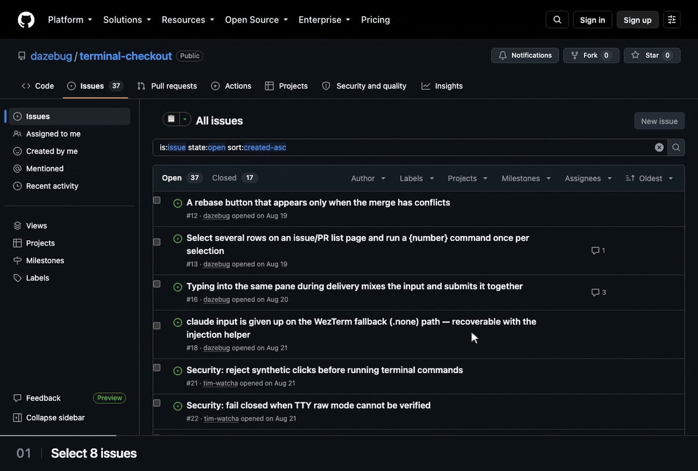
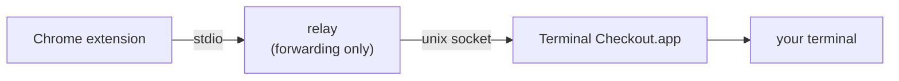

<!-- Translated from README.md at commit 59a640c. Keep this file line-for-line with README.md; see CONTRIBUTING.md. -->
<div align="center">
  <p><a href="README.ko.md">🇰🇷 한국어</a> · <a href="README.zh-Hant.md">🇹🇼 繁體中文</a> · <a href="README.md">🇺🇸 English</a> · <b>🇯🇵 日本語</b></p>
  
  <h1>Terminal Checkout</h1>
  <p><strong>GitHub からワンクリックで、リポジトリ、ブランチ、ワークツリーへ。</strong></p>
  <p>Claude Code を起動して、PR や issue のコンテキストを渡せます。その回だけのひとことを添えることもできます。</p>
  <p>Chrome 拡張機能とネイティブ macOS アプリで構成されています。Claude Code は必須ではありません。</p>
  <p>
    <a href="https://github.com/dazebug/terminal-checkout/actions/workflows/ci.yml"></a>
    <a href="#動作要件"></a>
    <a href="LICENSE"></a>
  </p>
  <p><a href="#インストール">インストール</a> · <a href="#使い方">使い方</a> · <a href="#対応ターミナル">ターミナル</a> · <a href="#トラブルシューティング">トラブルシューティング</a> · <a href="CONTRIBUTING.md">コントリビューション</a></p>
</div>



## 機能

- **13 種類のプリセットとカスタムコマンド** — ワークフローを選ぶことも、独自に定義することもできます。
- **PR ごとにワークツリー** — 選択した PR を、それぞれ専用のワークツリーとターミナルセッションで開きます。
- **Claude Code にコンテキストを渡す** — `!gh …` 行を claude のシェルモードで実行したあと、その回限りのひとことを ▾ から送れます。
- **Chrome にターミナル操作の権限は不要** — 権限はネイティブアプリの側に付きます。
- **ボタンとコマンドを同期** — Chrome の同期で複数のマシン間で共有でき、UI は 5 つの言語に対応しています。

## インストール

### 動作要件

- macOS 13 以降、Google Chrome、[対応ターミナル](#対応ターミナル)のいずれか
- ビルド用の Swift ツールチェーン — Command Line Tools（`xcode-select --install`）があれば十分です
- 任意: [gh](https://cli.github.com)（gh を呼び出すプリセットと、まだ手元にないリポジトリの clone に使います）、`claude`（Claude Code 用）、[zoxide](https://github.com/ajeetdsouza/zoxide)（リポジトリがどこにあっても見つけ出します。[リポジトリに入る](#リポジトリに入る)を参照）。ログインシェルにないツールがワークフローに影響する場合は、共通の問題領域に表示されます。

### 対応ターミナル

| ターミナル | 必要な設定 | Claude 入力をタイプ入力する場合の条件 |
|:---|:---|:---|
| iTerm2 | オートメーション権限（Terminal Checkout だけに付与） | 権限以外は不要 |
| WezTerm | macOS の権限は不要 | WezTerm のウィンドウがすでに開いていること |
| Warp | オートメーション権限は不要 | アクセシビリティ権限。加えて、入力の配信中は対象のタブが表示されたままであること |
| cmux | ソケット制御モード `automation`（`password` や `allowAll` でも可） | シェル統合が surface の tty を公開していること。配信はバックグラウンドのタブでも続行できます |
| cmux NIGHTLY | cmux と同じ。stable には決してフォールバックしない別の選択肢です | cmux と同じ |

最後の列が関係するのは、タイプ入力される claude 入力だけです。claude 入力のないボタンや、入力が 1 つだけで、それを最初のメッセージとして渡すボタンなら、「必要な設定」だけで使えます。詳しくは [claude 入力](#claude-入力)を参照してください。

### <a name="2-build-and-install-the-app"></a>1. アプリをビルドしてインストールする

```bash
git clone https://github.com/dazebug/terminal-checkout.git
cd terminal-checkout
./install.sh
```

`install.sh` はアプリをビルドして `~/Applications/Terminal Checkout.app` にインストールし、そのまま起動します。sudo は不要で、対話的な操作もなく、冪等です。

### <a name="3-finish-in-the-setup-window"></a>2. 設定ウィンドウで仕上げる

設定ウィンドウには「一般」「GitHub」「Slack」のツールバー項目があります。共通の初回インストール案内では、Native Host の登録、Chrome への拡張機能のインストール、GitHub からの最初のリクエストを順に案内します。この案内は「一般」から再表示できます。

1. **初回インストール** — 案内で Chrome の手順を開き、緑色の [Chrome にインストール] をクリックします。アプリが拡張機能フォルダのパスをコピーして `chrome://extensions` を開くので、表示された 4 つの手順に従ってください。
2. **一般** — [対応ターミナル](#対応ターミナル)から 1 つ選び、[ターミナルをテスト] で新しいタブまたは workspace にコマンドが開くことを確認します。このテストでは Chrome からのリクエストや claude 入力の配信は確認しません。
3. **実行後の画面** — ボタンを押したあと、新しいターミナルに切り替えるか、現在の画面を前面に保つかを選びます。Warp は常に新しいタブに切り替わり、この選択は無効になります。
4. **GitHub** — 未知のリポジトリを clone する前に探すベースフォルダを設定できます。設定を利用できない場合にだけ案内が表示されます。
5. **Slack** — 作業フォルダと任意の claude 指示文を設定します。キーボードから Slack スレッドを開く場合はショートカットを録音してください。

<details>
<summary>設定ウィンドウについて</summary>

- **初回インストール案内** — アプリは起動時に Native Host の登録を確認して修復します。拡張機能を読み込んだあと、GitHub のプルリクエストページで Terminal Checkout のボタンを 1 回押してください。記録されたリクエストが示すのは拡張機能のコンテキストがアプリに届いたことだけで、コマンドの成功ではありません。
- 「一般」の **接続の詳細**には、Chrome のリクエスト記録、Native Host、アプリのソケット、選択中のターミナル、ログインシェルから見つかったツールが表示されます。cmux では [cmux の設定をコピーしてファイルを開く] または [cmux の状態をもう一度確認] を使えます。
- **権限と問題** — iTerm2 のオートメーション、cmux ソケットへのアクセス、Warp のアクセシビリティが必要な場合は問題ブロックに表示されます。cmux のアクセス拒否を「起動していない」とは扱いません。cmux のソケット制御では automation を推奨しますが、password と allowAll も使えます。
- **Warp の claude 入力** — アクセシビリティが必要なのは claude 入力をタイプ送信するボタンだけです。claude 入力を予約する同梱プリセット 4 つはすべてこの経路を使います。配信中は Warp のタブを表示しておく必要があり、権限がない場合はタブを開く前にボタンが拒否されます。
- **リポジトリのベースフォルダ** — 空の場合、コマンドは zoxide を使います。zoxide にリポジトリが見つからない場合は設定したベースフォルダを使い、まだなければ `gh` で clone します。gh はインストールして認証しておく必要があります。
- 「一般」の [GitHub ボタンを編集…] は、アプリが拡張機能からリクエストを受け取ったあとにオプションページを開きます。セットアップ後も 3 つのツールバー項目は利用でき、初回インストール案内は「一般」から再表示できます。
- アプリは普段は表示されません。メニューバーのアイコンはなく、Dock に表示されるのは設定ウィンドウが開いている間だけです。Spotlight（⌘Space）または Launchpad から開き直せます。アプリが終了していても、拡張機能のボタンを押せば自動で起動します。

</details>
### 3. 最初のボタンを押す

zoxide にリポジトリ名で clone 先が記録されているリポジトリか、`<base>/<repo>` にある（または `gh` でそこに clone できる）リポジトリの GitHub ページを開き、リポジトリ名の横にある **📂** を押します。そのリポジトリの中で新しいターミナルタブが開きます。各ページで何ができるかは、[使い方](#使い方)で説明しています。

## アップデート

```bash
git pull --ff-only
./install.sh
```

そのあと `chrome://extensions` で拡張機能を再読み込みし（Terminal Checkout のカードの ↻）、GitHub のタブも再読み込みします。コードに変更がある状態で再ビルドするとアプリのアドホック署名の ID も変わるため、iTerm2 を使っている場合はオートメーションの確認をもう一度許可し、Warp でタイプ入力される claude 入力を使っている場合はアクセシビリティをもう一度許可する必要があります（[トラブルシューティング](#トラブルシューティング)）。

<details>
<summary>前回の保存以降にプリセットが改善された場合</summary>

保存済みのボタンは、それまでのコマンドをそのまま保持します。知らないうちに書き換えられることはありません。プリセットが更新されると、オプションページに更新のお知らせが表示されます。お知らせには影響を受けるボタンが `old → new` の形で並び、項目ごとに変更内容の説明とチェックボックスが付きます。私たちが配布したプリセットの書き換えには、あらかじめチェックが入っています。自分でカスタマイズしたコマンドはチェックなしで表示され、動作の変更として示されます。コマンドの残りの部分が、今後は新しい移動処理で選ばれたディレクトリで実行されることになるからです。適用してもフォームが埋まるだけで、書き込みはほかの編集と同じく**保存**で行います。適用しないという選択（「今のままにする」）も記録されるので、お知らせが再び表示されることはありません。このページを開いている間に別のデバイスで設定が変更された場合、保存は上書きせずに拒否されます。再読み込みすると変更後の設定を確認できます。保存していない編集がある場合は、先にエクスポートしておいてください。カスタマイズしたコマンドが書き換えられるのは、最初の節が古いものとまったく同じ場合だけです。それ以外は一覧に表示されるので、各自で対応してください。スキーマのバージョンは `storage.sync` で共有されるため、一度決めれば、同じアカウントのすべてのマシンにその判断が反映されます。

</details>

## 使い方

<a name="pr-pages"></a><a name="issue-pages"></a><a name="pr-and-issue-list-pages"></a><a name="repository-pages"></a>GitHub のページの種類ごとに、最大 5 つのボタンからなる専用のセットがあり、ラベルには絵文字か短いテキストを使います。拡張機能のアイコンをクリックすると、開いているページの最初のボタンが実行されます。

| ページ | ボタンの位置 | 既定のボタン |
|:---|:---|:---|
| PR | PR ヘッダーのブランチ名の横 | ⏏️ **ブランチをチェックアウト** — PR のブランチをチェックアウトし、失敗したらその `../{repo}-{branch_underbar}` ワークツリーに移動します |
| issue | Open/Closed バッジの横 | 📋 **issue を読む (claude)** — claude を起動し、issue、コメント、相互参照の番号をシェルモードで取得します |
| リポジトリ | リポジトリ名の横 | 📂 **ターミナルで開く** — リポジトリに移動します |
| PR リスト | リストの上 | 🤖 **PR をチェックアウト + Claude** — 選択した PR ごとに、`gh pr checkout` で detached HEAD 状態のワークツリー（`../{repo}-pr-{number}`）と claude セッションを 1 つずつ作ります |
| issue リスト | リストの上 | 📋 **issue をトリアージ** — 選択した issue ごとに、コメント付きで claude セッションを 1 つずつ開きます |

- **リストページ** — GitHub のチェックボックスで行を選択します（GitHub がチェックボックスを表示しない場合は、Terminal Checkout が独自に追加します）。選択した行ごとに専用のセッションが開き、1 回のバッチで最大 25 件です。リストページでは拡張機能のアイコンが選択を読み取れないため、アイコンを押すと最初の*リポジトリ*ボタンが実行されます。
- **既定の PR チェックアウト**はブランチが `origin` にあることを前提としているため、フォークからの PR には対応していません。PR リストのプリセットは `gh pr checkout` を使うので、こちらは対応しています。
- **`gh` を呼び出すプリセット**（「PR をレビュー (claude)」「PR をチェックアウト + Claude」「issue を読む (claude)」「issue の作業を開始」「issue をトリアージ」）を使うには、gh をインストールしてログインしておく必要があります（`brew install gh` のあと `gh auth login`）。gh がない場合は共通の問題領域に表示されます。

<details>
<summary>全 13 種のプリセット</summary>

プリセットは拡張機能のオプションページで選べます。[変数](#変数)を使って独自のコマンドを書くこともできます。

| ページ | 表示 | プリセット | 実行内容 |
|:---|:---:|:---|:---|
| PR | ⏏️ | ブランチをチェックアウト | `{cd} && git fetch origin && { git checkout {branch} \|\| cd ../{repo}-{branch_underbar}; }` |
| PR | 🤖 | チェックアウト + Claude | 上と同じ処理のあとに `claude` |
| PR | 🌳 | ワークツリー + Claude | fetch し、`../{repo}-{branch_underbar}` を `{branch}` のワークツリーとして作成または再利用して fast-forward したあと、`claude` |
| PR | 🪵 | ワークツリー | 上と同じ処理（claude なし） |
| PR | 🔍 | PR をレビュー (claude) | `{cd} && claude` のあと、claude のシェルモードで `!gh pr view {number} --comments` と `!gh pr diff {number}` |
| PR リスト | 🤖 | PR をチェックアウト + Claude | 選択した PR ごとに、detached HEAD 状態のワークツリー `../{repo}-pr-{number}` を作り、`gh pr checkout {number} --detach` のあと `claude` |
| issue | 📋 | issue を読む (claude) | `{cd} && claude` のあと、シェルモードで issue、コメント、この issue を相互参照している issue と PR の番号を取得 |
| issue | 🌳 | issue の作業を開始 | ワークツリー `../{repo}-issue-{number}` を作成または再利用し（作成する場合は `origin/{main}` から新しいブランチ `issue-{number}` を切ります）、issue のコメントを渡して `claude` |
| issue | 📂 | issue を開く | `{cd}` |
| issue リスト | 📋 | issue をトリアージ | 選択した issue ごとに、`{cd} && claude` のあと issue のコメント |
| リポジトリ | 📂 | ターミナルで開く | `{cd}` |
| リポジトリ | 📂🤖 | 開く + Claude | `{cd} && claude` |
| リポジトリ | ⤓ | main を更新 | `{cd} && git checkout {main} && git pull --ff-only` |

「issue を読む (claude)」は次のシェルモードの行を予約します。「issue の作業を開始」と「issue をトリアージ」が予約するのは 2 番目の行だけです:

```bash
!gh issue view {number}                       # body and metadata
!gh issue view {number} --comments            # comments
!gh api repos/{owner}/{repo}/issues/{number}/timeline \
  --jq '[.[]|select(.event=="cross-referenced")|.source.issue.number]'   # numbers of issues/PRs that cross-reference this one
```

</details>

## Claude Code

### claude 入力

ボタンのコマンドが `claude` を実行する場合、そのボタンにはオプションページで最大 10 個の入力を予約できます。たとえば `!gh pr diff {number}` のあとに `Summarize the risky parts` を続ける、といった使い方です。アプリは、条件を満たす最初のメッセージを起動時に渡すか、実行中のセッションに入力をタイプ入力します:

- **`!` 入力は claude のシェルモードにタイプ入力されます**。そのため本物のシェルコマンドとして実行され、出力もセッションに残ります。連続するものは、安全性のチェックに通り、まとめた行が 4 KiB 以内に収まる場合にだけ、1 行にまとめられます。
- **プレーンテキストの入力は、ちょうど 1 つだけなら最初のメッセージにできます**。ただし、後述するコマンド、シェル、実行ファイルのチェックに通った場合に限られ、通らなければタイプ入力されます。
- スラッシュコマンド、`#` のメモリ行、それ以外の入力の組み合わせはタイプ入力されます。

<details>
<summary>入力の配信方法</summary>

**`!` 入力はタイプ入力され、連続する場合は 1 行にまとめてタイプ入力されます**。`!` 行が「シェルで実行する」という意味を持つのは、claude 自身の入力ボックスに入力されたときだけです。起動時に引数として渡すと普通のテキストとして届き、claude が判断して Bash ツールで実行することになります。その際は権限の確認で止まることがあり、1 ターンも消費します（実測）。タイプ入力すればコマンドとして実行され、セッションにもコマンドとして残ります。

- **連続する `!` 入力は 1 行にまとめられます**。`;` でつなぎ、出力を見分けられるよう、それぞれの前にバナーを入れます。3 つの入力でも、タイプ入力と送信のサイクルは 3 回ではなく 1 回で済みます。`&&` ではなく `;` を使うのは、別々の `!` 行は互いの実行を止めなかったからで、まとめてもその性質は変わりません。途中のコマンドが失敗しても、それ以降のコマンドは実行されます。
- **まとめると実行内容が変わる場合は、まとめません**。別々に送信すれば `!` 行ごとに新しいシェルが使われます（`!export TOKEN=x` は次の入力に引き継がれません）が、まとめた行では 1 つのシェルを共有します。そのため、シェルの状態を変えるもの（`cd`、`export`、`source`、`set`、`exit`、`VAR=…`）を含む一連の入力は、1 つずつタイプ入力されます。構文の影響が次の入力に及ぶ可能性がある場合も同様です。この 2 つ目の判定は、あえて大まかにしています。**クォートされていない `#` や `=` があれば、位置にかかわらずまとめません**。ヒアドキュメント、末尾の `&`、閉じていないクォート、複合コマンドのキーワード（`if`、`for`、`while`、`case`…）、演算子で始まるか終わる本体も同じ扱いです。`echo a#b` は無害ですが、それでも単独でタイプ入力されます。このチェックは、どの `#` がコメントなのかを見極めようとはしません。過去に 2 回、その見極めを誤ったからです。クォートすれば（`echo 'a#b'`）、再びまとめられるようになります。1 サイクル余分にかかりますが、その代わり `["!cd sub", "!rm -rf build"]` は意図したとおりのディレクトリを削除します。
- **まとめた行が 4 KiB を超える場合は、代わりに 1 入力ずつタイプ入力されます**。切り詰めることは決してありません。この上限を設けているのは、Warp の注入ヘルパーが 1 回のリクエストで 8 KiB を超えるデータを受け付けないためです。行をまとめるのは最適化のためなので、この場合は個別にタイプ入力します。
- 実行されるのは、書いたとおりのテキストそのものです。claude が動いているディレクトリで claude のシェルモードを通して実行されるので、自分でタイプしたときと同じように、コマンドとその出力がセッションに表示されます。
- プレーンテキストの入力、スラッシュコマンド、`#` のメモリ行は、それぞれ単独でタイプ入力されます。`!` の連続は、それ以外の入力が現れたところで途切れます。
- NUL バイトを含む入力は、変更して配信するのではなく、その場で拒否します。tty では NUL バイトを送れないためです。

**プレーンテキストの入力をちょうど 1 つだけ含むリストは、代わりに最初のメッセージにできます**。プレーンテキストはただのメッセージなので、claude の最初の引数としてコマンドの末尾に追加できます。セッションは最初からそのメッセージが入った状態で始まり、タイプ入力も、画面の読み取りも、claude の起動待ちも要りません。追加するのは以下のルールをすべて満たす場合だけで、満たさなければタイプ入力されます:

- 渡し先は `claude` ではなく **`command claude`** です。`command` は POSIX で「関数やエイリアスを飛ばして実行ファイルを実行する」という意味なので、同じ名前のラッパーがテキストを受け取ることはできません。ただし、シェルのビルトインは飛ばし**ません**。そのため、ビルトインを読み込むコマンド（`zmodload`、`enable`）があると、代わりに追加が中止されます。
- そのため、**追加するには `claude` の実行ファイルが存在している必要があります**。アプリは起動時にログインシェルへ問い合わせます。子シェルで問い合わせるので、同名の関数やエイリアスがあっても実行ファイルを見つけられ、そのファイルが実際に実行可能かどうかも確認します。`claude` が関数かエイリアス*でしかない*場合、Slack のリンクも開けないことが共通の問題領域に表示されます。
- 追加するのは、レンダリング後のコマンドが単純な連結（`&&`、`||`、`;`、`|`、グループ、サブシェル）で、**最後のコマンドが素の `claude`** の場合だけです。つまり、フラグがなく、パイプの受け側でもなく、リダイレクトもなく、後ろに何も続かないことが条件です。フラグを除外するのは、一部のフラグ（`--resume`）が引数を自分の値として取り込んでしまうからです。
- さらに、**コマンドのすべての語が、コマンド名として安全なものでなければなりません**。そのシェルで名前を再定義できるもの（`function`、`alias`、`eval`、`source`/`.`、`hash`、`trap`、`export`、`PATH=…` のような代入、`if`/`for`/`while`/`case` などの複合コマンドのキーワード）も、クォートや展開を含む語も使えません。アプリはこれらを読み取れないためです。その分、タイプ入力に切り替わるケースが必要以上に増えます。`git add . && claude` や、クォートした引数を含むものは、代わりにタイプ入力されます。これは以前と同じ動作です。
- ログインシェルは POSIX 系（`sh`、`bash`、`zsh`、`dash`、`ksh`…）である必要があり、メッセージは 1 行でなければなりません。csh/tcsh では、テキスト中の `!` は位置にかかわらず、**シングルクォートの中でも**履歴展開され、コマンドライン全体が失敗します（実測: `echo START; /bin/echo -- 'do it!x'` は `x: Event not found.` と表示するだけで、`START` は実行されません）。また改行があると、iTerm2 でも WezTerm でもコマンドラインがそこで終わってしまいます。
- **混在はできません**。リストにプレーンテキスト*と*それ以外のものがある場合は、すべてタイプ入力されます。最初のメッセージの送信とタイプ入力を同じセッションで行うと、claude の起動処理と競合します。メッセージを送信すると開始から 2∼3 秒後に入力ボックスがクリアされ、それまでにタイプ入力した内容は消えてしまいます（実測）。

**タイプ入力のコストと、アプリが知らせること・知らせないこと**

- アプリは新しいタブで claude の準備が整うのを最大 **2 分**待ち、それを過ぎるとあきらめて、その旨をログに残します。シェルに対してタイプ入力することは決してありません。まず、claude がフォアグラウンドプロセスになり、tty が raw モードになるのを待ちます。
- 各入力の前には、短いランダムなマーカーをタイプ入力して表示されるのを確かめ、ボックスをクリアして消えるのを確かめます。これによって、読み取っている画面がこのペインのものであること、表示されたものが本当に入力ボックスの中にあること、ターミナルでの Ctrl+U が実際に処理されたことがわかります。そのうえで入力を一度だけタイプ入力して送信します。
- 初めてのフォルダで claude の信頼確認が表示されている間は、配信を保留します。約 **15 秒**以内に承認すれば配信は続きますが、それより長くかかると、その入力以降の配信はあきらめます。
- ログに記録されるのは **sent**（送信済み）であって、配信済みではありません。送信した行を claude がメッセージとして受け取ったかどうかは TUI の外からは確かめようがないため、アプリもそうは主張しません。Return キーが結局効かなかった場合、その入力は失われますが、ログ上は送信済みとして数えられたままです。
- **cmux と cmux NIGHTLY では、配信は作成した surface 宛てに行われ、バックグラウンドのタブでも続きます**。どちらのチャンネルも、Warp 向けのフォーカスに依存した画面確認は使わず、アクセシビリティ権限も要りません。

</details>

### claude へのひとこと

コマンドに `claude` という語が含まれるボタンには、入力を 10 個保存していても、ひとこと用の別枠があるため、ページヘッダーのボタンにもリストのバッチボタンにも ▾ キャレットが付きます。キャレットを押すと 1 行の入力ボックスが開き、その上にボタンがもともと送る入力が一覧表示されます。ひとことはそれらのあとに送られるので、claude は取得済みのコンテキストがそろった状態でひとことを読みます。ひとことはそのクリック 1 回限りのもので、保存されることはありません。リストページでは、バッチ内のすべてのセッションにひとことが届きます。

ひとことは 1 行のプレーンテキストで、UTF-8 で最大 4096 バイトです。`!`、`/`、`#`、あるいはほかの種類の空白や不可視文字で始めることはできず、`{…}` を含めることも、改行、タブ、その他の制御文字を入れることもできません。

Enter キーか送信ボタンで送信します。ボタンには ⏳ が表示され、続いて ✅ か ❌ が表示されます。✅ は、アプリがコマンドを受け付けてターミナルを開いたという意味です。claude への配信状況はアプリのログで報告されます。拒否されたひとことはボックスに残り、その下に理由が表示されます。❌ になった場合も、ひとことが入ったままボックスは開いています。

<details>
<summary>ひとことについて詳しく</summary>

- ボックスの上の一覧には、保存されている入力が順番に表示されます。`{number}` などの変数はまだ埋められておらず、送信時に埋められます。保存された入力がないボタンでは、一覧は表示されません。
- 両端の通常のスペースは、チェックの前に取り除かれます。先頭の文字を制限しているのは、アプリがそれらの文字をシェルコマンドや入力ボックスのコマンドとして解釈してしまうからで、`{…}` を禁止しているのは、アプリが変数として解釈してしまうからです。改行、タブ、その他の制御文字は、取り除くのではなく拒否します。改行を含むテキストも、1 行につなげるのではなく、貼り付けやドロップの時点で拒否します。
- ページがボタンを描画したあとでそのボタンの保存済み入力が変わった場合（オプションページで編集した、または別のデバイスから同期された場合）は、実際の内容と一致しなくなった一覧を表示したまま送信することはせず、送信を拒否します。ページを再読み込みしてください。
- IME で入力・変換中のキー操作は、IME に任せます。韓国語では、1 回の Enter で最後の音節が確定し、ひとこと全体が一度だけ送信されます。Esc を押すと、ひとことを残したままボックスが閉じます。日本語では、変換を確定する Enter は確定だけを行い、次の Enter で送信されます。
- ❌ の場合、理由はコンソールに出力されます。送信せずに閉じたひとことや送信に失敗したひとことは、ページを再読み込みするまで、そのページで同じボタンのボックスを次に開いたときに復元されます。
- リストページでは、送信を押した時点で選択されている行がバッチの対象になります。
- ひとことがどの経路をたどるか（セッションにタイプ入力されるか、最初のメッセージとして渡されるか）は [claude 入力](#claude-入力)のルールに従います。アプリ側でトリミングしたあとで決まるため、ここではどちらになるかは保証しません。Warp でタイプ入力されるひとことには、ほかのタイプ入力と同じくアクセシビリティ権限が必要です。
- 拡張機能のアイコンでは、これまでどおりひとことなしで最初のボタンが実行されます。

</details>

### 既知の制限

- 入力は 1 行のものに限られます。
- アプリは各入力の前に入力ボックスをクリアし、配信が終わると後片付けを試みます。そのため、配信中に入力した下書きが消えることがあります。後片付けは失敗することもあり、その場合は Enter を押すと送信されてしまうテキストが残ります。
- 入力がタイプ入力されるボタンは、アプリが配信できないと判断できる場合、**何も開く前に拒否されます**（❌ が表示され、タブは開きません）。対象は、Warp でアクセシビリティ権限か同梱の注入ヘルパーがない場合と、WezTerm で WezTerm のウィンドウが開いていない場合です。claude 入力のないボタンや、入力が 1 つだけで、それを最初のメッセージとして渡すボタンは影響を受けません。ひとことを添えたクリックは、ひとことも含めて判断されます。
- **Warp では、タイプ入力はそのタブが画面に表示されている間しか配信されません**。ほかに切り替えると配信は一時停止し、戻ると再開します。
- ✅ は、アプリがコマンドを受け付けてターミナルを開いたという意味です。アプリのログには送信した入力と配信の失敗が記録されますが、claude が各入力を受け取ったことまでは確認できません。

<details>
<summary>アプリがシェルの中で確認できないこと</summary>

次の 2 つは実行時のシェルとファイルシステムに依存するため、アプリは最初のメッセージを追加する前に確認できません。1 つは **`claude` を別のプログラムに解決してしまう `PATH`**、もう 1 つは `command claude` の呼び出しを横取りしてしまう、**rc ファイル内の `command` という関数またはエイリアス**です。

</details>

### Slack のスレッドを claude で開く

1. Terminal Checkout の Slack 項目で作業フォルダと指示文を設定します。
2. **ショートカットを設定**を押し、使いたいキーの組み合わせ（例: ⌃⇧⌘C）を押します。⌘、⌃、⌥ のいずれかを含める必要があります。
3. **ログイン時に Terminal Checkout を開く**をオンにします。ショートカットはアプリの実行中だけ使えるため、オンにするとログイン時にアプリが開きます。
4. Slack でメッセージの**リンクをコピー**を選び、そのショートカットを押します。Terminal Checkout はクリップボードからリンクを読み取り、設定したフォルダで claude を起動し、リンクを先頭に、設定していれば指示文を後ろに続けた 1 つの開始引数を渡します。claude がスレッドを読むには、Slack MCP を利用できる必要があります。

ショートカットは Slack を含め、どのアプリが前面にあっても使えます。クリップボードが選ぶのは claude が読む Slack メッセージだけで、作業フォルダ・指示文・コマンドは Terminal Checkout の設定から取得します。

## 設定

アプリの設定は「一般」「GitHub」「Slack」の各項目にあります。ボタン、コマンド、main ブランチは拡張機能のオプションページで設定します。アプリが拡張機能からリクエストを受け取ったあと、「一般」の [GitHub ボタンを編集…] を選ぶか、`chrome://extensions` → Terminal Checkout → 拡張機能のオプション から開けます。

- 拡張機能の設定は、**保存**を押したときにだけ書き込まれます。
- ボタンのカードは、`⠿` ハンドルをドラッグするか、ハンドルにフォーカスして `↑` `↓` キーを押すと並べ替えられます。[複製] を押すと、元のカードのすぐ後ろにコピーが作られます。この並び順が GitHub 上でのボタンの順序になり、拡張機能のアイコンで実行されるのは最初のボタンです。
- 設定は Chrome の `storage.sync` に保存されるため、同じ Google アカウントでサインインし、「拡張機能」の同期を有効にしている Chrome 同士で共有されます。
- **backup** セクションの [エクスポート (JSON)] / [インポート…] は、アカウントを使わずに設定を移すときや、再インストールするときに使います。インポートはフォームを埋めるだけなので、内容を確認してから**保存**を押して適用してください。

<details>
<summary>同期とバックアップについて詳しく</summary>

拡張機能の ID は manifest の `key` で固定されていてどの環境でも同じなので、マシンをまたいで同期できます。複製したカードのツールチップには `(1)` のような番号が付きます。

バックアップファイルには、どの世代のプリセットを基準に書き出したかが記録されます。古いバックアップには保存済みのボタンと同じ更新のお知らせが表示され、その対象はファイルに含まれていたキーだけでなく、インポート後のフォーム全体になります。より新しい拡張機能で作られたバックアップは、途中まで読み込むのではなく拒否します。

</details>

### <a name="1-decide-how-commands-find-your-repositories"></a>リポジトリに入る

どのプリセットも、リポジトリに移動する節 `{cd}` で始まります。アプリはこれを、GitHub 項目の**リポジトリのベースフォルダ**の設定に応じてレンダリングします:

| ベースフォルダ | `{cd}` のレンダリング結果 |
|:---|:---|
| 未設定 | zoxide によるジャンプ。zoxide が `{repo}` とまったく同じ名前（大文字と小文字は区別しない）で記録しているフォルダに移動します |
| `<base>` | zoxide によるジャンプ。失敗したら、`<base>/{repo}` が **git リポジトリであれば**そこへフォールバックし、それも失敗したら `gh repo clone {owner}/{repo} <base>/{repo}` へフォールバックします |

ジャンプが最初に試されるので、ジャンプで見つかったフォルダが後続の手段で上書きされることはありません。ベースフォルダがある場合、どちらの方法でも見つからなかったリポジトリは `gh repo clone` で clone されます。その際、`gh` のプロトコルと認証の設定が使われます。ベースフォルダはこの Mac にだけ保存され、同期される拡張機能の設定に含まれることはありません。

<details>
<summary>zoxide を使う</summary>

[zoxide](https://github.com/ajeetdsouza/zoxide) を使うと、リポジトリがどこにあってもジャンプできます。インストールして、シェルの設定ファイルに init 行を追加してください:

```bash
brew install zoxide
echo 'eval "$(zoxide init zsh)"' >> ~/.zshrc && source ~/.zshrc
```

コマンドが実行するのは `zoxide` の実行ファイルなので、z.sh やその移植版では代わりになりません。zoxide は訪れたディレクトリを学習するため、一度も `cd` したことのないリポジトリはまだデータベースにありません。登録されるまではジャンプが失敗しますが、そこを補うのがまさにベースフォルダです。ベースフォルダを設定している場合、GitHub 項目には `zoxide` がなくても代替手段が残ることが表示されます。

ジャンプでは、zoxide がリポジトリ名で記録しているフォルダを `zoxide query --list` で調べ、名前が `{repo}` とまったく同じもの（大文字と小文字は区別しない）のうち、順位が最も高いものに移動します。`z {repo}` を使わないのは意図的です。zoxide はフォルダ名のどこかに `{repo}` が含まれていれば一致とみなし、より最近使ったものを優先するので、`z` はプリセットがチェックアウトの隣に作る `{repo}-<branch>` ワークツリーに移動してしまうことがあります。しかもチェックアウトの中から実行すると、必ず別の場所に移動します。`z` は現在のディレクトリを候補から外すからです。別のフォルダ名で置いている clone も、ジャンプでは見つかりません。

インストールしたばかりの zoxide はデータベースが空なので、ジャンプは `zoxide has not recorded a directory named {repo}` と表示して 0 以外の終了コードで終わり、最初の `&&` 以降は何も実行されません。コマンド自体は*配信されて*おり、失敗はシェルの中で起きているので、ボタンの表示は成功のままです。ターミナルに出るこのメッセージが唯一の手がかりです。zoxide がない場合（`command not found`）も同じように失敗しますが、ベースフォルダはどちらのケースも補います。

中間のステップでは、`<base>/{repo}` にただ移動するのではなく、それが本当に git リポジトリかどうかを確認します。そうしないと、存在はしてもチェックアウトではないディレクトリ（中断された clone が残した空のフォルダや、作業用のディレクトリなど）が「見つかった」とみなされ、コマンドの残り（`git fetch`、`git checkout`）がそこで実行されてしまいます。チェックに失敗すると git が画面にその旨を表示し（`fatal: not a git repository`）、clone のステップに移ります。そのフォルダが空でなければ、clone は中身に手を触れず、`destination path ... already exists and is not an empty directory` で止まります。

</details>

### 変数

| 変数 | 値 | PR | PR リスト | issue | issue リスト | リポジトリ |
|:---|:---|:---:|:---:|:---:|:---:|:---:|
| `{cd}` | リポジトリへの移動。ページではなくアプリが埋めます（[前述](#リポジトリに入る)） | ✓ | ✓ | ✓ | ✓ | ✓ |
| `{repo}` | リポジトリ名 | ✓ | ✓ | ✓ | ✓ | ✓ |
| `{owner}` | リポジトリのオーナー（`gh api repos/{owner}/{repo}/…` 用） | ✓ | ✓ | ✓ | ✓ | ✓ |
| `{main}` | main ブランチ（後述） | ✓ | — | ✓ | — | ✓ |
| `{number}` | PR / issue の番号（数字のみ。リストページでは選択した行のもの） | ✓ | ✓ | ✓ | ✓ | — |
| `{branch}` | PR の head ブランチ（マージされる側） | ✓ | — | — | — | — |
| `{base}` | PR の base ブランチ（マージ先） | ✓ | — | — | — | — |
| `{branch_underbar}` | `{branch}` の `/` を `_` に置き換えたもの（ワークツリーのディレクトリ名などに使用） | ✓ | — | — | — | — |

変数はコマンドでも claude 入力でも同じように使えます。ページから取得する値は、ASCII の英字、数字、`-_./` だけに制限されます。`{cd}` は検証済みの要素からアプリが組み立てるシェル構文で、`{repo}` を必要とします。詳細ページ用のテンプレートをリストで使えるのは、テンプレートが使う変数がすべてリストでも使える場合だけです。足りない変数があると、実行は拒否されます。

**`{main}`** は、リポジトリごとの個別設定 → ページからの検出 → 全体の既定値の順に決まります。PR ページでは base ブランチを、リポジトリと issue のページではリポジトリの既定ブランチを検出するので、`master` のリポジトリでも個別設定は要りません。

**`{base}`** は PR ページからそのまま読み取られ、個別設定もフォールバックもありません。実際のマージ先が重要な場面で使ってください（`git rebase origin/{base}`）。読み取れない場合は、別の値で代用せずに実行を拒否します。

### 言語

Terminal Checkout は**英語、韓国語、日本語、簡体字中国語、繁体字中国語**に対応しています。アプリは「一般」の**言語**行に従い、既定では macOS の言語を使います。拡張機能は **Chrome の**表示言語に従うため、アプリと拡張機能で言語が異なる場合があります。

> **翻訳について**：アプリと拡張機能のテキストのうち、英語と韓国語は人の手で書かれています。**日本語、簡体字中国語、繁体字中国語は機械翻訳による初稿で、各言語の話者によるレビューを受けていません**。修正の issue や PR を歓迎します。私たちが翻訳した文字列がシェルに渡ることはありません。

<details>
<summary>アプリと拡張機能の言語の決まり方</summary>

- **シェルに渡るものは一切翻訳されません**。テストコマンドや、アプリがリポジトリに入るために組み立てる節は構造上英語に固定されており、ユーザー自身のコマンドテンプレートに手が加わることも決してありません。
- **[システムの言語に従う]** が既定です。macOS の言語の優先順位に従い、5 つの言語のうち対応できる最初のものを選びます。どれにも当てはまらない場合は**英語**にフォールバックします。言語を明示的に選んだ場合は、その選択どおりに使われます。指定していない別の言語に切り替わることは決してありません。一覧はそれぞれの言語の文字で書かれているので、読めない言語を選んでしまっても元に戻せます。
- **アプリ自身のテキストはすぐに切り替わります**。[システムの言語に従う] を選ぶと、このアプリが以前書き込んだ `AppleLanguages` の値ではなく、システムが管理する言語の優先順位をもとに決まります。ファイル選択、警告、メニューバーの標準項目など、macOS が描画するシステムのダイアログは**次回の起動**から切り替わるため、アプリの言語を変更したあと「一般」から再起動できます。claude 入力の配信中に再起動を押しても、その旨を伝えるだけで何もしません。配信が中断されてしまうため、再起動の要求は実行待ちにせずに拒否します。配信が終わってからもう一度押してください。
- **拡張機能はアプリに何も問い合わせません**。メッセージ ID は拡張機能が描画するときに Chrome の表示言語のカタログから解決されるので、表示言語を変更して（`chrome://settings/languages`）ページを再読み込みするだけで切り替わります。Chrome には拡張機能ごとの言語設定はありません。保存済みのボタンのラベルは保存した時点のテキストのスナップショットなので、Chrome の言語を変えても書き換わりません。新しいテキストにしたい場合は、ボタンを作り直すか編集してください。Chrome の言語が私たちの提供していない言語に設定されている場合は**英語**にフォールバックし、ページ自身の `lang` 属性でもそのことを示します。
- `zh-Hant` は香港とマカオも対象にしています。macOS 自体もこれらの地域を同じように扱っています。
- **[システムの言語に従う] で消えるのは、このアプリが記録した上書き設定のうち、いまも同じ値のものだけです**。システム設定でアプリごとに選んだ言語、`-AppleLanguages` 引数、あるいはさらに優先度の高い設定があれば、そちらが引き続き優先されます。アプリは、自分が書き込んだと証明できない値を削除しません。macOS の権限確認のダイアログはさらに別の話で、macOS 自身が描画するため、ここでの選択に従うかどうかはわかっていません。

</details>

## 仕組み



macOS のオートメーション権限は、*responsible process*（権限の帰属先となるプロセス）に付与されます。そのため、Chrome が起動したネイティブホストが自分でターミナルを操作すると、その権限は Chrome に付いてしまいます。この構成では、Chrome が起動する relay はアプリの unix ソケットにバイトを転送するだけで、アプリが起動していなければバックグラウンドで起動します。LaunchServices 経由で起動され、自身が responsible process となるアプリが、リクエストの検証、コマンドのレンダリング、claude 入力の配信方法の決定、ターミナルの操作を担います。そのため権限は Terminal Checkout に付き、ブラウザに付くことは決してありません。各部分がこの形になっている理由は [`docs/context/`](docs/context/index.md) に記録しています。

## セキュリティ

- コマンドテンプレートは、ユーザー自身が書いた信頼できる設定です。GitHub のページから読み取った値は[変数](#変数)の文字ホワイトリストで検査され、これによってコマンドインジェクションを防いでいます。
- アプリのソケット、cmux の automation モード、Warp の注入ヘルパーは、同じ macOS ユーザーのすべてのプロセスを信頼します。
- 拡張機能は `https://github.com` でのみ動作します。
- GitHub のページ上で動くスクリプト（XSS や、そのサイトにアクセスできる別の拡張機能）は、送信を押す前にひとことのテキストを書き換えられます。claude はそれをユーザー本人の言葉として受け取ります。ただし、スクリプトが自分でひとことを送信することはできません。偽のクリックやキー入力は無視されます。

<details>
<summary>詳しい仕組み</summary>

- Chrome が Native Host の relay を起動するのは、ホワイトリストに登録された拡張機能 ID（`allowed_origins`）に対してだけです。これを強制しているのは relay 自身ではなく Chrome です。
- アプリのソケットはモード 0600 に設定されており、接続相手の検証も行います。Warp の注入ヘルパーは、配信が終わった瞬間に終了させます。

</details>

信頼モデルの全体像と脆弱性の報告方法は、[SECURITY.md](SECURITY.md) にまとめています。

## トラブルシューティング

<details>
<summary><b>「Native host has exited」と表示される、または拡張機能が反応しない</b></summary>

設定ウィンドウを開きます（Spotlight から Terminal Checkout を起動）。問題は共通の問題領域に表示されます。Native Host の登録に対応が必要な場合は、[Native Host を登録／更新] を押してください。リポジトリを移動した場合やアプリを再インストールした場合は、`./install.sh` をもう一度実行してください。

</details>

<details>
<summary><b>権限を拒否してしまった</b></summary>

該当する問題ブロックのボタンからオートメーションまたはアクセシビリティの設定を開きます。iTerm2 は **プライバシーとセキュリティ → オートメーション**で Terminal Checkout を許可し、Warp の画面読み取りには**アクセシビリティ**が必要です。

</details>

<details>
<summary><b>cmux または cmux NIGHTLY のソケットへのアクセスが拒否される</b></summary>

「一般」の接続の詳細から [cmux の設定をコピーしてファイルを開く] を選び、JSON の断片をコピーして `~/.config/cmux/cmux.json` を開きます。アプリは `automation` モードを推奨しますが、`password` と `allowAll` でもソケットを制御できます。このファイルは両方のチャンネルで共有され、アプリは書き込みません。

</details>

<details>
<summary><b>cmux または cmux NIGHTLY が起動していない</b></summary>

選択した cmux チャンネルを自分で起動してください。ソケットが現れたら「一般」の接続の詳細で [cmux の状態をもう一度確認] を選びます。NIGHTLY は別のバンドルなので stable に置き換わることはありません。[cmux の設定をコピーしてファイルを開く] は JSON の断片をコピーして既存のファイルかフォルダを開くだけで、cmux の起動やファイルへの書き込みは行いません。

</details>

<details>
<summary><b>cmux または cmux NIGHTLY でコマンドは実行されたのに、claude 入力が届かない</b></summary>

ペインのシェル統合がオフになっていて、`debug.terminals` にその surface の tty がない可能性があります。その場合、コマンドはそのまま残りますが、claude 入力は破棄されます。アプリのログは `log show --predicate 'subsystem == "com.dazebug.terminal-checkout"' --last 15m --info` で確認できます。

</details>

<details>
<summary><b>Warp で claude 入力が配信されない</b></summary>

タイプ入力（すべての `!` 入力。つまり claude 入力を予約する同梱プリセット 4 つすべて）にはアクセシビリティ権限が必要です。最初のメッセージとして渡される入力には不要です。▾ キャレットから添えるひとことも入力の 1 つです。すでに入力を 1 つ予約しているボタンに添えると入力は 2 つになり、タイプ入力されます。なお、アプリは独自のトリミングを行ってから数えるので、トリミングで消える文字だけでできた保存済みの入力は数に入りません。ボタンに ❌ が表示されてタブが開かなかった場合は、アプリが配信できないことを事前に把握していたということです。共通の問題領域に表示される Warp のアクセシビリティ案内に従うか、再インストールして同梱のヘルパーを復元してください。タブは開いたのに入力だけがない場合: 配信が終わるまでそのタブを表示していましたか？ ほかに切り替えると、アプリは待機します（戻ると再開します）。それ以外の場合、原因は `log show --predicate 'subsystem == "com.dazebug.terminal-checkout"' --last 15m --info` で確認できます。

</details>

<details>
<summary><b>claude 入力が最初のメッセージとして渡されず、タイプ入力された</b></summary>

リストに `!`、スラッシュコマンド、`#` 行が含まれているなら、それが通常の動作です。コマンドの末尾に追加されるのは、プレーンテキストの入力をちょうど 1 つだけ含むリストだけです（プレーンテキストの行が 2 つあると間に改行が必要になるため、タイプ入力されます）。▾ キャレットから添えるひとことも入力の 1 つとして数えます。プレーンテキストの入力が 1 つだけなのにタイプ入力される場合は、次の条件をすべて満たす必要があります。コマンドが素の `claude` で終わっていること（末尾にフラグ、リダイレクト、パイプ、コメントがないこと）。書いた語がすべて読み取り可能で、コマンド名として安全であること（`git add .`、`-m 'msg'`、`export …`、`PATH=…` はいずれも追加を妨げます。アプリ自身の `{cd}` 節は通常の 1 語として扱われます）。メッセージが 1 行であること。ログインシェルが POSIX 系であること。`claude` が関数やエイリアスではなく、実際の実行ファイルであること。

</details>

<details>
<summary><b>再ビルド後にまた権限の確認が表示される</b></summary>

アドホック署名では、コードが変わったビルドは署名 ID も変わるため、オートメーションの確認をもう一度許可してください。アクセシビリティの許可では、さらに厄介な問題が起こります。古い項目はスイッチがオンのままシステム設定に表示され続けますが、もう効力はなく、スイッチを切り替えても元には戻りません。`./install.sh` はインストール済みのものと新しくビルドしたもののコードハッシュを比較し、異なる場合に限ってその項目をリセットして、もう一度許可できるようにします。これが関係するのは Warp の claude 入力を使っている場合だけです。リセットを実行できない場合、スクリプトは対話的な操作は何もせず、自分で実行するためのコマンドを 1 つ表示します。

</details>

<details>
<summary><b><code>zoxide has not recorded a directory named …</code> と表示され、それ以降の処理が何も実行されない</b></summary>

zoxide には、その名前と一致するフォルダが記録されていません。zoxide をインストールしてからそのリポジトリに `cd` していないか、clone したフォルダの名前がリポジトリ名と異なっています。コマンドの最初の節が失敗し、`&&` でつながった処理はそこで止まります。アプリはこの失敗を検知できません。コマンドは配信されたあとシェルの中で失敗しているので、ボタンの表示は成功のままです。GitHub 項目で**リポジトリのベースフォルダ**を設定すれば、コマンドは `<base>/<repo>` にフォールバックし、なければ clone します。あるいは、一度手動でそのリポジトリに `cd` してください。それで zoxide が学習します。詳しくは [リポジトリに入る](#リポジトリに入る)を参照してください。

</details>

<details>
<summary><b><code>command not found: zoxide</code></b></summary>

zoxide がインストールされていること、ターミナルが `PATH` 経由で zoxide を見つけられるログインシェルを使っていること、そして `eval "$(zoxide init zsh)"`（またはお使いのシェル向けの同等の行）がシェルの設定ファイルに書かれていることを確認してください。init 行がないと、zoxide は新しいフォルダを一切学習しません。ベースフォルダはこのケースも補います。zoxide がない場合も、データベースが空の場合と同じように失敗するからです。

</details>

<details>
<summary><b>ボタンが表示されない</b></summary>

GitHub の UI が更新されると、ボタンを差し込む位置が変わることがあります。拡張機能のアイコンをクリックする方法は、その位置に依存しない別の経路です。ただし同じページのデータを読むので、こちらも失敗することがあります。失敗の内容は service worker のコンソールに出力されます。

</details>

## 開発

```bash
swift test --package-path app   # Core unit tests
node --test                     # extension (JS) unit tests — no dependencies
app/build.sh                    # build the app bundle (app/build/Terminal Checkout.app)
app/e2e.sh                      # relay ↔ socket ↔ server round-trip regression test (after building)
node tools/check-locales.js     # _locales structure: name parity and argument bindings against en
```

まずは [CONTRIBUTING.md](CONTRIBUTING.md) をお読みください。アーキテクチャ上の制約と実測で確かめた落とし穴は [`CLAUDE.md`](CLAUDE.md) に、新しいターミナルに対応するときに手を入れる箇所は [`docs/new-terminal-checklist.md`](docs/new-terminal-checklist.md) に、設計の背景にある理由は [`docs/context/`](docs/context/index.md) にまとめています。

## アンインストール

```bash
./uninstall.sh
```

Chrome 拡張機能は、`chrome://extensions` から手動で削除してください。

## ライセンス

[MIT](LICENSE)
