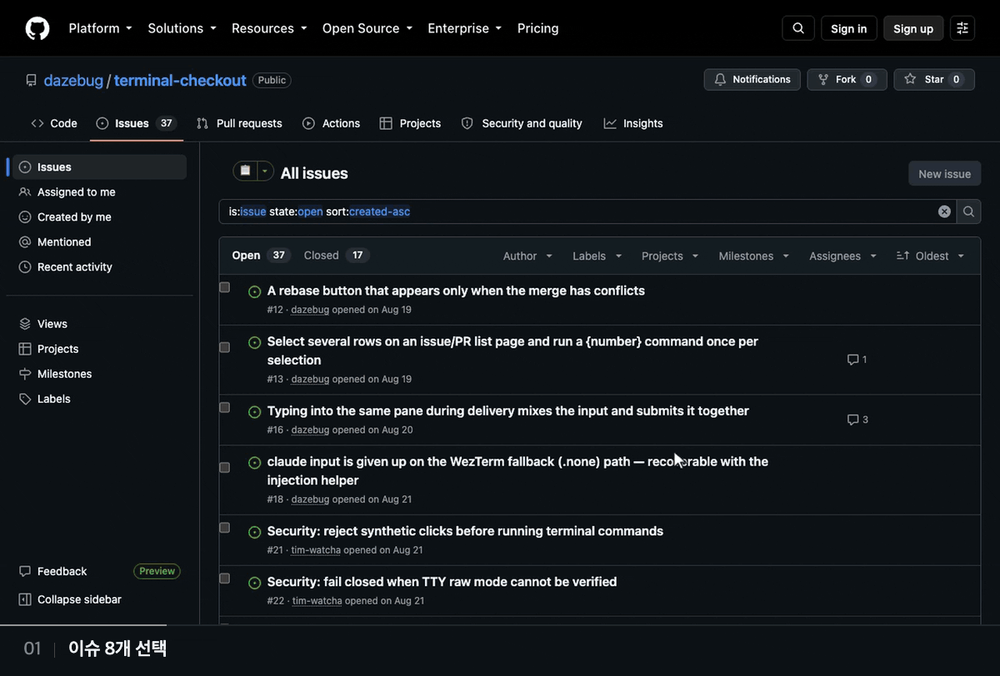
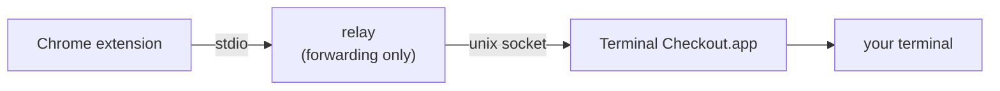

<!-- Translated from README.md at commit 59a640c. Keep this file line-for-line with README.md; see CONTRIBUTING.md. -->
<div align="center">
  <p><b>🇰🇷 한국어</b> · <a href="README.zh-Hant.md">🇹🇼 繁體中文</a> · <a href="README.md">🇺🇸 English</a> · <a href="README.ja.md">🇯🇵 日本語</a></p>
  
  <h1>Terminal Checkout</h1>
  <p><strong>GitHub에서 클릭 한 번으로 저장소, 브랜치, 워크트리로 이동합니다.</strong></p>
  <p>Claude Code를 시작해 PR이나 이슈의 컨텍스트를 전달하고, 원하면 이번 실행에 붙일 한 마디도 함께 보냅니다.</p>
  <p>Chrome 확장 프로그램과 macOS 네이티브 앱으로 이루어져 있습니다. Claude Code는 없어도 됩니다.</p>
  <p>
    <a href="https://github.com/dazebug/terminal-checkout/actions/workflows/ci.yml"></a>
    <a href="#요구-사항"></a>
    <a href="LICENSE"></a>
  </p>
  <p><a href="#설치">설치</a> · <a href="#사용법">사용법</a> · <a href="#지원-터미널">터미널</a> · <a href="#문제-해결">문제 해결</a> · <a href="CONTRIBUTING.md">기여하기</a></p>
</div>



## 기능

- **프리셋 13개와 사용자 지정 명령** — 워크플로를 고르거나 직접 정의합니다.
- **PR마다 워크트리 하나** — 선택한 PR을 각각 별도의 워크트리와 터미널 세션으로 엽니다.
- **Claude Code에 컨텍스트 전달** — claude의 셸 모드에서 `!gh …` 줄을 실행하고, 이어서 이번 실행에만 쓰는 ▾ 한 마디를 보냅니다.
- **Chrome에는 터미널 제어 권한이 필요 없습니다** — 권한은 네이티브 앱에 귀속됩니다.
- **동기화되는 버튼과 명령** — Chrome 동기화로 여러 기기에서 공유되고, 인터페이스는 다섯 개 언어로 제공됩니다.

## 설치

### 요구 사항

- macOS 13+, Google Chrome, 그리고 [지원 터미널](#지원-터미널) 중 하나
- 빌드용 Swift 툴체인 — Command Line Tools(`xcode-select --install`)면 충분합니다
- 선택 사항: gh를 호출하는 프리셋을 쓰거나 아직 로컬에 없는 저장소를 clone하려면 [gh](https://cli.github.com)가, Claude Code를 쓰려면 `claude`가 필요합니다. [zoxide](https://github.com/ajeetdsouza/zoxide)는 저장소가 어디에 있든 찾아 줍니다([저장소로 들어가기](#저장소로-들어가기)). 로그인 셸에 도구가 없어 작업에 영향을 주면 공통 문제 영역에 표시됩니다.

### 지원 터미널

| 터미널 | 필요한 설정 | Claude 입력을 타이핑하기 위한 조건 |
|:---|:---|:---|
| iTerm2 | Terminal Checkout에만 부여하는 자동화 권한 | 권한 외에는 없음 |
| WezTerm | macOS 권한 필요 없음 | 실행 중인 WezTerm 창이 있어야 합니다 |
| Warp | 자동화 권한 필요 없음 | 손쉬운 사용 권한이 있어야 하고, 입력을 전달하는 동안 대상 탭이 화면에 계속 보여야 합니다 |
| cmux | 소켓 제어 모드 `automation`(`password`, `allowAll`도 가능) | 셸 통합이 surface의 tty를 노출해야 합니다. 탭이 백그라운드에 있어도 전달이 이어질 수 있습니다 |
| cmux NIGHTLY | cmux와 같음. 따로 선택하는 항목이며 stable로 절대 폴백하지 않음 | cmux와 같음 |

마지막 열은 claude 입력을 타이핑할 때에만 해당합니다. claude 입력이 없는 버튼이나 입력 하나를 첫 메시지에 실어 보내는 버튼은 필요한 설정만 갖추면 됩니다 — [claude 입력](#claude-입력)을 참고하세요.

### <a name="2-build-and-install-the-app"></a>1. 앱 빌드와 설치

```bash
git clone https://github.com/dazebug/terminal-checkout.git
cd terminal-checkout
./install.sh
```

`install.sh`는 앱을 빌드해 `~/Applications/Terminal Checkout.app`에 설치하고 실행합니다. sudo가 필요 없고, 중간에 아무것도 묻지 않으며, 여러 번 실행해도 결과가 같습니다.

### <a name="3-finish-in-the-setup-window"></a>2. 설정 창에서 마무리하기

설정 창은 일반 · GitHub · Slack 툴바 항목으로 나뉩니다. 공통 처음 설치 안내에는 Native Host 등록, Chrome 확장 설치, GitHub에서 첫 요청 보내기가 들어 있으며 일반 항목에서 다시 열 수 있습니다.

1. **처음 설치** — 초록색 [Chrome에 설치하기]를 누르세요. 앱이 확장 폴더 경로를 복사하고 `chrome://extensions`를 연 뒤 안내의 네 단계를 펼칩니다. Chrome에서 **개발자 모드**를 켜고 **압축해제된 확장 프로그램 로드**를 누른 다음 **⇧⌘G → ⌘V → Enter → [선택]** 순으로 진행하세요. 개발자 모드는 계속 켜 두세요 — Chrome 133부터 끄면 압축해제된 확장 프로그램이 비활성화됩니다.
2. **일반** — [지원 터미널](#지원-터미널) 중 하나를 고른 뒤 [터미널 테스트]로 새 탭이나 workspace에서 명령이 열리는지 확인하세요. 이 테스트는 Chrome 요청이나 claude 입력 전달을 확인하지 않습니다.
3. **실행 후 화면** — 버튼을 누른 뒤 새 터미널로 이동할지 지금 화면을 유지할지 고릅니다. Warp는 항상 새 탭으로 이동하며 이 선택은 비활성으로 표시됩니다.
4. **GitHub** — 낯선 저장소를 clone하기 전에 찾을 저장소 기본 폴더를 정할 수 있습니다. 설정을 쓸 수 없을 때만 안내가 표시됩니다.
5. **Slack** — 작업 폴더와 선택 사항인 claude 지시문을 정하고, 키보드로 Slack 스레드를 열려면 단축키를 녹화하세요.

<details>
<summary>설정 창 자세히 보기</summary>

- **처음 설치 안내** — 앱은 시작할 때 Native Host 등록을 확인하고 고칩니다. 확장 프로그램을 불러온 뒤 GitHub PR 페이지에서 Terminal Checkout 버튼을 한 번 누르세요. 기록된 요청은 확장 프로그램 문맥이 앱에 도착했다는 뜻이며, 명령이 성공했다는 뜻은 아닙니다.
- 일반 항목의 **연결 상세**에는 Chrome 요청 기록, Native Host, 앱 소켓, 선택한 터미널, 로그인 셸에서 찾은 도구가 표시됩니다. cmux에서는 [cmux 설정 복사하고 파일 열기] 또는 [cmux 상태 다시 확인]을 사용할 수 있습니다.
- **권한과 문제** — iTerm2 자동화, cmux 소켓 접근, Warp 손쉬운 사용 권한은 조치가 필요할 때 문제 블록으로 표시됩니다. cmux 접근 거부는 “실행 중 아님”으로 취급하지 않습니다. cmux 소켓 제어에는 automation 모드를 권장하며 password와 allowAll도 사용할 수 있습니다.
- **Warp claude 입력** — claude 입력을 타이핑하는 버튼에만 손쉬운 사용 권한이 필요합니다. claude 입력을 예약하는 기본 프리셋 네 개는 모두 이 경로를 씁니다. 전달하는 동안 Warp 탭이 화면에 보여야 하며, 권한이 없으면 앱은 탭을 열기 전에 버튼을 거부합니다.
- **저장소 기본 폴더** — 비워 두면 명령은 zoxide를 사용합니다. zoxide가 저장소를 찾지 못하면 설정한 기본 폴더를 대신 사용하며, 저장소가 없으면 `gh`로 clone합니다. gh는 설치하고 인증해야 합니다.
- 일반 항목의 [GitHub 버튼 편집…]은 앱이 확장 요청을 받은 뒤 확장 프로그램 옵션 페이지를 엽니다. 설정을 마친 뒤에도 툴바의 세 항목은 계속 사용할 수 있으며, 처음 설치 안내는 일반에서 다시 열 수 있습니다.
- 평소에는 앱이 눈에 띄지 않습니다. 메뉴 막대 아이콘이 없고 Dock에는 설정 창이 열려 있을 때만 나타납니다. Spotlight(⌘Space)나 Launchpad에서 다시 열 수 있으며, 앱이 꺼져 있어도 확장 프로그램 버튼을 누르면 자동으로 시작됩니다.
- 다른 기기에서 이미 Terminal Checkout을 쓰고 있나요? Chrome이 같은 Google 계정으로 동기화되고 있다면 확장 프로그램을 불러온 뒤 버튼과 명령이 자동으로 내려오므로, 다시 설정할 필요가 없습니다.

</details>
### 3. 첫 버튼 누르기

clone한 폴더가 저장소 이름으로 zoxide에 기록된 저장소나, `<base>/<repo>`에 있는(또는 `gh`로 그곳에 clone할 수 있는) 저장소의 GitHub 페이지를 여세요. 저장소 이름 옆의 **📂** 버튼을 누르면 그 저장소 안에서 새 터미널 탭이 열립니다. 이제 각 페이지에서 무엇을 할 수 있는지는 [사용법](#사용법)에서 확인하세요.

## 업데이트

```bash
git pull --ff-only
./install.sh
```

그런 다음 `chrome://extensions`에서 확장 프로그램을 새로고침하고(Terminal Checkout 카드의 ↻), 열려 있는 GitHub 탭도 새로고침하세요. 코드가 바뀐 채로 다시 빌드하면 앱의 ad-hoc 서명 ID도 바뀝니다. 그래서 iTerm2 사용자는 자동화 프롬프트를 한 번 더 허용해야 하고, Warp에서 타이핑 방식의 claude 입력을 쓰는 사용자는 손쉬운 사용 권한을 다시 허용해야 합니다([문제 해결](#문제-해결)).

<details>
<summary>마지막 저장 이후 프리셋이 개선되었나요?</summary>

저장된 버튼은 원래 명령을 그대로 유지하며, 모르는 사이에 다시 쓰이지 않습니다. 프리셋이 바뀌면 옵션 페이지에 영향을 받는 버튼마다 `old → new`와 변경 설명, 체크박스가 표시됩니다. 기본 제공 프리셋을 바꾸는 항목은 미리 선택되고, 직접 수정한 명령은 새 진입 절이 고른 디렉터리에서 나머지 명령이 실행되는 동작 변경으로 표시되며 선택 해제되어 있습니다. 선택한 변경을 적용하면 편집 중인 설정만 바뀝니다. [저장]은 이를 기록하고, [내 것 유지]는 명령을 바꾸지 않은 채 검토 결과를 기록합니다. 페이지를 연 뒤 다른 기기에서 설정이 바뀌면 덮어쓰지 않도록 저장이 거부되고 편집은 이 페이지에 남습니다. 저장하지 않은 편집이 없을 때만 다시 읽기로 최신 설정을 적용할 수 있습니다. 편집을 보존하려면 최신 설정을 받아들인 뒤 편집을 다시 적용하고 [저장]을 누르세요. 내보내기에는 저장된 설정만 들어갑니다. 직접 고친 명령은 첫 절이 예전 것과 정확히 같을 때만 고쳐 쓰고, 그 밖의 명령은 직접 처리하도록 목록으로 보여 줍니다. 스키마 버전도 `storage.sync`에 담겨 함께 동기화되므로, 한 번 결정하면 같은 계정의 모든 기기에 적용됩니다.

</details>

## 사용법

<a name="pr-pages"></a><a name="issue-pages"></a><a name="pr-and-issue-list-pages"></a><a name="repository-pages"></a>GitHub 페이지 종류마다 최대 다섯 개의 버튼이 따로 있고, 버튼은 이모지나 짧은 텍스트로 표시됩니다. 확장 프로그램 아이콘을 누르면 지금 보고 있는 페이지의 첫 번째 버튼이 실행됩니다.

| 페이지 | 버튼 위치 | 기본 버튼 |
|:---|:---|:---|
| PR | PR 헤더의 브랜치 이름 옆 | ⏏️ **브랜치 체크아웃** — PR 브랜치를 체크아웃하고, 실패하면 그 브랜치의 `../{repo}-{branch_underbar}` 워크트리로 들어갑니다 |
| 이슈 | Open/Closed 배지 옆 | 📋 **이슈 읽기 (claude)** — claude를 시작하고, 셸 모드로 이슈와 댓글, 교차 참조 번호를 가져옵니다 |
| 저장소 | 저장소 이름 옆 | 📂 **터미널에서 열기** — 저장소로 이동합니다 |
| PR 목록 | 목록 위 | 🤖 **PR 체크아웃 + Claude** — 선택한 PR마다 `gh pr checkout`으로 detached 워크트리(`../{repo}-pr-{number}`) 하나와 claude 세션 하나를 엽니다 |
| 이슈 목록 | 목록 위 | 📋 **이슈 분류** — 선택한 이슈마다 댓글과 함께 claude 세션을 하나씩 엽니다 |

- **목록 페이지** — GitHub의 체크박스로 행을 선택합니다(GitHub에 체크박스가 없는 곳에는 Terminal Checkout이 직접 추가합니다). 선택한 행마다 세션이 따로 열리며, 한 번에 최대 25개까지입니다. 목록 페이지에서는 확장 프로그램 아이콘이 선택 상태를 볼 수 없으므로 첫 번째 *저장소* 버튼을 실행합니다.
- **기본 PR 체크아웃**은 브랜치가 `origin`에 있다고 가정하므로 포크에서 온 PR은 처리하지 못합니다. PR 목록 프리셋이 쓰는 `gh pr checkout`은 포크 PR도 처리합니다.
- **`gh`를 호출하는 프리셋** — PR 리뷰 (claude), PR 체크아웃 + Claude, 이슈 읽기 (claude), 이슈 작업 시작, 이슈 분류. 이 프리셋을 쓰려면 gh를 설치하고 로그인해야 합니다(`brew install gh` 후 `gh auth login`). gh가 없으면 공통 문제 영역에 표시됩니다.

<details>
<summary>프리셋 13개 전체</summary>

페이지 종류에 맞는 프리셋을 프리셋 서랍에서 고르세요. 각 프리셋은 버튼이 놓일 위치를 보여 줍니다. [추가]를 누르거나 버튼 자리로 끌어 놓아 추가하고, [바꾸기]를 눌러 같은 페이지의 버튼을 고를 수도 있습니다. 직접 수정한 명령을 바꿀 때는 확인이 필요합니다. [변수](#변수)로 명령을 직접 작성할 수도 있습니다.

| 페이지 | 표시 | 프리셋 | 실행 내용 |
|:---|:---:|:---|:---|
| PR | ⏏️ | 브랜치 체크아웃 | `{cd} && git fetch origin && { git checkout {branch} \|\| cd ../{repo}-{branch_underbar}; }` |
| PR | 🤖 | 체크아웃 + Claude | 위와 같고, 이어서 `claude` |
| PR | 🌳 | 워크트리 + Claude | fetch한 뒤 `../{repo}-{branch_underbar}`를 `{branch}`의 워크트리로 만들거나 재사용하고, fast-forward한 다음 `claude` |
| PR | 🪵 | 워크트리 | 위와 같되 claude 없이 |
| PR | 🔍 | PR 리뷰 (claude) | `{cd} && claude` 후 claude의 셸 모드에서 `!gh pr view {number} --comments`와 `!gh pr diff {number}` |
| PR 목록 | 🤖 | PR 체크아웃 + Claude | 선택한 PR마다: detached 워크트리 `../{repo}-pr-{number}`, `gh pr checkout {number} --detach`, 이어서 `claude` |
| 이슈 | 📋 | 이슈 읽기 (claude) | `{cd} && claude` 후 셸 모드로 이슈, 댓글, 이 이슈를 교차 참조하는 이슈와 PR의 번호 |
| 이슈 | 🌳 | 이슈 작업 시작 | 워크트리 `../{repo}-issue-{number}`를 만들거나 재사용하고(새로 만들 때는 `origin/{main}`에서 새 브랜치 `issue-{number}`를 만듭니다), 이어서 이슈 댓글과 함께 `claude` |
| 이슈 | 📂 | 이슈 열기 | `{cd}` |
| 이슈 목록 | 📋 | 이슈 분류 | 선택한 이슈마다: `{cd} && claude` 후 이슈 댓글 |
| 저장소 | 📂 | 터미널에서 열기 | `{cd}` |
| 저장소 | 📂🤖 | 열기 + Claude | `{cd} && claude` |
| 저장소 | ⤓ | main 갱신 | `{cd} && git checkout {main} && git pull --ff-only` |

이슈 읽기 (claude)는 아래 셸 모드 줄을 예약하고, 이슈 작업 시작과 이슈 분류는 그중 두 번째 줄만 예약합니다.

```bash
!gh issue view {number}                       # body and metadata
!gh issue view {number} --comments            # comments
!gh api repos/{owner}/{repo}/issues/{number}/timeline \
  --jq '[.[]|select(.event=="cross-referenced")|.source.issue.number]'   # numbers of issues/PRs that cross-reference this one
```

</details>

## Claude Code

### claude 입력

버튼의 명령이 `claude`를 실행한다면 예시 페이지에서 버튼을 선택해 팝오버로 입력을 최대 10개까지 편집할 수 있습니다. 예를 들어 `!gh pr diff {number}` 다음에 `Summarize the risky parts`를 둘 수 있습니다. 입력 행은 끌어 놓거나 `↑`/`↓`로 순서를 바꿉니다. 아래 예시 영역은 명령과 입력을 예시 값으로 펼쳐 보여 주는 표시용 미리보기입니다. 실제 명령은 버튼을 실행할 때 앱이 만듭니다. 앱은 조건에 맞는 입력을 첫 메시지로 넘기거나 실행 중인 세션에 입력을 타이핑합니다.

- **`!` 입력은 claude의 셸 모드에 타이핑되므로** 실제 셸 명령으로 실행되고, 출력이 세션에 남습니다. 이런 입력이 연달아 있으면 안전 검사를 통과하고 합친 줄이 4 KiB 이내일 때만 한 줄로 합칩니다.
- **평문 입력이 정확히 하나면 첫 메시지가 될 수 있습니다.** 단, 아래의 명령·셸·실행 파일 검사를 통과해야 하며, 통과하지 못하면 타이핑됩니다.
- 슬래시 명령, `#` 메모리 줄, 그 밖의 입력 조합은 타이핑됩니다.

<details>
<summary>입력이 전달되는 방식</summary>

**`!` 입력은 타이핑하며, 연달아 있으면 한 줄로 묶어 타이핑합니다.** `!` 줄이 "셸에서 실행하라"는 뜻이 되는 곳은 claude 자체의 입력창뿐입니다. 시작할 때 인자로 넘기면 평범한 텍스트로 도착하고, claude가 이를 Bash 도구로 실행하기로 결정합니다. 이 과정은 권한 프롬프트에서 멈출 수 있고 턴을 하나 소모합니다(실측). 타이핑하면 명령으로 실행되고, 세션에도 명령으로 남습니다.

- **연달아 있는 `!` 입력은 `;` 기호로 이어 한 줄로 합치고**, 출력을 구분할 수 있도록 입력마다 앞에 배너를 붙입니다. 그러면 입력 세 개를 타이핑하고 제출하는 과정을 세 번 대신 한 번만 수행합니다. 따로 제출한 `!` 줄은 하나가 실패해도 그 뒤의 명령을 막지 않습니다. 병합할 때도 이 동작을 유지하려고 `&&` 대신 `;`을 씁니다.
- **병합하면 실행되는 내용이 달라질 때는 병합하지 않습니다.** 따로 제출하면 `!` 줄마다 새 셸에서 실행되지만(`!export TOKEN=x`는 다음 입력으로 이어지지 않습니다), 병합한 줄은 셸 하나를 공유합니다. 그래서 셸 상태를 바꾸는 것(`cd`, `export`, `source`, `set`, `exit`, `VAR=…`)이 하나라도 들어 있는 연속 입력은 하나씩 타이핑하며, 구문이 다음 입력에까지 영향을 줄 수 있는 경우도 마찬가지입니다. 이 두 번째 검사는 일부러 투박하게 만들었습니다. **따옴표로 감싸지 않은 `#` 또는 `=` 문자는 어디에 있든 병합을 막으며**, heredoc, 끝에 붙은 `&`, 닫히지 않은 따옴표, 복합 명령 키워드(`if`, `for`, `while`, `case`…), 연산자로 시작하거나 끝나는 본문도 마찬가지입니다. `echo a#b`는 무해하지만 그래도 따로 타이핑합니다. 이 검사는 어느 `#` 기호가 주석인지 증명하려 하지 않는데, 그 판단을 두 번 틀린 적이 있기 때문입니다. 따옴표로 감싸면(`echo 'a#b'`) 다시 병합됩니다. 타이핑과 제출을 한 번 더 하는 대신, `["!cd sub", "!rm -rf build"]`가 의도한 디렉터리를 지우도록 합니다.
- **병합한 줄이 4 KiB를 넘으면 입력을 하나씩 타이핑합니다.** 잘라 내는 일은 절대 없습니다. Warp의 주입 헬퍼는 요청 한 번에 8 KiB를 넘는 양을 거부하므로 이 한도를 둡니다. 병합은 최적화 기능이므로 한도를 넘으면 생략합니다.
- 실행되는 것은 직접 쓴 텍스트 그대로이며, claude가 실행 중인 디렉터리에서 claude의 셸 모드를 거쳐 실행됩니다. 그래서 직접 타이핑했을 때와 마찬가지로 세션에 명령과 그 출력으로 나타납니다.
- 평문 입력, 슬래시 명령, `#` 메모리 줄은 각각 따로 타이핑합니다. 연달아 있는 `!` 입력은 다른 종류의 입력이 처음 나오는 곳에서 끝납니다.
- NUL 바이트가 든 입력은 바꿔서 전달하지 않고 아예 거부합니다. tty로는 NUL 바이트를 보낼 수 없기 때문입니다.

**목록에 평문 입력이 정확히 하나만 있으면 타이핑하는 대신 그 입력을 첫 메시지로 보낼 수 있습니다.** 평문은 그냥 메시지이므로 claude의 첫 인자로 명령 뒤에 덧붙일 수 있고, 그러면 그 메시지가 이미 들어간 상태로 세션이 시작됩니다. 타이핑도 화면 읽기도 필요 없고, claude가 뜨기를 기다리지도 않습니다. 아래 규칙을 모두 만족할 때만 덧붙이고, 그렇지 않으면 타이핑합니다.

- 메시지는 `claude`가 아니라 **`command claude`에** 넘깁니다. POSIX에서 `command`는 "함수와 별칭을 건너뛰고 실행 파일을 실행하라"는 뜻이므로, 같은 이름의 래퍼는 입력한 텍스트를 받을 수 없습니다. 다만 셸 내장 명령은 건너뛰지 **않으므로**, 내장 명령을 불러오는 명령(`zmodload`, `enable`)이 있으면 덧붙이지 않습니다.
- 그래서 **덧붙이려면 `claude` 실행 파일이 있어야 합니다**. 앱은 시작할 때 로그인 셸에 물어보는데, 자식 셸에서 묻기 때문에 직접 정의한 함수나 별칭이 그 뒤의 파일을 가리지 않습니다. 파일이 실제로 실행 가능한지도 확인합니다. `claude`가 *함수나 별칭으로만* 있다면 입력은 첫 메시지로 전달되지 않고 타이핑되며, 공통 문제 영역이 이를 알립니다. Slack 링크는 첫 메시지로만 전달할 수 있어 열리지 않습니다.
- 덧붙이기는 렌더링된 명령이 단순한 체인(`&&`, `||`, `;`, `|`, 그룹, 서브셸)이고 **마지막 명령이 아무것도 붙지 않은 `claude`일** 때만 일어납니다. 플래그가 없고, 파이프로 입력을 받는 쪽이 아니며, 리다이렉트도 없고, 뒤에 아무것도 없어야 합니다. 플래그를 허용하지 않는 이유는 일부 플래그(`--resume`)가 이 인자를 자신의 값으로 해석하기 때문입니다.
- 또한 **명령의 모든 단어가 명령 이름으로 써도 안전한 단어여야 합니다**. 그 셸에서 이름을 다시 바인딩할 수 있는 것(`function`, `alias`, `eval`, `source`/`.`, `hash`, `trap`, `export`, `PATH=…` 같은 대입, `if`/`for`/`while`/`case` 같은 복합 키워드)이 없어야 하고, 따옴표로 감쌌거나 확장을 쓰는 단어도 없어야 합니다. 앱은 이런 단어를 해석할 수 없기 때문입니다. 그 결과, 덧붙여도 안전한 경우까지 타이핑으로 처리하게 됩니다. 명령이 `git add . && claude` 형태이거나 따옴표로 감싼 인자를 포함하면, 입력은 기존처럼 타이핑됩니다.
- 로그인 셸은 POSIX 계열(`sh`, `bash`, `zsh`, `dash`, `ksh`…)이어야 하고, 메시지는 한 줄이어야 합니다. csh/tcsh에서는 텍스트 어디에 있든 `!`가 **작은따옴표 안에서도** 히스토리 확장되어 명령줄 전체를 망가뜨립니다(실측: `echo START; /bin/echo -- 'do it!x'`는 `x: Event not found.`만 출력하고 `START`는 끝내 실행되지 않습니다). 또 줄바꿈이 있으면 iTerm2와 WezTerm 모두에서 명령줄이 중간에 끝나 버립니다.
- **섞어 쓸 수 없습니다.** 목록에 평문*과* 다른 입력이 함께 있으면 전부 타이핑합니다. 첫 메시지를 보내면서 같은 세션에 타이핑하면 claude가 시작하는 과정과 경합이 생깁니다. 그 메시지를 제출하면 시작 2∼3초 뒤에 입력창이 비워지면서 그 전에 타이핑한 내용이 모두 지워집니다(실측).

**타이핑의 대가, 그리고 앱이 알려 주는 것과 알려 주지 않는 것.**

- 앱은 새 탭에서 claude가 준비되기를 최대 **2분** 기다리고, 그래도 준비되지 않으면 포기하고 로그에 그렇게 남깁니다. 셸에는 절대 타이핑하지 않습니다. 먼저 claude가 포그라운드 프로세스가 되고 tty가 raw 모드로 바뀌기를 기다립니다.
- 입력마다 먼저 짧은 무작위 마커를 타이핑해 화면에 나타나는지 보고, 입력창을 비운 뒤 사라지는지 봅니다. 이렇게 해서 지금 읽는 화면이 이 pane이라는 것, 화면에 나타난 텍스트가 정말 입력창 안에 있다는 것, 터미널의 Ctrl+U가 실제로 처리되었다는 것을 확인합니다. 그런 다음 입력을 한 번 타이핑하고 제출합니다.
- 처음 여는 폴더에서 claude의 신뢰 프롬프트가 떠 있는 동안에는 전달을 멈춥니다. 약 **15초** 안에 수락하면 전달이 이어지고, 그보다 오래 걸리면 그 입력부터는 포기합니다.
- 로그의 **sent**는 '보냄'을 뜻하며, '전달됨'을 뜻하지는 않습니다. 제출한 줄을 claude가 메시지로 처리했는지는 TUI 밖에서는 무엇으로도 확인할 수 없으므로, 앱은 그렇다고 주장하지 않습니다. Return 키 입력이 끝내 처리되지 않으면 해당 입력은 유실되지만, 로그에는 여전히 보낸 것으로 집계됩니다.
- **cmux와 cmux NIGHTLY에서는 생성된 surface를 지정해 전달하며, 백그라운드 탭에서도 전달이 이어집니다.** 두 채널 모두 Warp의 포커스에 의존하는 화면 검증을 사용하지 않으며, 손쉬운 사용 권한도 필요 없습니다.

</details>

### claude에게 한 마디

명령에 `claude`라는 단어가 있는 버튼에는 저장 입력을 10개 모두 채워도 한 마디가 별도 칸을 쓰므로 ▾ 캐럿이 붙으며, 페이지 헤더의 버튼과 목록의 배치 버튼이 모두 해당합니다. 캐럿을 누르면 한 줄짜리 입력칸이 열리고, 그 위에 버튼이 이미 보내는 입력들이 나열됩니다. 한 마디는 그 입력들 다음에 보내므로, claude는 가져온 컨텍스트가 이미 있는 상태에서 한 마디를 읽습니다. 한 마디는 그 클릭 한 번에만 쓰이고 절대 저장되지 않으며, 목록 페이지에서는 배치의 모든 세션이 이 한 마디를 받습니다.

한 마디는 한 줄짜리 평문이며, UTF-8 기준 최대 4096바이트입니다. `!`, `/`, `#`, 또는 다른 종류의 공백이나 보이지 않는 문자로 시작할 수 없고, `{…}` 구간을 포함하거나 줄바꿈, 탭, 그 밖의 제어 문자를 담을 수 없습니다.

Enter나 보내기 버튼으로 보냅니다. 버튼에는 ⏳가 뜬 다음 ✅ 또는 ❌가 뜹니다. ✅는 앱이 명령을 받아들이고 터미널을 열었다는 뜻이며, claude에게 전달되는 상황은 앱 로그에 기록됩니다. 거부된 한 마디는 입력칸에 그대로 남고 그 아래에 이유가 표시되며, ❌가 뜬 뒤에도 입력칸은 한 마디가 든 채로 열려 있습니다.

<details>
<summary>한 마디 자세히 보기</summary>

- 입력칸 위 목록에는 저장된 입력이 순서대로 나오며, `{number}`를 비롯한 변수는 아직 채워지지 않은 상태입니다. 변수는 보낼 때 채워집니다. 저장된 입력이 없는 버튼에는 목록이 나오지 않습니다.
- 앞뒤의 일반 공백은 검사 전에 제거합니다. 첫 글자 규칙이 있는 이유는 앱이 그 문자들을 셸 명령이나 입력창 명령으로 읽게 되기 때문이고, `{…}` 구간을 막는 이유는 앱이 이를 변수로 읽게 되기 때문입니다. 줄바꿈, 탭, 그 밖의 제어 문자는 제거하지 않고 거부하며, 줄바꿈이 든 텍스트는 한 줄로 합치지 않고 붙여 넣거나 끌어다 놓는 순간 거부합니다.
- 페이지가 버튼을 그린 뒤 그 버튼의 저장된 입력이 바뀌면(옵션 페이지에서 고쳤거나 다른 기기에서 동기화된 경우), 더 이상 맞지 않는 목록을 띄운 채 보내지 않고 전송을 거부합니다. 페이지를 새로고침하세요.
- IME에서 문자를 조합 중일 때 쓰는 키는 IME가 처리하도록 둡니다. 한국어에서는 Enter 한 번으로 마지막 음절이 확정되고 한 마디 전체가 한 번 전송되며, Esc를 누르면 한 마디를 남겨 둔 채 입력칸이 닫힙니다. 일본어에서는 변환을 확정하는 Enter는 확정만 하고, 그다음 Enter로 보냅니다.
- ❌가 뜨면 이유는 콘솔에 있습니다. 보내지 않고 닫은 한 마디나 전송에 실패한 한 마디는, 페이지를 새로고침하기 전까지 그 페이지에서 같은 버튼의 입력칸을 다시 열면 되살아납니다.
- 목록 페이지에서는 보내기를 누른 시점에 선택되어 있던 행이 배치에 담깁니다.
- 한 마디가 세션에 타이핑될지, 첫 메시지로 넘어갈지는 [claude 입력](#claude-입력) 규칙을 따릅니다. 앱이 자체 트리밍을 거친 뒤에 정하므로, 이 문서에서는 어느 쪽이 될지 단정하지 않습니다. Warp에서 타이핑되는 한 마디에는 다른 타이핑 입력과 마찬가지로 손쉬운 사용 권한이 필요합니다.
- 확장 프로그램 아이콘은 여전히 한 마디 없이 첫 번째 버튼을 실행합니다.

</details>

### 알려진 제약

- 입력은 한 줄짜리만 가능합니다.
- 앱은 입력을 하나 보낼 때마다 먼저 입력창을 비우고, 전달이 끝나면 정리를 시도합니다. 그래서 전달 중에 쓰던 초안이 지워질 수 있습니다. 정리는 실패할 수도 있으며, 그러면 Enter를 누르는 순간 제출될 텍스트가 남습니다.
- 입력을 타이핑해야 하는 버튼은, 앱이 전달할 수 없다는 것을 알 수 있으면 **아무것도 열기 전에 거부됩니다**(❌, 탭 없음). 손쉬운 사용 권한이나 번들된 주입 헬퍼가 없는 Warp, 그리고 실행 중인 WezTerm 창이 없는 WezTerm이 그런 경우입니다. claude 입력이 없는 버튼이나 입력 하나를 첫 메시지에 실어 보내는 버튼은 영향을 받지 않습니다. 한 마디를 붙인 클릭은 한 마디까지 포함해서 판단합니다.
- **Warp에서는 그 탭이 화면에 있는 동안에만 타이핑 입력이 전달됩니다.** 다른 곳으로 전환하면 전달이 멈추고, 돌아오면 다시 이어집니다.
- ✅는 앱이 명령을 받아들이고 터미널을 열었다는 뜻입니다. 앱 로그에는 보낸 입력과 전달 실패가 기록되지만, claude가 각 입력을 받았는지는 확인할 수 없습니다.

<details>
<summary>앱이 셸 안에서 볼 수 없는 것</summary>

다음 두 가지는 실행 시점의 셸과 파일 시스템에 달려 있어서, 앱이 첫 메시지를 덧붙이기 전에 확인할 수 없습니다. 하나는 **`claude`를 다른 프로그램으로 해석하는 `PATH`이고**, 다른 하나는 `command claude` 호출을 가로챌 **rc 파일 안의 `command` 함수나 별칭**입니다.

</details>

### Slack 스레드를 claude로 열기

1. Terminal Checkout의 Slack 항목에서 작업 폴더와 지시문을 정합니다.
2. **단축키 지정**을 누르고 쓸 키 조합(예: ⌃⇧⌘C)을 누릅니다. ⌘, ⌃, ⌥ 중 하나가 들어가야 합니다.
3. **로그인할 때 Terminal Checkout 열기**를 켭니다. 단축키는 앱이 실행 중일 때만 동작하므로, 켜 두면 로그인할 때 앱이 열립니다.
4. Slack에서 메시지의 **링크 복사**를 선택한 뒤 그 단축키를 누릅니다. Terminal Checkout은 클립보드에서 링크를 읽어 설정한 폴더에서 claude를 시작하고, 링크를 먼저 넣고 지시문이 있으면 뒤에 붙인 단일 시작 인자를 전달합니다. claude가 스레드를 읽으려면 Slack MCP를 사용할 수 있어야 합니다.

단축키는 Slack을 포함해 어느 앱이 앞에 있든 동작합니다. 클립보드가 정하는 것은 claude가 읽을 Slack 메시지뿐이며 작업 폴더·지시문·명령은 앱 설정에서 옵니다.

## 설정

앱 설정은 일반 · GitHub · Slack 항목에 있습니다. 버튼, 명령, main 브랜치는 확장 프로그램 옵션 페이지에서 다루며, 앱이 확장 요청을 받은 뒤 일반의 [GitHub 버튼 편집…]을 누르거나 `chrome://extensions` → Terminal Checkout → 확장 프로그램 옵션에서 열 수 있습니다. 이 페이지의 GitHub 화면은 설정을 위한 예시이며 실제 GitHub 페이지가 아닙니다.

- 저장 막대에는 편집 상태가 저장 전인지, 저장 중인지, 저장되었는지가 표시됩니다. [변경 취소]는 저장하지 않은 편집을 버리고, [저장]만 확장 프로그램 설정을 기록합니다.
- 버튼을 선택하면 팝오버가 열려 표시·툴팁·명령을 편집하고 복제·삭제·이동할 수 있습니다. 버튼을 끌어 놓거나 `←`/`→`를 눌러 순서를 바꾸세요. 이 순서대로 GitHub에 표시되며, 확장 프로그램 아이콘은 첫 번째 버튼을 실행합니다.
- 설정은 Chrome의 `storage.sync`에 저장되므로, 같은 Google 계정으로 로그인하고 "확장 프로그램" 동기화를 켠 Chrome끼리 설정을 공유합니다.
- **backup** 섹션에 [기본값으로 되돌리기], [내보내기 (JSON)], [가져오기…]가 있습니다. 기본값으로 되돌리기는 확인 후 편집 중인 설정을 바꿉니다. 내보내기에는 저장된 설정만 들어가며, 가져오기는 검토할 편집 내용을 채우므로 [저장]을 눌러야 적용됩니다.

<details>
<summary>동기화와 백업 자세히 보기</summary>

확장 프로그램 ID가 manifest의 `key`로 고정되어 어디서나 같기 때문에 기기 간 동기화가 됩니다. 버튼을 복제하면 툴팁에 `(1)` 같은 접미사가 붙습니다.

백업 파일에는 어느 세대의 프리셋을 기준으로 작성했는지가 기록됩니다. 오래된 백업을 가져오면 저장된 버튼과 같은 업데이트 알림이 뜨는데, 이 알림은 파일에 들어 있던 키만이 아니라 가져온 뒤의 양식 전체를 대상으로 합니다. 더 새로운 확장 프로그램에서 만든 백업은 일부만 읽는 대신 거부합니다.

</details>

### <a name="1-decide-how-commands-find-your-repositories"></a>저장소로 들어가기

모든 프리셋은 저장소로 들어가는 절인 `{cd}`로 시작합니다. 앱은 GitHub 항목의 **저장소 기본 폴더**를 바탕으로 이 절을 렌더링합니다.

| 기본 폴더 | `{cd}`의 동작 |
|:---|:---|
| 설정 안 함 | zoxide 점프 — zoxide가 기록한 폴더 중 이름이 대소문자 구분 없이 정확히 `{repo}`인 폴더로 들어갑니다 |
| `<base>` | zoxide 점프, 실패하면 `<base>/{repo}`(**그곳이 git 저장소라면**), 그것도 실패하면 `gh repo clone {owner}/{repo} <base>/{repo}` |

점프를 먼저 시도하므로, 여기서 폴더를 찾으면 이후 단계에서 다른 폴더를 선택하는 일은 절대 없습니다. 기본 폴더를 설정했다면, 두 방법으로도 찾지 못한 저장소는 `gh`에 설정해 둔 프로토콜과 인증을 그대로 써서 `gh repo clone`으로 clone합니다. 기본 폴더는 이 Mac에만 저장되며, 동기화되는 확장 프로그램 설정에는 절대 들어가지 않습니다.

<details>
<summary>zoxide 사용하기</summary>

[zoxide](https://github.com/ajeetdsouza/zoxide)는 저장소가 어디에 있든 그곳으로 바로 이동해 줍니다. 설치한 다음 셸 설정에 init 줄을 추가하세요.

```bash
brew install zoxide
echo 'eval "$(zoxide init zsh)"' >> ~/.zshrc && source ~/.zshrc
```

명령은 `zoxide` 실행 파일을 실행하므로 z.sh나 그 포팅판으로는 대신할 수 없습니다. zoxide는 방문한 디렉터리를 학습하기 때문에, 한 번도 `cd`로 들어간 적 없는 저장소는 아직 데이터베이스에 없습니다. 데이터베이스에 기록되기 전까지는 점프가 실패합니다. 기본 폴더 설정은 바로 이 경우에 대비한 것입니다. 기본 폴더를 설정해 두면 `zoxide`가 없어도 대체 경로가 남는다고 GitHub 항목에 표시됩니다.

점프는 `zoxide query --list`에서 zoxide가 저장소 이름으로 기록한 폴더들을 받아, 이름이 대소문자 구분 없이 정확히 `{repo}`인 폴더 중 순위가 가장 높은 곳으로 들어갑니다. 일부러 `z {repo}`를 쓰지 않습니다. zoxide는 폴더 이름 어디에든 `{repo}`가 들어 있으면 일치로 보고 최근에 쓴 쪽을 우선하므로, `z`는 프리셋이 체크아웃 옆에 만드는 `{repo}-<branch>` 워크트리로 들어갈 수 있습니다. 게다가 `z`는 현재 디렉터리를 건너뛰기 때문에, 체크아웃 안에서 실행하면 항상 다른 곳으로 갑니다. 저장소와 이름이 다른 폴더에 clone한 경우에도 점프로는 찾지 못합니다.

막 설치한 zoxide는 데이터베이스가 비어 있으므로, 점프는 `zoxide has not recorded a directory named {repo}`를 출력하고 0이 아닌 종료 코드로 끝나며, 첫 `&&` 뒤로는 아무것도 실행되지 않습니다. 명령은 *분명히* 전달되었고 실패는 셸 안에서 일어났기 때문에, 버튼은 여전히 성공을 표시하고 터미널에 뜬 그 메시지가 유일한 단서입니다. zoxide가 설치되지 않은 경우(`command not found`)도 똑같이 실패하며, 기본 폴더는 두 경우에 모두 대체 경로로 쓰입니다.

가운데 단계는 `<base>/{repo}`에 그냥 들어가지 않고, 그곳이 정말 git 저장소인지 확인합니다. 이 확인이 없으면 존재하지만 체크아웃이 아닌 디렉터리(중단된 clone이 남긴 빈 폴더나 임시 작업 디렉터리)도 저장소를 찾은 것으로 처리되어, 명령의 나머지(`git fetch`, `git checkout`)가 거기서 실행될 것입니다. 확인에 실패하면 git이 화면에 그 사실을 알리고(`fatal: not a git repository`) clone 단계로 넘어갑니다. 그 폴더가 비어 있지 않다면 clone은 안의 내용을 건드리지 않고 `destination path ... already exists and is not an empty directory` 오류를 내며 멈춥니다.

</details>

### 변수

| 변수 | 값 | PR | PR 목록 | 이슈 | 이슈 목록 | 저장소 |
|:---|:---|:---:|:---:|:---:|:---:|:---:|
| `{cd}` | 저장소로 이동 — 페이지가 아니라 앱이 채움([위 참고](#저장소로-들어가기)) | ✓ | ✓ | ✓ | ✓ | ✓ |
| `{repo}` | 저장소 이름 | ✓ | ✓ | ✓ | ✓ | ✓ |
| `{owner}` | 저장소 소유자(`gh api repos/{owner}/{repo}/…`에 사용) | ✓ | ✓ | ✓ | ✓ | ✓ |
| `{main}` | main 브랜치(아래 참고) | ✓ | — | ✓ | — | ✓ |
| `{number}` | PR/이슈 번호(숫자만, 목록 페이지에서는 선택한 행에서 가져옴) | ✓ | ✓ | ✓ | ✓ | — |
| `{branch}` | PR의 head 브랜치(병합되는 쪽) | ✓ | — | — | — | — |
| `{base}` | PR의 base 브랜치(병합을 받는 쪽) | ✓ | — | — | — | — |
| `{branch_underbar}` | `{branch}`의 `/`를 `_`로 바꾼 값(워크트리 디렉터리 이름 등에 사용) | ✓ | — | — | — | — |

변수는 명령과 claude 입력에서 똑같이 동작합니다. 페이지에서 가져온 값에는 ASCII 영문자, 숫자, `-_./`만 쓸 수 있습니다. `{cd}`는 앱이 검증된 값으로 구성하는 셸 구문이며, `{repo}`가 있어야 합니다. 상세 페이지용 템플릿은 쓰는 변수가 모두 목록 페이지에서도 제공될 때만 목록에서 동작합니다. 없는 변수가 있으면 실행이 거부됩니다.

**`{main}`은** 저장소별 재정의 → 페이지 감지 → 전역 기본값 순서로 정해집니다. PR 페이지에서는 base 브랜치를, 저장소와 이슈 페이지에서는 저장소의 기본 브랜치를 감지하므로 `master`를 쓰는 저장소도 재정의할 필요가 없습니다.

**`{base}`는** 재정의나 폴백 없이 PR 페이지에서 읽은 값을 그대로 씁니다. 실제 병합 대상이 중요한 곳에 쓰세요(`git rebase origin/{base}`). 값을 읽지 못하면 다른 값으로 대신하지 않고 실행을 거부합니다.

### 언어

Terminal Checkout은 **영어, 한국어, 일본어, 중국어 간체, 중국어 번체**를 지원합니다. 앱은 일반 항목의 **언어** 행을 따르며 기본값은 macOS 언어입니다. 확장 프로그램은 **Chrome의** 표시 언어를 따르므로 둘이 다를 수 있습니다.

> **번역 안내.** 앱과 확장 프로그램의 영어·한국어 문구는 사람이 직접 썼습니다. **일본어, 중국어 간체, 중국어 번체 문구는 기계 번역 초안이며, 해당 언어 사용자의 검토를 거치지 않았습니다.** 수정 제안은 이슈나 PR로 환영합니다. 번역 대상 텍스트는 셸로 넘어가지 않습니다.

<details>
<summary>앱과 확장 프로그램이 언어를 정하는 방식</summary>

- **셸로 넘어가는 텍스트는 번역하지 않습니다**. 테스트 명령과 앱이 저장소에 들어가려고 만드는 절은 애초에 영어로 고정되어 있고, 직접 작성한 명령 템플릿은 절대 건드리지 않습니다.
- **[시스템 언어를 따름]이** 기본값입니다. macOS에 설정된 언어 순서대로 확인해, 지원하는 다섯 언어 중 처음 일치하는 언어를 선택합니다. 다섯 언어 중 어느 것에도 해당하지 않으면 **영어**로 대체합니다. 언어를 직접 고르면 고른 그대로 따르며, 지정하지 않은 제3의 언어로 넘어가는 일은 절대 없습니다. 목록에는 각 언어가 그 언어의 문자로 적혀 있어서, 읽을 수 없는 언어를 골랐더라도 다시 언어를 바꿀 수 있습니다.
- **앱 자체의 텍스트는 즉시 바뀝니다.** [시스템 언어를 따름]을 고르면, 이 앱이 예전에 써 둔 `AppleLanguages` 값이 아니라 시스템이 관리하는 언어 순서를 기준으로 정합니다. macOS가 그리는 시스템 대화상자(파일 선택기, 경고창, 메뉴 막대의 표준 항목)는 **다음 실행**부터 바뀌므로, 앱 언어를 바꾼 뒤 일반 항목에서 다시 시작할 수 있습니다. claude 입력을 전달하는 중에 다시 시작을 누르면 전달 중이라는 알림만 표시합니다. 다시 시작하면 전달이 끊기므로, 요청을 대기열에 넣지 않고 거부합니다. 전달이 끝난 뒤 다시 누르면 됩니다.
- **확장 프로그램은 앱에 아무것도 묻지 않습니다.** 확장 프로그램이 화면을 표시할 때 Chrome 표시 언어의 카탈로그에서 메시지 ID에 해당하는 문구를 찾으므로, 그 언어를 바꾸고(`chrome://settings/languages`) 페이지를 새로고침하기만 하면 됩니다. Chrome에는 확장 프로그램별 언어 설정이 없습니다. 저장된 버튼 레이블은 저장할 때의 텍스트를 그대로 담고 있어서 Chrome 언어를 바꿔도 다시 쓰이지 않습니다. 레이블을 새 텍스트로 바꾸려면 버튼을 다시 만들거나 편집하세요. Chrome이 우리가 제공하지 않는 언어로 설정되어 있으면 **영어**로 대체되며, 페이지의 `lang` 속성에도 그렇게 표시됩니다.
- `zh-Hant`는 홍콩과 마카오도 포함합니다. macOS도 이 지역을 그렇게 처리합니다.
- **[시스템 언어를 따름]은 이 앱이 기록했고 지금도 값이 그대로인 재정의만 지웁니다.** 시스템 설정에서 앱별로 고른 언어, `-AppleLanguages` 인자, 또는 우선순위가 더 높은 다른 설정은 그대로 적용됩니다. 앱은 자신이 썼다고 증명할 수 없는 값은 지우지 않습니다. macOS 권한 프롬프트는 또 다른 경우입니다. macOS가 직접 그리기 때문에, 여기서 고른 언어를 따르는지는 알려져 있지 않습니다.

</details>

## 동작 방식



macOS는 자동화 권한을 *책임 프로세스*(responsible process)에 귀속시킵니다. 그래서 Chrome이 띄운 네이티브 호스트가 터미널을 직접 조작한다면 그 권한은 Chrome에 귀속됩니다. 여기서는 Chrome이 띄우는 relay가 바이트를 앱의 unix 소켓으로 전달하기만 하고, 앱이 실행 중이 아니면 백그라운드에서 앱을 실행합니다. 앱은 LaunchServices를 통해 스스로 책임 프로세스가 되도록 시작되며, 요청을 검증하고, 명령을 렌더링하고, claude 입력을 어떻게 전달할지 정하고, 터미널을 조작합니다. 그래서 권한은 Terminal Checkout에 귀속되고, 브라우저에는 절대 귀속되지 않습니다. 각 부분이 왜 이런 형태인지는 [`docs/context/`](docs/context/index.md)에 기록되어 있습니다.

## 보안

- 명령 템플릿은 직접 작성한, 신뢰할 수 있는 설정입니다. GitHub 페이지에서 읽은 값은 [변수](#변수)의 문자 허용 목록 검사를 거치며, 이 검사가 명령 주입을 막습니다.
- 앱 소켓, cmux의 automation 모드, Warp 주입 헬퍼는 같은 macOS 사용자의 모든 프로세스를 신뢰합니다.
- 확장 프로그램은 `https://github.com`에서만 동작합니다.
- GitHub 페이지에서 실행되는 스크립트(XSS나, 그 사이트에 접근할 수 있는 다른 확장 프로그램)는 보내기를 누르기 전에 한 마디의 내용을 바꿀 수 있고, claude는 그것을 사용자가 쓴 것으로 받아들입니다. 하지만 스크립트가 스스로 한 마디를 보낼 수는 없습니다. 가짜 클릭과 키 입력은 무시되기 때문입니다.

<details>
<summary>세부 동작</summary>

- Chrome은 허용 목록에 있는 확장 프로그램 ID(`allowed_origins`)에 대해서만 Native Host relay를 실행합니다. 이는 relay 자신이 아니라 Chrome이 강제합니다.
- 앱 소켓은 모드 0600이고 피어 검증을 거치며, Warp 주입 헬퍼는 전달이 끝나는 즉시 강제 종료됩니다.

</details>

전체 신뢰 모델과 취약점 제보 방법은 [SECURITY.md](SECURITY.md)에 있습니다.

## 문제 해결

<details>
<summary><b>"Native host has exited"가 뜨거나 확장 프로그램이 반응하지 않을 때</b></summary>

설정 창을 여세요(Spotlight에서 Terminal Checkout 실행). 공통 문제 영역에 문제가 표시됩니다. Native Host 등록에 조치가 필요하면 [Native Host 등록/갱신]을 누르세요. 저장소를 옮겼거나 앱을 다시 설치했다면 `./install.sh`를 다시 실행하세요.

</details>

<details>
<summary><b>권한을 거부했을 때</b></summary>

문제 블록의 동작 버튼으로 자동화 또는 손쉬운 사용 설정을 여세요. iTerm2는 **개인정보 보호 및 보안 → 자동화**에서 Terminal Checkout을 허용하고, Warp 화면 읽기에는 **손쉬운 사용** 권한이 필요합니다.

</details>

<details>
<summary><b>cmux나 cmux NIGHTLY의 소켓 접근이 거부될 때</b></summary>

일반 항목의 연결 상세에서 [cmux 설정 복사하고 파일 열기]를 눌러 JSON 조각을 복사하고 `~/.config/cmux/cmux.json`을 여세요. 앱은 `automation` 모드를 권장하며 `password`와 `allowAll`도 소켓 제어를 허용합니다. 두 채널은 파일을 함께 쓰며 앱은 파일에 쓰지 않습니다.

</details>

<details>
<summary><b>cmux나 cmux NIGHTLY가 실행 중이 아닐 때</b></summary>

일반 항목의 [터미널 테스트]가 선택한 채널을 인자 없이 실행합니다. 소켓이 나타난 뒤 연결 상세에서 [cmux 상태 다시 확인]을 누르세요. NIGHTLY는 별도 번들이며 stable로 조용히 바뀌지 않습니다. [cmux 설정 복사하고 파일 열기]는 JSON 조각을 복사하고 기존 파일이나 폴더를 열 뿐, cmux를 시작하거나 파일에 쓰지 않습니다.

</details>

<details>
<summary><b>cmux나 cmux NIGHTLY에서 명령은 실행됐는데 claude 입력이 빠졌을 때</b></summary>

pane의 셸 통합이 꺼져 있어서 `debug.terminals`에 그 surface의 tty가 없을 수 있습니다. 이때 명령은 그대로 두지만 claude 입력은 포기합니다. 앱 로그는 `log show --predicate 'subsystem == "com.dazebug.terminal-checkout"' --last 15m --info`로 확인하세요.

</details>

<details>
<summary><b>Warp에서 claude 입력이 전달되지 않을 때</b></summary>

타이핑하는 입력에는 손쉬운 사용 권한이 필요합니다. 모든 `!` 입력이 타이핑되므로, claude 입력을 예약하는 기본 제공 프리셋 네 개 모두 이 권한이 필요합니다. 첫 메시지에 실어 보내는 입력에는 필요 없습니다. ▾ 캐럿으로 쓴 한 마디는 입력이 하나 더 붙는 셈입니다. 이미 입력을 하나 예약한 버튼에 붙이면 입력이 두 개인 목록이 되어 타이핑됩니다. 앱은 자체 트리밍을 거친 뒤에 개수를 세므로, 트리밍하면 사라지는 문자로만 이루어진 저장 입력은 세지 않습니다. 버튼에 ❌가 뜨고 탭이 열리지 않았다면, 앱이 전달할 수 없다는 것을 미리 안 경우입니다. 공통 문제 영역의 Warp 손쉬운 사용 문제 안내를 따르거나 다시 설치해 번들된 헬퍼를 복구하세요. 탭은 열렸는데 입력만 빠졌다면, 전달이 끝날 때까지 그 탭을 보고 있었나요? 다른 곳으로 전환하면 앱이 기다립니다(돌아오면 이어집니다). 그 밖의 경우에는 `log show --predicate 'subsystem == "com.dazebug.terminal-checkout"' --last 15m --info`에서 이유를 확인하세요.

</details>

<details>
<summary><b>claude 입력이 첫 메시지에 실리지 않고 타이핑되었을 때</b></summary>

목록에 `!`, 슬래시 명령, `#` 줄이 있다면 이것이 정상적인 경로입니다. 명령에 덧붙이는 것은 평문 입력을 정확히 하나 담은 목록뿐입니다(평문 두 줄은 사이에 줄바꿈이 필요하므로 타이핑됩니다). ▾ 캐럿으로 쓴 한 마디도 입력 하나로 칩니다. 평문 입력이 하나뿐인데도 타이핑된다면 다음 조건을 확인하세요. 명령은 아무것도 붙지 않은 `claude`로 끝나야 합니다(뒤에 플래그, 리다이렉트, 파이프, 주석이 없어야 함). 직접 작성한 모든 단어는 앱이 해석할 수 있어야 하며, 명령 이름으로 쓰더라도 안전해야 합니다(`git add .`, `-m 'msg'`, `export …`, `PATH=…`는 모두 덧붙이기를 막고, 앱이 만드는 `{cd}` 절은 일반 단어 하나로 취급합니다). 메시지는 한 줄이어야 하고 로그인 셸은 POSIX 계열이어야 합니다. `claude`는 함수나 별칭이 아닌 실제 실행 파일이어야 합니다.

</details>

<details>
<summary><b>다시 빌드한 뒤 권한 프롬프트가 또 뜰 때</b></summary>

ad-hoc 서명이라서 코드가 바뀐 빌드는 서명 ID도 바뀝니다. 자동화 프롬프트를 한 번 더 허용하세요. 손쉬운 사용 권한에는 더 큰 문제가 생깁니다. 예전 항목이 시스템 설정 목록에 스위치가 켜진 채로 남아 있지만 더 이상 효력이 없고, 껐다 켜도 다시 적용되지 않습니다. `./install.sh`는 설치된 앱과 새로 빌드한 앱의 코드 해시를 비교해 서로 다를 때만 그 항목을 초기화하므로, 권한을 다시 허용할 수 있습니다. 이 초기화는 Warp claude 입력을 쓸 때만 의미가 있습니다. 초기화를 실행할 수 없으면 스크립트는 대화형 작업을 수행하지 않고 직접 실행할 명령 하나를 출력합니다.

</details>

<details>
<summary><b><code>zoxide has not recorded a directory named …</code>가 뜨고 그 뒤로 아무것도 실행되지 않을 때</b></summary>

zoxide에 정확히 그 이름의 폴더가 없다는 뜻입니다. zoxide를 설치한 뒤로 그 저장소에 `cd`로 들어간 적이 없거나, clone한 폴더 이름이 저장소 이름과 다른 경우입니다. 명령의 첫 절이 실패해서 `&&` 체인이 거기서 멈춘 것입니다. 앱은 이 상황을 볼 수 없습니다. 명령은 전달되었고 셸 안에서 실패했기 때문에, 버튼은 여전히 성공을 표시합니다. GitHub 항목에서 **저장소 기본 폴더**를 설정하면 명령이 `<base>/<repo>`로 넘어가고, 없으면 clone합니다. 아니면 저장소에 한 번 직접 `cd`하세요. zoxide는 그렇게 해서 폴더를 학습합니다. [저장소로 들어가기](#저장소로-들어가기)를 참고하세요.

</details>

<details>
<summary><b><code>command not found: zoxide</code></b></summary>

zoxide가 설치되어 있는지, 터미널이 로그인 셸을 사용하고 그 `PATH`에서 zoxide를 찾을 수 있는지, 셸 설정에 `eval "$(zoxide init zsh)"`(또는 사용하는 셸에 맞는 줄)가 있는지 확인하세요. init 줄이 없으면 zoxide는 새 폴더를 절대 학습하지 않습니다. 기본 폴더는 이 경우에도 대체 경로로 쓰입니다. zoxide가 없을 때도 데이터베이스가 비었을 때와 똑같이 실패하기 때문입니다.

</details>

<details>
<summary><b>버튼이 나타나지 않을 때</b></summary>

GitHub UI가 업데이트되면 버튼 앵커가 달라질 수 있습니다. 확장 프로그램 아이콘을 누르는 방법은 그 앵커에 의존하지 않는 대체 경로입니다. 다만 같은 페이지 데이터를 읽기 때문에 이 방법도 실패할 수 있으며, 실패 내용은 service worker 콘솔에 남습니다.

</details>

## 개발

```bash
swift test --package-path app   # Core unit tests
node --test                     # extension (JS) unit tests — no dependencies
app/build.sh                    # build the app bundle (app/build/Terminal Checkout.app)
app/e2e.sh                      # relay ↔ socket ↔ server round-trip regression test (after building)
node tools/check-locales.js     # _locales structure: name parity and argument bindings against en
```

먼저 [CONTRIBUTING.md](CONTRIBUTING.md)를 읽어 보세요. 아키텍처 제약과 실측으로 확인한 함정은 [`CLAUDE.md`](CLAUDE.md)에, 새 터미널을 지원할 때 손대야 할 곳은 [`docs/new-terminal-checklist.md`](docs/new-terminal-checklist.md)에, 설계 이유는 [`docs/context/`](docs/context/index.md)에 있습니다.

## 제거

```bash
./uninstall.sh
```

Chrome 확장 프로그램은 `chrome://extensions`에서 직접 제거하세요.

## 라이선스

[MIT](LICENSE)
