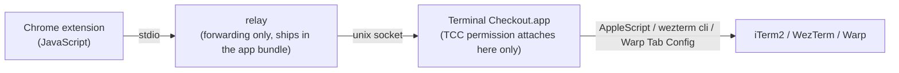

# Terminal Checkout

[](https://github.com/dazebug/terminal-checkout/actions/workflows/ci.yml)
[](LICENSE)

**One click from GitHub to your Mac terminal.**

Terminal Checkout puts configurable buttons on GitHub PR, issue, and repository pages. Press one and your command runs in a new tab of iTerm2, WezTerm, or Warp — check out the branch, create a worktree, or launch a [Claude Code](https://claude.com/claude-code) session that has already read the issue. It ships as a Chrome extension plus a native macOS app.

## Features

- **Buttons where you work** — up to 3 buttons each on PR, issue, and repository pages; labels are free-form (emoji or short text). Clicking the extension icon runs the first button for the page you're on.
- **Any command** — templates with `{repo}`, `{branch}`, `{base}`, `{number}`, … variables, validated against a strict character whitelist before anything runs.
- **Claude Code hand-off** — if your command starts `claude`, up to 5 scheduled inputs are typed and submitted for you once claude is actually ready — slash commands and `!` shell-mode lines included.
- **Opens where you are** — new tabs are created in the terminal window you're currently looking at (best effort, with explicit fallbacks when no window can be found).
- **Minimal permissions by design** — Chrome itself gets no terminal control. Only the app holds a single "Terminal Checkout → iTerm2" Automation permission; WezTerm needs no TCC permission, and Warp needs the Accessibility permission only for the optional claude-input feature.
- **Settings that follow you** — buttons and commands live in Chrome `storage.sync` and follow your Google account across machines.

## How it works

macOS attributes Automation (Apple Events) permission to the "responsible process". If Chrome spawned a native host that drove the terminal directly, the permission would attach to **Chrome**, and you'd have to grant terminal control to the whole browser. Terminal Checkout splits the path so that never happens:



- The relay Chrome spawns contains no terminal or command logic — it forwards bytes to the app's unix socket, and if the app isn't running it launches the app in the background, so you don't need to keep the app open.
- **Terminal Checkout.app** — launched via LaunchServices, so it is its own responsible process — validates the request, renders the command, and drives the terminal.
- Warp has one extra piece: it has no API for sending text to a pane, so a button with scheduled claude input first launches a small injection helper (`terminal-checkout-warp-helper`, shipped inside the app bundle) in the new tab, and the app hands the input to it. The helper writes only into that tab's tty and exits on its own when delivery finishes or the tab closes. Confirming that claude received the input requires reading the screen — that's why claude input on Warp needs the Accessibility permission.

## Requirements

- macOS 13+
- Google Chrome
- One of iTerm2, WezTerm, or Warp
- Swift toolchain, for building (Command Line Tools via `xcode-select --install` is enough)
- A way for the commands to reach your repository on disk: [zoxide](https://github.com/ajeetdsouza/zoxide)/[z.sh](https://github.com/rupa/z), a **base directory** set in the app, or both — see [Getting into the repository](#getting-into-the-repository)
- Optional: [gh](https://cli.github.com) for the issue presets and for cloning a repository you don't have locally yet, `claude` for claude input

On every launch the app checks `z`, `gh`, and `claude` in a login shell and flags only the missing ones in the setup window. With a base directory set, a missing `z` is a note rather than an error — the commands fall back to that folder.

## Installation

### 1. Decide how commands find your repositories

The buttons run a command that starts by moving into the repository. Give it at least one way to get there — the two combine, and `z` is always tried first:

**zoxide** — jumps to a repository wherever it lives (skip if you already have it):

```bash
brew install zoxide
```

Add this line to `~/.zshrc`, then `source ~/.zshrc`:

```bash
eval "$(zoxide init zsh)"
```

> zoxide learns the directories you visit, so a repository you have never `cd`'d into isn't in its database yet. Until it is, `z <folder>` fails — which is exactly what the base directory covers.

**A base directory** — the folder you keep repositories in, e.g. `~/Codes`. You set it in the app's setup window, in installation step 3 below. It is used whenever `z` fails, and it clones the repository if you don't have it locally yet, so a first click works on a repository you've never opened. Details: [Getting into the repository](#getting-into-the-repository).

### 2. Build and install the app

```bash
git clone https://github.com/dazebug/terminal-checkout.git
cd terminal-checkout
./install.sh
```

`install.sh` builds the app, installs it to `~/Applications/Terminal Checkout.app`, and launches it. No sudo, non-interactive, idempotent.

### 3. Finish in the setup window

> **Note:** The app's own UI is still in Korean — localization is tracked in [#24](https://github.com/dazebug/terminal-checkout/issues/24). Until it lands, the English labels used in this README appear in the app as: Install in Chrome = 「Chrome에 설치하기」, Request iTerm2 Permission = 「iTerm2 권한 요청」, Run in Terminal = 「터미널에서 실행」, Run Test = 「동작 테스트」, Open Extension Options Page = 「확장 옵션 페이지 열기」, Show Setup Guide Again = 「설치 안내 다시 보기」, Open System Settings = 「시스템 설정 열기」, Register/Update = 「등록/업데이트」, Repository base folder = 「저장소 기본 폴더」, Choose Folder… = 「폴더 선택…」.

When the app opens, walk through the setup window in order. Native Host registration and extension-folder preparation finish automatically at launch; the window is state-driven — completed cards disappear, remaining only as the pipeline lights (●) at the top.

1. **Extension** — click [Install in Chrome]. The extension folder path is copied to your clipboard, `chrome://extensions` opens, and the window shows a ①→④ guide:
   - Turn on **Developer mode** (top right)
   - Click **Load unpacked** (top left)
   - In the file picker: **⇧⌘G → ⌘V (paste) → Enter → [Select]**
   - **Keep Developer mode on** — from Chrome 133, turning it off disables unpacked extensions
   - This step is marked complete when the app first receives a request from the extension — press any Terminal Checkout button on GitHub once
2. **Terminal** — choose iTerm2, WezTerm, or Warp
3. **iTerm2 control permission** (shown only when iTerm2 is selected and not yet granted) — click [Request iTerm2 Permission] and allow the prompt. The permission goes to this app only; WezTerm and Warp need none.
   - **Warp claude input** (shown only when Warp is selected and not granted) — allow the Accessibility permission. It's used to confirm on the Warp screen that claude received the input; without it, commands still run but scheduled claude input is not delivered. Keep the tab visible during delivery.
4. **Repository base folder** — the folder you keep repositories in (`~/Codes`, say); type it or pick it with [Choose Folder…]. Leave it empty and the commands only use `z`, exactly as before. Filled in, a button works even on a repository you have never opened locally — see [Getting into the repository](#getting-into-the-repository)
5. **Run Test** — click [Run in Terminal]; you're done when `echo` runs in a new terminal tab

Once setup completes, the window keeps only the terminal selection, the repository base folder, Run Test, [Open Extension Options Page], and [Show Setup Guide Again].

> Already using Terminal Checkout on another machine? If Chrome syncs under the same Google account, your buttons and commands come down automatically after you load the extension — no reconfiguration needed.

> Once distribution moves to the Chrome Web Store (unlisted), the unpacked-extension steps above will shrink to a store install; the app install and permission steps stay.

The app is invisible in daily use — no menu-bar icon, and it appears in the Dock only while the setup window is open. Reopen the window any time by launching **Terminal Checkout** from Spotlight (⌘Space) or Launchpad. Pressing an extension button starts the app automatically if it's off.

## Updating

```bash
git pull --ff-only
./install.sh
```

Then refresh the extension at `chrome://extensions` (↻ on the Terminal Checkout card). Rebuilding changes the ad-hoc signing identity, so macOS may ask for the Automation permission again — allow it once.

> **Updating from a version without the base directory?** Your saved buttons keep the exact command you already had — nothing rewrites them. The presets now open with `{cd}` instead of `z {repo}`; to move a button onto it, open the extension options page, apply the preset again on that button, and press **Save**.

## Usage

### PR pages

A button appears next to the branch name in the PR header. The default command checks out the PR branch; if checkout fails (e.g. the branch is checked out in a worktree), it moves to the worktree at the conventional path `../{repo}-{branch_underbar}`:

```bash
{cd} && git fetch origin && { git checkout {branch} || cd ../{repo}-{branch_underbar}; }
```

`{cd}` is the clause that moves into the repository — the app renders it, and what it expands to depends on your base directory ([Getting into the repository](#getting-into-the-repository)).

The default command assumes the PR branch exists on `origin` — i.e. a same-repository PR. It doesn't fetch branches that live on a fork; a fork-safe preset (via `gh pr checkout {number}`) is planned.

### Issue pages

A button appears next to the status badge (Open/Closed), configured separately from PR buttons. The default **Read Issue** button launches claude in the repository directory, then feeds it these lines in order — a claude input starting with `!` is run in the shell by claude, so the `gh` output lands directly in claude's context:

```bash
!gh issue view {number}                       # body and metadata
!gh issue view {number} --comments            # comments
!gh api repos/{owner}/{repo}/issues/{number}/timeline \
  --jq '[.[]|select(.event=="cross-referenced")|.source.issue.number]'   # issues/PRs that mention this one
```

This preset needs `gh` (`brew install gh`, then `gh auth login`); the setup window warns you if it's missing.

### Repository pages

A button appears next to the repository name in the header. The default **Open in Terminal** button moves into the repo directory (`{cd}`). Since this button takes the shape of GitHub's green action button, a text label like `Open in Terminal` suits it better than an emoji. On GitHub pages that are neither PR nor issue, the extension icon runs this set's first button.

### claude input

If the command runs `claude`, the options page lets you schedule up to 5 inputs per button — e.g. `/review` followed by `Summarize the changes in PR {branch}`. The app types them in order only after confirming the new tab's foreground process has become claude — the delivery gates are designed to fail closed, dropping input rather than typing into a shell; if claude doesn't appear within 2 minutes, the inputs are quietly dropped. Each input is submitted only after it's confirmed as actually typed on screen, so delivery holds while claude's trust prompt for a first-time folder is up — accept within 15 seconds and it continues; take longer and delivery is abandoned from that input on.

Known limits:

- Inputs are single-line only.
- Not delivered when WezTerm was off and a fresh process was started (fallback), or on Warp when the injection helper failed to launch or the Accessibility permission is missing — the command itself still runs.
- **On Warp, delivery happens only while you're looking at that tab.** Warp renders only the focused tab, so the app submits input only after confirming its own tab is on screen. Switching away pauses delivery; coming back resumes it.

## Configuration

Installation, terminal selection, and permissions live in the app's setup window. Buttons, commands, and the main branch live in the extension options page — [Open Extension Options Page] in the setup window, or `chrome://extensions` → Terminal Checkout → Extension options.

- Reorder button cards by dragging the `⠿` handle, or focus the handle and press `↑` `↓`. [Duplicate] creates a copy right after the original (its tooltip gets a `(1)`-style suffix). This order is the order buttons appear on GitHub, and the first button is what the extension icon runs.
- Settings are stored in Chrome's `storage.sync`. The extension ID is pinned by the manifest `key`, so Chromes signed into the same Google account (with "Extensions" enabled in sync) share settings across machines.
- The **backup** section's [Export (JSON)] / [Import…] cover account-less migration and reinstall insurance. Import only fills the form — review and press **Save** to apply.

### Getting into the repository

Every preset opens with `{cd}`, the clause that moves into the repository. The app renders it from the **base directory** in its setup window:

| Base directory | What `{cd}` becomes |
|:---|:---|
| not set | `z {repo}` |
| `<base>` | `z {repo}`, falling back to `<base>/{repo}` **if that is a git repository**, falling back to `gh repo clone {owner}/{repo} <base>/{repo}` |

`z` is tried first either way, so a jump it makes is never overridden, and with no base directory the command is exactly what it was before this setting existed. That is also the failure the setting removes: a freshly installed zoxide has an empty database, `z {repo}` exits non-zero with `zoxide: no match found`, and nothing after the first `&&` runs. The command *was* delivered and the failure happened inside your shell, so the button still reports success and nothing on screen contradicts it.

With a base directory, that same button falls through to the folder and clones the repository when it isn't there — which also covers not having zoxide at all, since `command not found` fails the same way. Cloning goes through `gh`, so it follows your `gh` protocol and auth settings and works for private repositories.

The middle step checks that `<base>/{repo}` really is a git repository rather than just entering it. A directory that exists but isn't a checkout — an empty folder left over from an interrupted clone, a scratch directory — would otherwise pass for "found it", and the rest of the command (`git fetch`, `git checkout`) would run there. When the check fails, git says so on screen (`fatal: not a git repository`) and the clone step takes over; if that folder isn't empty, the clone stops with `destination path ... already exists and is not an empty directory` rather than touching what's in it.

The value lives in the app rather than the extension because it is machine-specific: extension settings sync across your Google account, and an absolute path from one machine is wrong on the next. For the same reason the extension can't send it — a request that tries is rejected.

### Variables

| Variable | Value | PR | Issue | Repo |
|:---|:---|:---:|:---:|:---:|
| `{cd}` | move into the repository — filled in by the app, not the page ([above](#getting-into-the-repository)) | ✓ | ✓ | ✓ |
| `{repo}` | repository name | ✓ | ✓ | ✓ |
| `{owner}` | repository owner (for `gh api repos/{owner}/{repo}/…`) | ✓ | ✓ | ✓ |
| `{main}` | main branch (per-repo override → page detection → global default) | ✓ | ✓ | ✓ |
| `{number}` | PR/issue number (digits only) | ✓ | ✓ | — |
| `{branch}` | the PR's head branch (the side being merged) | ✓ | — | — |
| `{base}` | the PR's base branch (the side merged into — exactly as read from the PR page) | ✓ | — | — |
| `{branch_underbar}` | `{branch}` with `/` replaced by `_` (for worktree directory names etc.) | ✓ | — | — |

Variables work identically in commands and claude inputs. Using a variable the page doesn't have (the `{branch}` family on issue/repo buttons, `{number}` on repo buttons) gets the run rejected. `{cd}` is the exception to "the page provides it" — the app supplies that one, on every page, and it needs `{repo}` to be available.

**`{main}`** is resolved as per-repo override → page detection → global default. Detection reads a different spot per page: PR pages read the base branch, while repository and issue pages read the repository's **default branch** that GitHub embeds in the page — so repos whose default branch is `master` are right without an override, on any `/tree/...` path. Register an override if you want to cover detection failure too.

**`{base}`** is the branch the PR actually merges into, read from the PR page as-is — no override, no fallback. `{main}` and `{base}` usually match, but they diverge when a per-repo override is set or the PR targets another branch (e.g. `release/2`). Use `{base}` for commands that must operate on the true merge target (`git merge --ff-only origin/{base}`, `git rebase origin/{base}`, …). If it can't be read from the page, it isn't sent and the run is rejected rather than silently substituted.

## Development

```bash
cd app && swift test   # Core unit tests
node --test            # extension (JS) pure-function unit tests — repo root, no dependencies
app/build.sh           # build the app bundle (app/build/Terminal Checkout.app)
app/e2e.sh             # relay ↔ socket ↔ server round-trip regression test (after building)
```

Architecture constraints and measured pitfalls are recorded in [`CLAUDE.md`](CLAUDE.md). Adding support for a new terminal? Start from [`docs/new-terminal-checklist.md`](docs/new-terminal-checklist.md).

## Security

- Chrome launches the Native Host relay only for whitelisted extension IDs (`allowed_origins`) — enforced by Chrome, not by the relay itself
- Variable values pass an alphanumeric + `-_./` whitelist, preventing command injection
- The app socket and the Warp injection helper deliberately trust processes of the same user (uid): mode 0600 + peer verification on the socket, and the helper is killed the moment delivery ends — see [SECURITY.md](SECURITY.md) for the full trust model
- The extension runs only on `https://github.com`

## Troubleshooting

**"Native host has exited" / the extension doesn't respond** — Open the setup window (launch Terminal Checkout from Spotlight); problem cards appear automatically. If the Chrome connection card shows, press [Register/Update]. If you moved the repository or reinstalled the app, run `./install.sh` again.

**You denied a permission** — [Open System Settings] in the setup window → **Privacy & Security → Automation → Terminal Checkout → iTerm2**. Warp's screen reading is the **Accessibility** item on the same screen.

**claude input isn't delivered on Warp** — First: were you looking at that tab until delivery finished? Switching away makes the app wait (it resumes when you return). Then check the **Accessibility** permission in the setup window — without screen reading, the app gives up delivery rather than risk a wrong submission. If permission is fine, the injection helper likely failed to launch; the reason is in `log show --predicate 'subsystem == "com.dazebug.terminal-checkout"' --last 15m --info`. Reinstalling (`./install.sh`) also refreshes the bundled helper.

**Permission prompts again after rebuilding** — Ad-hoc signing means a rebuild changes the signing identity; allow the Automation prompt once more.

**`zoxide: no match found`, and nothing after it runs** — zoxide has never recorded that repository, so the first clause of the command fails and the `&&` chain stops there. The app can't see this: the command was delivered and died inside your shell, so the button still reports success. Set a **repository base folder** in the setup window and the command falls through to `<base>/<repo>`, cloning it when missing — or `cd` into the repository once by hand, which is what teaches zoxide. See [Getting into the repository](#getting-into-the-repository).

**`z` doesn't work** — Make sure your terminal uses a login shell and zoxide/z is set up in your shell config (`.zshrc`, `.bashrc`). A base folder covers this case too, since a missing `z` fails the same way a cold database does.

**Buttons don't appear** — GitHub UI updates can move button anchors. Clicking the extension icon is an alternative path that doesn't depend on those anchors — it reads the same page data, so it can fail too; failures land in the service-worker console.

## Uninstall

```bash
./uninstall.sh
```

Remove the Chrome extension yourself at `chrome://extensions`.

## License

[MIT](LICENSE)
