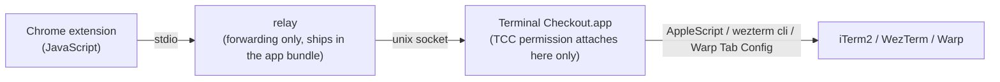

# Terminal Checkout

[](https://github.com/dazebug/terminal-checkout/actions/workflows/ci.yml)
[](LICENSE)

**One click from GitHub to your Mac terminal.**

Terminal Checkout puts configurable buttons on GitHub PR, issue, and repository pages. Press one and your command runs in a new tab of iTerm2, WezTerm, or Warp — check out the branch, create a worktree, or launch a [Claude Code](https://claude.com/claude-code) session that has already read the issue. It ships as a Chrome extension plus a native macOS app.

## Features

- **Buttons where you work** — up to 3 buttons each on PR, issue, and repository pages; labels are free-form (emoji or short text). Clicking the extension icon runs the first button for the page you're on.
- **Any command** — templates with `{repo}`, `{branch}`, `{base}`, `{number}`, … variables, validated against a strict character whitelist before anything runs.
- **Claude Code hand-off** — if your command runs `claude`, up to 5 scheduled inputs are handed over for you. `!` lines are typed into claude's shell mode so they really run as commands, with a run of them merged into one line; a list holding exactly one plain-text line is handed over as claude's opening message instead, with no typing at all.
- **Opens where you are** — new tabs are created in the terminal window you're currently looking at (best effort, with explicit fallbacks when no window can be found).
- **Minimal permissions by design** — Chrome itself gets no terminal control. Only the app holds a single "Terminal Checkout → iTerm2" Automation permission; WezTerm needs no TCC permission, and Warp needs the Accessibility permission for buttons whose claude inputs are typed — which is every shipped preset that schedules claude input, since all three use `!`.
- **Settings that follow you** — buttons and commands live in Chrome `storage.sync` and follow your Google account across machines.
- **Five languages** — English, Korean, Japanese, Simplified Chinese and Traditional Chinese. The app follows macOS (or the language you pick in it); the extension follows Chrome. See [Language](#language) for how each side resolves and which translations are a machine-translated first pass.

## How it works

macOS attributes Automation (Apple Events) permission to the "responsible process". If Chrome spawned a native host that drove the terminal directly, the permission would attach to **Chrome**, and you'd have to grant terminal control to the whole browser. Terminal Checkout splits the path so that never happens:



- The relay Chrome spawns contains no terminal or command logic — it forwards bytes to the app's unix socket, and if the app isn't running it launches the app in the background, so you don't need to keep the app open.
- **Terminal Checkout.app** — launched via LaunchServices, so it is its own responsible process — validates the request, renders the command, and drives the terminal.
- Turning the scheduled inputs into "what gets typed" and "what rides in argv" happens in the app, before the terminal branch, so it works the same on all three terminals. A request either types everything or appends everything — never both in one session.
- Warp has one extra piece: it has no API for sending text to a pane, so a button whose claude inputs are **typed** first launches a small injection helper (`terminal-checkout-warp-helper`, shipped inside the app bundle) in the new tab, and the app hands the inputs to it. The helper writes only into that tab's tty and exits on its own when delivery finishes or the tab closes. Confirming that claude received the input requires reading the screen — that's why typed claude input on Warp needs the Accessibility permission. A button with no claude input, or whose one input is a plain-text line, launches no helper and needs no permission — 8 of the 11 shipped presets are in that shape, because they schedule no claude input at all.

## Requirements

- macOS 13+
- Google Chrome
- One of iTerm2, WezTerm, or Warp
- Swift toolchain, for building (Command Line Tools via `xcode-select --install` is enough)
- A way for the commands to reach your repository on disk: [zoxide](https://github.com/ajeetdsouza/zoxide)/[z.sh](https://github.com/rupa/z), a **base directory** set in the app, or both — see [Getting into the repository](#getting-into-the-repository)
- Optional: [gh](https://cli.github.com) for the issue presets and for cloning a repository you don't have locally yet, `claude` for claude input

On every launch the app checks `z`, `gh`, and `claude` in a login shell and flags only the missing ones in the setup window. With a base directory set, a missing `z` is a note rather than an error — the commands fall back to that folder.

## Installation

### 1. Decide how commands find your repositories

The buttons run a command that starts by moving into the repository. Give it at least one way to get there — the two combine, and `z` is always tried first:

**zoxide** — jumps to a repository wherever it lives (skip if you already have it):

```bash
brew install zoxide
```

Add this line to `~/.zshrc`, then `source ~/.zshrc`:

```bash
eval "$(zoxide init zsh)"
```

> zoxide learns the directories you visit, so a repository you have never `cd`'d into isn't in its database yet. Until it is, `z <folder>` fails — which is exactly what the base directory covers.

**A base directory** — the folder you keep repositories in, e.g. `~/Codes`. You set it in the app's setup window, in installation step 3 below. It is used whenever `z` fails, and it clones the repository if you don't have it locally yet, so a first click works on a repository you've never opened. Details: [Getting into the repository](#getting-into-the-repository).

### 2. Build and install the app

```bash
git clone https://github.com/dazebug/terminal-checkout.git
cd terminal-checkout
./install.sh
```

`install.sh` builds the app, installs it to `~/Applications/Terminal Checkout.app`, and launches it. No sudo, non-interactive, idempotent.

### 3. Finish in the setup window

When the app opens, walk through the setup window in order. Native Host registration and extension-folder preparation finish automatically at launch; the window is state-driven — completed cards disappear, remaining only as the pipeline lights (●) at the top.

1. **Extension** — click [Install in Chrome]. The extension folder path is copied to your clipboard, `chrome://extensions` opens, and the window shows a ①→④ guide:
   - Turn on **Developer mode** (top right)
   - Click **Load unpacked** (top left)
   - In the file picker: **⇧⌘G → ⌘V (paste) → Enter → [Select]**
   - **Keep Developer mode on** — from Chrome 133, turning it off disables unpacked extensions
   - This step is marked complete when the app first receives a request from the extension. After Chrome loads it, open a GitHub PR, issue, or repository page and press any Terminal Checkout button once
2. **Language** — English, Korean, Japanese, Simplified Chinese, Traditional Chinese, or [Follow the system language] (the default). This is the **app's** language; the extension follows Chrome. See [Language](#language)
3. **Terminal** — choose iTerm2, WezTerm, or Warp
4. **iTerm2 control permission** (shown only when iTerm2 is selected and not yet granted) — click [Request iTerm2 Permission] and allow the prompt. The permission goes to this app only; WezTerm and Warp need none.
   - **Warp claude input** (shown only when Warp is selected and not granted) — allow the Accessibility permission. It's used to confirm on the Warp screen that claude received input that was **typed** into the session — which is every `!` input, and therefore the three shipped presets that schedule claude input. Without it such a button is **refused outright**: no tab opens, and the button shows ❌ rather than running the command with the input missing. Keep the tab visible during delivery. Only buttons with no claude input, or whose one input is a plain-text line, avoid this path.
5. **Repository base folder** — the folder you keep repositories in (`~/Codes`, say); type it or pick it with [Choose Folder…]. Leave it empty and the commands only use `z`, exactly as before. Filled in, a button works even on a repository you have never opened locally — see [Getting into the repository](#getting-into-the-repository)
6. **Run Test** — click [Run in Terminal]; you're done when `echo` runs in a new terminal tab

Once setup completes, the window keeps only the language, the terminal selection, the repository base folder, Run Test, [Open Extension Options Page], and [Show Setup Guide Again].

> Already using Terminal Checkout on another machine? If Chrome syncs under the same Google account, your buttons and commands come down automatically after you load the extension — no reconfiguration needed.

> Once distribution moves to the Chrome Web Store (unlisted), the unpacked-extension steps above will shrink to a store install; the app install and permission steps stay.

The app is invisible in daily use — no menu-bar icon, and it appears in the Dock only while the setup window is open. Reopen the window any time by launching **Terminal Checkout** from Spotlight (⌘Space) or Launchpad. Pressing an extension button starts the app automatically if it's off.

## Updating

```bash
git pull --ff-only
./install.sh
```

Then refresh the extension at `chrome://extensions` (↻ on the Terminal Checkout card). Rebuilding changes the ad-hoc signing identity, so macOS may ask for the Automation permission again — allow it once.

> **Presets improved since you last saved?** Your saved buttons keep the exact command you already had — nothing is rewritten behind your back. When the presets move on, the options page shows an update notice listing each affected button as `old → new`, saying what the change does, with a checkbox per item. Rewrites of presets we shipped are pre-checked; a command you customized is offered unchecked and marked as a behavior change, because the rest of it will now run wherever the new entry clause lands. Applying only fills the form; the write goes through the same **Save** as any other edit, and declining ("Keep mine") is recorded too, so the notice doesn't come back. If another device changed your settings while this page was open, Save is refused rather than overwriting them — reload to see them, exporting first if you have unsaved edits. A command you customized is rewritten only when its first clause is exactly the old one — anything else is listed for you to handle. Since the schema version travels in `storage.sync`, deciding once settles it on every machine on your account.

## Usage

### PR pages

A button appears next to the branch name in the PR header. The default command checks out the PR branch; if checkout fails (e.g. the branch is checked out in a worktree), it moves to the worktree at the conventional path `../{repo}-{branch_underbar}`:

```bash
{cd} && git fetch origin && { git checkout {branch} || cd ../{repo}-{branch_underbar}; }
```

`{cd}` is the clause that moves into the repository — the app renders it, and what it expands to depends on your base directory ([Getting into the repository](#getting-into-the-repository)).

The default command assumes the PR branch exists on `origin` — i.e. a same-repository PR. It doesn't fetch branches that live on a fork; a fork-safe preset (via `gh pr checkout {number}`) is planned.

### Issue pages

A button appears next to the status badge (Open/Closed), configured separately from PR buttons. The default **Read Issue** button launches claude in the repository directory and then types these lines into it — a claude input starting with `!` runs in claude's shell mode, so `gh` really runs in that session and its output is there as command output. The three of them go in as one merged line:

```bash
!gh issue view {number}                       # body and metadata
!gh issue view {number} --comments            # comments
!gh api repos/{owner}/{repo}/issues/{number}/timeline \
  --jq '[.[]|select(.event=="cross-referenced")|.source.issue.number]'   # issues/PRs that mention this one
```

This preset needs `gh` (`brew install gh`, then `gh auth login`); the setup window warns you if it's missing.

### Repository pages

A button appears next to the repository name in the header. The default **Open in Terminal** button moves into the repo directory (`{cd}`). Since this button takes the shape of GitHub's green action button, a text label like `Open in Terminal` suits it better than an emoji. On GitHub pages that are neither PR nor issue, the extension icon runs this set's first button.

### claude input

If the command runs `claude`, the options page lets you schedule up to 5 inputs per button — e.g. `!gh pr diff {number}` followed by `Summarize the risky parts`. Most of them are **typed into the session**, because that is the only way a `!` line becomes a real shell command; a list holding exactly one plain-text line skips the typing and rides along as claude's opening message instead.

**`!` inputs are typed, and a run of them is typed as one line.** A `!` line only means "run this in the shell" to claude's own input box: passed as an argument at startup it arrives as ordinary text, and claude then decides to run it with its Bash tool — which can stop for a permission prompt and costs a turn (measured). Typed, it runs as a command and stays in the session as one.

- **Consecutive `!` inputs are merged into a single line** joined with `;`, each preceded by a banner so the outputs can be told apart. Three inputs are then one type-and-submit cycle instead of three. `;` and not `&&`: separate `!` lines never stopped each other, and the merge keeps that — a failing command does not swallow the ones after it.
- **Merging is skipped when it would change what runs.** Submitted separately, each `!` line gets a fresh shell — `!export TOKEN=x` does not carry into the next input — but a merged line shares one. So a run containing anything that changes shell state (`cd`, `export`, `source`, `set`, `exit`, `VAR=…`) is typed one input at a time, as is a run whose syntax could run past its own end. That second test is deliberately blunt: **any unquoted `#` or `=` stops the merge wherever it sits**, and so do a heredoc, a trailing `&`, an unterminated quote, a compound-command keyword (`if`, `for`, `while`, `case`…), and a body that begins or ends with an operator. `echo a#b` is harmless and gets typed on its own anyway — the check does not try to prove which `#` is a comment, because it got that wrong twice. Quote it (`echo 'a#b'`) and the run merges again. It costs a cycle and keeps `["!cd sub", "!rm -rf build"]` deleting the directory you meant.
- **A merged line longer than 4 KiB is typed input by input instead.** Nothing is ever truncated — the limit exists because Warp's injection helper refuses more than 8 KiB in one request, and merging, being the optimisation, is what gives way.
- What runs is exactly the text you wrote, in the directory claude is running in, through claude's shell mode — so it appears in the session as a command, with its output, the way it would if you had typed it.
- A plain-text input, a slash command and a `#` memory line are each typed on their own; a run of `!` ends at the first input that is not one.
- An input containing a NUL byte is rejected outright rather than delivered altered — a tty cannot carry it.

**A list holding exactly one plain-text input becomes the opening message instead.** Plain text is just a message, so it is appended to your command as claude's first argument and the session starts with it already in — no typing, no screen reading, no waiting for claude to boot. The rules for that append:

- It is handed to **`command claude`**, not to `claude`. `command` is POSIX for "skip functions and aliases, run the executable", so a wrapper of that name cannot receive your text. It does **not** skip shell builtins, which is why a command that loads one (`zmodload`, `enable`) stops the append instead.
- Because of that, **appending needs a `claude` executable to exist**. The app asks your login shell at startup — in a child shell, so a function or an alias of yours does not hide the file behind it, and it checks the file is actually runnable. If `claude` is *only* a function or an alias, the inputs are typed instead, and the setup window says so.
- The append only happens when the rendered command is a plain chain (`&&`, `||`, `;`, `|`, groups, subshells) whose **last command is a bare `claude`** — no flags, not on the receiving end of a pipe, no redirect, nothing after it. Flags are out because some of them (`--resume`) swallow the argument as their own value.
- Beyond that, **every word of the command has to be one that would be safe as a command name**: nothing that can rebind a name in that shell (`function`, `alias`, `eval`, `source`/`.`, `hash`, `trap`, `export`, an assignment like `PATH=…`, a compound keyword such as `if`/`for`/`while`/`case`) and nothing quoted or expanded, which the app cannot read. The price is over-folding — `git add . && claude` and anything with a quoted argument are typed instead, which is what they did before.
- Your login shell has to be POSIX-family (`sh`, `bash`, `zsh`, `dash`, `ksh`…), and the message must be single-line. In csh/tcsh a `!` anywhere in your text is history-expanded **even inside single quotes** and takes the whole command line with it (measured: `echo START; /bin/echo -- 'do it!x'` prints only `x: Event not found.` — `START` never runs), and a newline would end the command line early in both iTerm2 and WezTerm.
- **Mixing is not allowed.** If the list has plain text *and* anything else, everything is typed. Sending an opening message and typing into the same session races claude's startup: submitting that message clears the input box 2–3 seconds in, and anything typed before then is wiped (measured).
- What the app still cannot see, because it needs your shell and filesystem at run time: a **`PATH` that resolves `claude` to a different program**, and a **`command` function or alias in your rc**, which would capture the invocation above.

**What typing costs, and what the app will and won't tell you.** Typed delivery is the normal path now, so it is worth knowing what it does to the session:

- The app waits up to **2 minutes** for claude to be ready in the new tab, then gives up and says so in its log. It never types into the shell: it waits for claude to be the foreground process with the tty in raw mode first.
- Before each input it types a short random marker, watches it appear, clears the box, and watches it go — that is how it knows the screen it reads is this pane, that what appears is really in the input box, and that the terminal's Ctrl+U was actually acted on. Then it types the input once and submits it.
- Those clears mean **a draft you start typing while delivery is running is erased**: one Ctrl+U per input, plus one when delivery ends. That is deliberate — the alternative is our line sitting in your box waiting for your Enter, and with a `!` line that Enter runs a command.
- Delivery holds while claude's trust prompt for a first-time folder is up. Accept within about **15 seconds** and it continues; take longer and it gives up from that input on.
- The log says **sent**, not delivered. Whether claude turned a submitted line into a message is not something anything outside the TUI can establish, so the app does not claim it. If a return key never took effect, that input is lost and the log still counts it as sent.
- **On Warp, delivery only runs while you're looking at that tab** (see below).

Known limits:

- Inputs are single-line only.
- A button whose inputs are typed — every button with a `!` input — is **refused before anything opens** when the app can already tell it couldn't deliver them: on Warp without the Accessibility permission or without the bundled injection helper, and on WezTerm when no WezTerm window is running (a fresh process gives no addressable pane). The button shows ❌ and no tab is created — better than a claude session sitting there with none of its context. Buttons whose single input rides in argv, and buttons with no claude input, are unaffected — merging `!` lines into one typed line does not avoid this, because the line is still typed.
- **On Warp, the typed route runs only while you're looking at that tab.** Warp renders only the focused tab, so the app submits input only after confirming its own tab is on screen. Switching away pauses delivery; coming back resumes it. The argv opening message is unaffected — it never touches the screen.

## Configuration

Installation, terminal selection, and permissions live in the app's setup window. Buttons, commands, and the main branch live in the extension options page — [Open Extension Options Page] in the setup window, or `chrome://extensions` → Terminal Checkout → Extension options.

- Reorder button cards by dragging the `⠿` handle, or focus the handle and press `↑` `↓`. [Duplicate] creates a copy right after the original (its tooltip gets a `(1)`-style suffix). This order is the order buttons appear on GitHub, and the first button is what the extension icon runs.
- Settings are stored in Chrome's `storage.sync`. The extension ID is pinned by the manifest `key`, so Chromes signed into the same Google account (with "Extensions" enabled in sync) share settings across machines.
- The **backup** section's [Export (JSON)] / [Import…] cover account-less migration and reinstall insurance. Import only fills the form — review and press **Save** to apply. The file records which generation of the presets it was written against: an older backup gets the same update notice, covering the whole form afterwards rather than just the keys the file carried, and a backup from a newer extension is refused instead of half-read.

### Language

Terminal Checkout ships **English, Korean, Japanese, Simplified Chinese and Traditional Chinese**, and **each side follows its own platform**. The app's language is the **Language** card in its setup window, defaulting to your macOS language. The extension's language is **Chrome's** — the display language at `chrome://settings/languages` — because that is where a browser extension's language lives, and Chrome has no per-extension setting for it. So there is no language control in the extension, and **the two can differ**: Japanese macOS with English Chrome shows a Japanese app and English buttons. That is what the two platforms answer, not a fault to report.

- **[Follow the system language]** is the default. It follows your macOS language order and picks the first of the five it can answer; a language none of them covers falls back to **English**. Choose an explicit language and it is honoured as chosen — it never falls through to a third language you did not name. The list is written in each language's own script, so you can find your way back out of one you cannot read.
- **The app's own text changes immediately.** System dialogs drawn by macOS — file pickers, alerts, the menu bar's standard items — follow from the **next launch**, which is why the card offers a restart. Pressing restart while a claude input is still being delivered does nothing except say so: the delivery would be cut off, so it is refused rather than queued, and you press again when it has finished.
- **The extension does not ask the app anything.** It reads Chrome's display language every time it draws, so changing that language and reloading a page is all it takes — nothing to restart, nothing to wait for, and nothing that can be out of date. A language Chrome is set to that we do not ship falls back to **English**, and the page says so in its own `lang` attribute.
- `zh-Hant` covers Hong Kong and Macau as well, which is what macOS itself does with those regions.
- **[Follow the system language] clears only this app's own override.** If you launch the app with an `-AppleLanguages` argument, or something with higher priority sets that key, it still wins — and the symptom looks the same from outside: every app follows the macOS language except this one. The macOS permission prompt is a separate case again: it is drawn by macOS itself, and whether it follows your choice here is not known.

> **Translation notice.** English and Korean are written by hand. **Japanese, Simplified Chinese and Traditional Chinese are a machine-translated first pass and have not been reviewed by a speaker.** They are shipped that way on purpose — a rough translation you can read beats a language you cannot — and corrections are welcome as issues or pull requests. Nothing we translate reaches a shell: the test command and the clause the app builds to enter a repository are fixed English by construction — your own command templates are yours and are never touched — so a translation cannot change what runs.

### Getting into the repository

Every preset opens with `{cd}`, the clause that moves into the repository. The app renders it from the **base directory** in its setup window:

| Base directory | What `{cd}` becomes |
|:---|:---|
| not set | `z {repo}` |
| `<base>` | `z {repo}`, falling back to `<base>/{repo}` **if that is a git repository**, falling back to `gh repo clone {owner}/{repo} <base>/{repo}` |

`z` is tried first either way, so a jump it makes is never overridden, and with no base directory the command is exactly what it was before this setting existed. That is also the failure the setting removes: a freshly installed zoxide has an empty database, `z {repo}` exits non-zero with `zoxide: no match found`, and nothing after the first `&&` runs. The command *was* delivered and the failure happened inside your shell, so the button still reports success and nothing on screen contradicts it.

With a base directory, that same button falls through to the folder and clones the repository when it isn't there — which also covers not having zoxide at all, since `command not found` fails the same way. Cloning goes through `gh`, so it follows your `gh` protocol and auth settings and works for private repositories.

The middle step checks that `<base>/{repo}` really is a git repository rather than just entering it. A directory that exists but isn't a checkout — an empty folder left over from an interrupted clone, a scratch directory — would otherwise pass for "found it", and the rest of the command (`git fetch`, `git checkout`) would run there. When the check fails, git says so on screen (`fatal: not a git repository`) and the clone step takes over; if that folder isn't empty, the clone stops with `destination path ... already exists and is not an empty directory` rather than touching what's in it.

The value lives in the app rather than the extension because it is machine-specific: extension settings sync across your Google account, and an absolute path from one machine is wrong on the next. For the same reason the extension can't send it — a request that tries is rejected.

### Variables

| Variable | Value | PR | Issue | Repo |
|:---|:---|:---:|:---:|:---:|
| `{cd}` | move into the repository — filled in by the app, not the page ([above](#getting-into-the-repository)) | ✓ | ✓ | ✓ |
| `{repo}` | repository name | ✓ | ✓ | ✓ |
| `{owner}` | repository owner (for `gh api repos/{owner}/{repo}/…`) | ✓ | ✓ | ✓ |
| `{main}` | main branch (per-repo override → page detection → global default) | ✓ | ✓ | ✓ |
| `{number}` | PR/issue number (digits only) | ✓ | ✓ | — |
| `{branch}` | the PR's head branch (the side being merged) | ✓ | — | — |
| `{base}` | the PR's base branch (the side merged into — exactly as read from the PR page) | ✓ | — | — |
| `{branch_underbar}` | `{branch}` with `/` replaced by `_` (for worktree directory names etc.) | ✓ | — | — |

Variables work identically in commands and claude inputs. Using a variable the page doesn't have (the `{branch}` family on issue/repo buttons, `{number}` on repo buttons) gets the run rejected. `{cd}` is the exception to "the page provides it" — the app supplies that one, on every page, and it needs `{repo}` to be available.

**`{main}`** is resolved as per-repo override → page detection → global default. Detection reads a different spot per page: PR pages read the base branch, while repository and issue pages read the repository's **default branch** that GitHub embeds in the page — so repos whose default branch is `master` are right without an override, on any `/tree/...` path. Register an override if you want to cover detection failure too.

**`{base}`** is the branch the PR actually merges into, read from the PR page as-is — no override, no fallback. `{main}` and `{base}` usually match, but they diverge when a per-repo override is set or the PR targets another branch (e.g. `release/2`). Use `{base}` for commands that must operate on the true merge target (`git merge --ff-only origin/{base}`, `git rebase origin/{base}`, …). If it can't be read from the page, it isn't sent and the run is rejected rather than silently substituted.

## Development

```bash
cd app && swift test   # Core unit tests
node --test            # extension (JS) pure-function unit tests — repo root, no dependencies
app/build.sh           # build the app bundle (app/build/Terminal Checkout.app)
app/e2e.sh             # relay ↔ socket ↔ server round-trip regression test (after building)

node tools/check-locales.js            # extension/_locales/ still matches extension/_i18n/ (node --test runs it too)
```

Architecture constraints and measured pitfalls are recorded in [`CLAUDE.md`](CLAUDE.md). Adding support for a new terminal? Start from [`docs/new-terminal-checklist.md`](docs/new-terminal-checklist.md). Why the project is shaped the way it is lives in [`docs/context/`](docs/context/index.md).

**Adding a language.** Four places, and the gates find the rest: add the tag to `supportedLocales` (`app/Sources/Core/Localization.swift`), add `app/Sources/App/Resources/<tag>.lproj/` with `Localizable.strings` and `InfoPlist.strings`, add `extension/_i18n/<tag>.js`, and add `extension/_locales/<chrome-code>/messages.json` with the extension's name and description — Chrome will not read those from anywhere else, and that directory is named in **Chrome's** locale codes rather than ours (`zh-Hans` is `zh_CN` there, `zh-Hant` is `zh_TW`). While the compatibility store still ships, the rest of that file must match it under the one Chrome-key conversion. `node tools/check-locales.js` checks that agreement but never writes either store: `_locales` is the authority, so do not regenerate it from `_i18n`. Then run the gates: the catalogue tests fail on a missing or extra key and on placeholders that disagree between languages, and `app/build.sh` fails if the built bundle does not match the source `.lproj` files byte for byte. Values are never translated for anything that reaches a shell — see the `ShellPayload` type and the note in [Language](#language).

## Security

- Chrome launches the Native Host relay only for whitelisted extension IDs (`allowed_origins`) — enforced by Chrome, not by the relay itself
- Variable values pass an alphanumeric + `-_./` whitelist, preventing command injection
- The app socket and the Warp injection helper deliberately trust processes of the same user (uid): mode 0600 + peer verification on the socket, and the helper is killed the moment delivery ends — see [SECURITY.md](SECURITY.md) for the full trust model
- The extension runs only on `https://github.com`

## Troubleshooting

**"Native host has exited" / the extension doesn't respond** — Open the setup window (launch Terminal Checkout from Spotlight); problem cards appear automatically. If the Chrome connection card shows, press [Register/Update]. If you moved the repository or reinstalled the app, run `./install.sh` again.

**You denied a permission** — [Open System Settings] in the setup window → **Privacy & Security → Automation → Terminal Checkout → iTerm2**. Warp's screen reading is the **Accessibility** item on the same screen.

**claude input isn't delivered on Warp** — Typed input (every `!` input, so all three shipped presets that schedule claude input) needs the Accessibility permission; a lone plain-text input, which rides in the opening message, does not. If the button showed ❌ and no tab opened, the app knew up front it couldn't deliver: grant **Accessibility** in the setup window (the window comes forward on its own to show you) or reinstall to restore the bundled helper. If the tab did open and only the input is missing: were you looking at that tab until delivery finished? Switching away makes the app wait (it resumes when you return). Otherwise the reason is in `log show --predicate 'subsystem == "com.dazebug.terminal-checkout"' --last 15m --info`.

**A claude input was typed instead of riding in the opening message** — That is the normal path for anything with a `!`, a slash command or a `#` line in the list: only a list holding exactly one plain-text input is appended to the command (two plain lines would need a newline between them, so they are typed). If a single plain-text input is still being typed, the command has to end in a bare `claude` (no trailing flag, redirect, pipe or comment), every word of it has to be readable and safe as a command name (`git add .`, `-m 'msg'`, `export …` and `PATH=…` all stop it), the message must be single-line, your login shell has to be POSIX-family, and `claude` has to be a real executable rather than a function or an alias.

**Permission prompts again after rebuilding** — Ad-hoc signing means a build whose code changed also changes the signing identity; allow the Automation prompt once more. The Accessibility grant fails worse than that: the old entry stays listed in System Settings with its switch on but no longer applies, and toggling it does not revive it. `./install.sh` compares the installed and freshly built code hashes and, only when they differ, resets that entry so you can grant it again — it matters only if you use Warp claude input. If the reset can't run, the script prints the single command to run yourself instead of doing anything interactive.

**`zoxide: no match found`, and nothing after it runs** — zoxide has never recorded that repository, so the first clause of the command fails and the `&&` chain stops there. The app can't see this: the command was delivered and died inside your shell, so the button still reports success. Set a **repository base folder** in the setup window and the command falls through to `<base>/<repo>`, cloning it when missing — or `cd` into the repository once by hand, which is what teaches zoxide. See [Getting into the repository](#getting-into-the-repository).

**`z` doesn't work** — Make sure your terminal uses a login shell and zoxide/z is set up in your shell config (`.zshrc`, `.bashrc`). A base folder covers this case too, since a missing `z` fails the same way a cold database does.

**Buttons don't appear** — GitHub UI updates can move button anchors. Clicking the extension icon is an alternative path that doesn't depend on those anchors — it reads the same page data, so it can fail too; failures land in the service-worker console.

## Uninstall

```bash
./uninstall.sh
```

Remove the Chrome extension yourself at `chrome://extensions`.

## License

[MIT](LICENSE)
