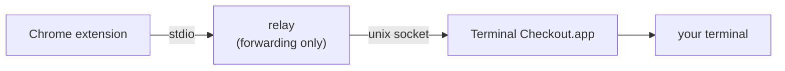

<div align="center">
  <p><a href="README.ko.md">🇰🇷 한국어</a> · <a href="README.zh-Hant.md">🇹🇼 繁體中文</a> · <b>🇺🇸 English</b> · <a href="README.ja.md">🇯🇵 日本語</a></p>
  
  <h1>Terminal Checkout</h1>
  <p><strong>One click from GitHub to your repo, branch, or worktree.</strong></p>
  <p>Start Claude Code and send it PR or issue context, with an optional note for this run.</p>
  <p>A Chrome extension and native macOS app. Claude Code is optional.</p>
  <p>
    <a href="https://github.com/dazebug/terminal-checkout/actions/workflows/ci.yml"></a>
    <a href="#requirements"></a>
    <a href="LICENSE"></a>
  </p>
  <p><a href="#installation">Installation</a> · <a href="#usage">Usage</a> · <a href="#supported-terminals">Terminals</a> · <a href="#troubleshooting">Troubleshooting</a> · <a href="CONTRIBUTING.md">Contributing</a></p>
</div>


## Features

- **13 presets, custom commands** — choose a workflow or define your own.
- **A worktree per PR** — open selected PRs in separate worktrees and terminal sessions.
- **Context for Claude Code** — `!gh …` lines run in claude's shell mode, then a one-off ▾ note for this run.
- **Chrome needs no terminal-control permission** — the permission attaches to the native app.
- **Synced buttons and commands** — Chrome sync across machines, with five interface languages.

## Installation

### Requirements

- macOS 13+, Google Chrome, and one of the [supported terminals](#supported-terminals)
- A Swift toolchain for building — the Command Line Tools (`xcode-select --install`) are enough
- Optional: [gh](https://cli.github.com) for the presets that call it and for cloning a repository you don't have yet, `claude` for Claude Code, and [zoxide](https://github.com/ajeetdsouza/zoxide), which finds your repositories wherever they live ([Getting into the repository](#getting-into-the-repository)). The shared problem area reports missing tools from your login shell when they affect a workflow.

### Supported terminals

| Terminal | Required setup | Conditions for typed Claude input |
|:---|:---|:---|
| iTerm2 | The Automation permission, granted to Terminal Checkout only | None beyond the permission |
| WezTerm | No macOS permission | A WezTerm window must already be running |
| Warp | No Automation permission | The Accessibility permission, and the target tab stays visible while input is delivered |
| cmux | Socket control mode `automation` (`password` and `allowAll` also work) | Shell integration must expose the surface's tty; delivery can continue in a background tab |
| cmux NIGHTLY | The same as cmux; a separate selection that never falls back to stable | The same as cmux |

The last column applies only to typed claude input. A button with no claude input, or whose one input rides in the opening message, needs only the required setup — see [claude input](#claude-input).

### <a name="2-build-and-install-the-app"></a>1. Build and install the app

```bash
git clone https://github.com/dazebug/terminal-checkout.git
cd terminal-checkout
./install.sh
```

`install.sh` builds the app, installs it to `~/Applications/Terminal Checkout.app`, and launches it. No sudo, non-interactive, idempotent.

### <a name="3-finish-in-the-setup-window"></a>2. Finish in the settings window

The settings window has General, GitHub and Slack toolbar panes. Its shared first-install checklist covers Native Host registration, installing the extension in Chrome and making the first request from GitHub; you can reopen the guide from General.

1. **First install** — Click the green [Install in Chrome] button. The app copies the extension folder path, opens `chrome://extensions` and expands the four checklist steps. In Chrome, turn on **Developer mode**, click **Load unpacked**, then use **⇧⌘G → ⌘V → Enter → Select**. Keep Developer mode on — from Chrome 133, turning it off disables unpacked extensions.
2. **General** — Choose one of the [supported terminals](#supported-terminals), then use [Terminal Test] to check that a command opens in a new tab or workspace. This test does not verify that Chrome sent a request or that claude input was delivered.
3. **After running** — Choose whether a button switches to the new terminal or keeps the current screen in front. Warp always switches to its new tab and shows this choice disabled.
4. **GitHub** — Set the repository base folder if you want commands to look there before cloning an unfamiliar repository. The window shows a notice only when that setting cannot be used.
5. **Slack** — Set the work folder and optional claude instruction, then record a shortcut if you want to open Slack threads from the keyboard.

<details>
<summary>More on the settings window</summary>

- **First-install checklist** — Native Host registration is checked and repaired when the app starts. After loading the extension, open a GitHub pull-request page and press any Terminal Checkout button once; the recorded request means an extension context reached the app, not that its command succeeded.
- **Connection details** in General shows the Chrome request record, Native Host, app socket, selected terminal and login-shell tool results. For cmux, use [Copy cmux settings and open the file] or [Check cmux status again].
- **Permissions and problems** — iTerm2 automation, cmux socket access and Warp Accessibility requirements appear as problem blocks when they need attention. The cmux status does not treat access denial as “not running.” Automation is recommended for cmux socket control; password and allowAll modes also permit it.
- **Warp claude input** — Accessibility is needed only for buttons that schedule typed claude input. The four shipped presets that schedule claude input all use that route. Delivery can continue only while the Warp tab is visible; without the permission, the app refuses the button before opening a tab.
- **Repository base folder** — When it is empty, commands use zoxide. If zoxide has no matching repository, the configured base folder is the fallback; a missing repository is cloned there with `gh`, which must be installed and authenticated.
- **Edit GitHub buttons…** in General opens the extension options page after the app has received an extension request. The toolbar keeps all three panes available after setup; the checklist can be reopened from General.
- The app is invisible in daily use — no menu-bar icon, and it appears in the Dock only while the settings window is open. Reopen it from Spotlight (⌘Space) or Launchpad. Pressing an extension button starts the app automatically if it is off.
- Already using Terminal Checkout on another machine? If Chrome syncs under the same Google account, your buttons and commands come down automatically after you load the extension — no reconfiguration needed.

</details>
### 3. Press your first button

Open the GitHub page of a repository whose clone zoxide has recorded under the repository's name, or that sits at `<base>/<repo>` — or can be cloned there with `gh` — and press **📂** next to its name: a new terminal tab opens inside that repository. From there, [Usage](#usage) shows what each page offers.

## Updating

```bash
git pull --ff-only
./install.sh
```

Then refresh the extension at `chrome://extensions` (↻ on the Terminal Checkout card) and reload your GitHub tabs. A rebuild whose code changed also changes the app's ad-hoc signing identity, so iTerm2 users allow the Automation prompt once more, and Warp users of typed claude input grant Accessibility again ([Troubleshooting](#troubleshooting)).

<details>
<summary>Presets improved since you last saved?</summary>

Your saved buttons keep the exact command you already had — nothing is rewritten behind your back. When presets change, the options page lists each affected button as `old → new`, explains the change and provides a checkbox. Shipped preset rewrites are pre-checked; a customized command is unchecked and marked as a behavior change because the rest will run in the directory chosen by the new entry clause. Applying selected changes updates the draft; [Save] writes it, while [Keep mine] records the review without changing your command. If another device changes settings after this page loads, Save is refused rather than overwriting them, and your edits stay on this page. Reload applies the latest settings only when there are no unsaved edits. To keep your edits, accept the latest settings, reapply your changes, then press [Save]. Export contains only saved settings. A command you customized is rewritten only when its first clause is exactly the old one — anything else is listed for you to handle. Since the schema version travels in `storage.sync`, deciding once settles it on every machine on your account.

</details>

## Usage

<a name="pr-pages"></a><a name="issue-pages"></a><a name="pr-and-issue-list-pages"></a><a name="repository-pages"></a>Each GitHub page kind gets its own set of up to five buttons, labelled with an emoji or short text. Clicking the extension icon runs the first button for the page you are on.

| Page | Where the button appears | Default button |
|:---|:---|:---|
| Pull request | Next to the branch names in the PR header | ⏏️ **Checkout Branch** — checks out the PR branch, or enters its `../{repo}-{branch_underbar}` worktree if that fails |
| Issue | Next to the Open/Closed badge | 📋 **Read Issue (claude)** — starts claude with the issue, its comments and its cross-reference numbers, fetched in shell mode |
| Repository | Next to the repository name | 📂 **Open in Terminal** — moves into the repository |
| PR list | Above the list | 🤖 **Checkout PR + Claude** — one detached worktree (`../{repo}-pr-{number}`) and claude session per selected PR, via `gh pr checkout` |
| Issue list | Above the list | 📋 **Triage Issue** — one claude session per selected issue, with its comments |

- **List pages** — select rows with GitHub's checkboxes (Terminal Checkout adds its own where GitHub shows none); each selected row opens its own session, up to 25 per batch. There the extension icon runs the first *repository* button, since it cannot see a selection.
- **The default PR checkout** expects the branch on `origin`, so it doesn't handle fork PRs; the PR-list preset uses `gh pr checkout`, which does.
- **Presets that call `gh`** — Review PR (claude), Checkout PR + Claude, Read Issue (claude), Start Work on Issue and Triage Issue — need it installed and logged in (`brew install gh`, then `gh auth login`); the shared problem area reports when it is missing.

<details>
<summary>All 13 presets</summary>

Press + beside a button spot to add a button there: pick one of that spot's presets or [Blank button], and the new button's editor opens. [Open preset drawer] shows every preset by page kind and lights up where each one goes; [Add] puts it at the end of its spot, dragging it to the spot places it where you drop it, and dropping it on a button replaces that button. To turn an existing button into a preset, click the button and choose [Replace with preset…]. Replacing a custom command asks for confirmation. You can also write your own commands with [variables](#variables).

| Page | Face | Preset | What it runs |
|:---|:---:|:---|:---|
| Pull request | ⏏️ | Checkout Branch | `{cd} && git fetch origin && { git checkout {branch} \|\| cd ../{repo}-{branch_underbar}; }` |
| Pull request | 🤖 | Checkout + Claude | the same, then `claude` |
| Pull request | 🌳 | Worktree + Claude | fetch, create or reuse `../{repo}-{branch_underbar}` as a worktree of `{branch}`, fast-forward it, then `claude` |
| Pull request | 🪵 | Worktree | the same, without claude |
| Pull request | 🔍 | Review PR (claude) | `{cd} && claude`, then `!gh pr view {number} --comments` and `!gh pr diff {number}` in claude's shell mode |
| PR list | 🤖 | Checkout PR + Claude | per selected PR: a detached worktree `../{repo}-pr-{number}`, `gh pr checkout {number} --detach`, then `claude` |
| Issue | 📋 | Read Issue (claude) | `{cd} && claude`, then the issue, its comments, and the numbers of the issues and PRs that cross-reference it, through shell mode |
| Issue | 🌳 | Start Work on Issue | creates or reuses a worktree `../{repo}-issue-{number}` (a new branch `issue-{number}` from `origin/{main}` when it creates one), then `claude` with the issue's comments |
| Issue | 📂 | Open Issue | `{cd}` |
| Issue list | 📋 | Triage Issue | per selected issue: `{cd} && claude`, then the issue's comments |
| Repository | 📂 | Open in Terminal | `{cd}` |
| Repository | 📂🤖 | Open + Claude | `{cd} && claude` |
| Repository | ⤓ | Update main | `{cd} && git checkout {main} && git pull --ff-only` |

Read Issue (claude) schedules these shell-mode lines; Start Work on Issue and Triage Issue schedule only the second:

```bash
!gh issue view {number}                       # body and metadata
!gh issue view {number} --comments            # comments
!gh api repos/{owner}/{repo}/issues/{number}/timeline \
  --jq '[.[]|select(.event=="cross-referenced")|.source.issue.number]'   # numbers of issues/PRs that cross-reference this one
```

</details>

## Claude Code

### claude input

If a button's command runs `claude`, select it on the example page to edit up to 10 inputs in its popover — for example `!gh pr diff {number}` followed by `Summarize the risky parts`; reorder rows by dragging or with `↑`/`↓`. The example panel shows the command and inputs filled with example values for display only; the app builds the real command when the button runs. The app supplies an eligible opening message at launch or types inputs into the running session:

- **`!` inputs are typed into claude's shell mode**, so they run as real shell commands and their output stays in the session. Consecutive ones are merged into one line only when the safety checks pass and the line fits within 4 KiB.
- **Exactly one plain-text input can become the opening message** when the command, shell and executable checks below pass; otherwise it is typed.
- Slash commands, `#` memory lines, and other input combinations are typed.

<details>
<summary>How inputs are delivered</summary>

**`!` inputs are typed, and a run of them is typed as one line.** A `!` line only means "run this in the shell" to claude's own input box: passed as an argument at startup it arrives as ordinary text, and claude then decides to run it with its Bash tool — which can stop for a permission prompt and costs a turn (measured). Typed, it runs as a command and stays in the session as one.

- **Consecutive `!` inputs are merged into a single line** joined with `;`, each preceded by a banner so the outputs can be told apart. Three inputs are then one type-and-submit cycle instead of three. `;` and not `&&`: separate `!` lines never stopped each other, and the merge keeps that — a failing command does not swallow the ones after it.
- **Merging is skipped when it would change what runs.** Submitted separately, each `!` line gets a fresh shell — `!export TOKEN=x` does not carry into the next input — but a merged line shares one. So a run containing anything that changes shell state (`cd`, `export`, `source`, `set`, `exit`, `VAR=…`) is typed one input at a time, as is a run whose syntax could run past its own end. That second test is deliberately blunt: **any unquoted `#` or `=` stops the merge wherever it sits**, and so do a heredoc, a trailing `&`, an unterminated quote, a compound-command keyword (`if`, `for`, `while`, `case`…), and a body that begins or ends with an operator. `echo a#b` is harmless and gets typed on its own anyway — the check does not try to prove which `#` is a comment, because it got that wrong twice. Quote it (`echo 'a#b'`) and the run merges again. It costs a cycle and keeps `["!cd sub", "!rm -rf build"]` deleting the directory you meant.
- **A merged line longer than 4 KiB is typed input by input instead.** Nothing is ever truncated — the limit exists because Warp's injection helper refuses more than 8 KiB in one request, and merging, being the optimisation, is what gives way.
- What runs is exactly the text you wrote, in the directory claude is running in, through claude's shell mode — so it appears in the session as a command, with its output, the way it would if you had typed it.
- A plain-text input, a slash command and a `#` memory line are each typed on their own; a run of `!` ends at the first input that is not one.
- An input containing a NUL byte is rejected outright rather than delivered altered — a tty cannot carry it.

**A list holding exactly one plain-text input can become the opening message instead.** Plain text is just a message, so it can be appended to your command as claude's first argument and the session starts with it already in — no typing, no screen reading, no waiting for claude to boot. It is appended only when every rule below holds; otherwise it is typed:

- It is handed to **`command claude`**, not to `claude`. `command` is POSIX for "skip functions and aliases, run the executable", so a wrapper of that name cannot receive your text. It does **not** skip shell builtins, which is why a command that loads one (`zmodload`, `enable`) stops the append instead.
- Because of that, **appending needs a `claude` executable to exist**. The app asks your login shell at startup — in a child shell, so a function or an alias of yours does not hide the file behind it, and it checks the file is actually runnable. If `claude` is *only* a function or an alias, the input is typed instead of being passed as the first message and the shared problem area explains this. Slack links can only be passed as the first message, so they will not open.
- The append only happens when the rendered command is a plain chain (`&&`, `||`, `;`, `|`, groups, subshells) whose **last command is a bare `claude`** — no flags, not on the receiving end of a pipe, no redirect, nothing after it. Flags are out because some of them (`--resume`) swallow the argument as their own value.
- Beyond that, **every word of the command has to be one that would be safe as a command name**: nothing that can rebind a name in that shell (`function`, `alias`, `eval`, `source`/`.`, `hash`, `trap`, `export`, an assignment like `PATH=…`, a compound keyword such as `if`/`for`/`while`/`case`) and nothing quoted or expanded, which the app cannot read. The price is over-folding — `git add . && claude` and anything with a quoted argument are typed instead, which is what they did before.
- Your login shell has to be POSIX-family (`sh`, `bash`, `zsh`, `dash`, `ksh`…), and the message must be single-line. In csh/tcsh a `!` anywhere in your text is history-expanded **even inside single quotes** and takes the whole command line with it (measured: `echo START; /bin/echo -- 'do it!x'` prints only `x: Event not found.` — `START` never runs), and a newline would end the command line early in both iTerm2 and WezTerm.
- **Mixing is not allowed.** If the list has plain text *and* anything else, everything is typed. Sending an opening message and typing into the same session races claude's startup: submitting that message clears the input box 2∼3 seconds in, and anything typed before then is wiped (measured).

**What typing costs, and what the app will and won't tell you.**

- The app waits up to **2 minutes** for claude to be ready in the new tab, then gives up and says so in its log. It never types into the shell: it waits for claude to be the foreground process with the tty in raw mode first.
- Before each input it types a short random marker, watches it appear, clears the box, and watches it go — that is how it knows the screen it reads is this pane, that what appears is really in the input box, and that the terminal's Ctrl+U was actually acted on. Then it types the input once and submits it.
- Delivery holds while claude's trust prompt for a first-time folder is up. Accept within about **15 seconds** and it continues; take longer and it gives up from that input on.
- The log says **sent**, not delivered. Whether claude turned a submitted line into a message is not something anything outside the TUI can establish, so the app does not claim it. If a return key never took effect, that input is lost and the log still counts it as sent.
- **On cmux and cmux NIGHTLY, delivery is addressed to the created surface and continues in a background tab**; neither channel uses Warp's focus-dependent screen proof or needs Accessibility permission.

</details>

### A note for claude

A button whose command has the word `claude` in it gets a ▾ caret, on page headers and list batch buttons — even one that stores all 10 inputs, because your note takes a slot of its own. It opens a one-line box with the inputs the button already sends listed above it. Your note is sent after them, so claude reads it with any fetched context already there; it belongs to that one click and is never saved, and on a list page every session in the batch gets it.

The note is one line of plain text, at most 4096 bytes of UTF-8. It may not start with `!`, `/`, `#` or another kind of space or invisible character, contain a `{…}` span, or hold line breaks, tabs or other control characters.

Enter or the send button sends; the button shows ⏳, then ✅ or ❌. ✅ means the app accepted the command and opened the terminal; delivery to claude is reported in the app's log. A refused note stays in the box with the reason under it, and after ❌ the box stays open with your note.

<details>
<summary>More on notes</summary>

- The list above the box shows the stored inputs in order, with `{number}` and the other variables still unfilled — they are filled in when you send. A button with no stored inputs shows no list.
- Ordinary spaces at either end are removed before the checks. The first-character rule exists because the app would read those characters as a shell command or an input-box command, and a `{…}` span because the app would read it as a variable. Line breaks, tabs and other control characters are refused rather than removed, and text with a line break in it is refused as you paste or drop it, instead of being flattened onto one line.
- If the button's stored inputs change after the page drew it (you edit it in the options page, or another device syncs), sending is refused rather than sent behind a list that is no longer true; reload the page.
- Keys an IME is still composing with are left to it: in Korean one Enter commits the last syllable and sends the whole note once, and Esc closes the box with the note kept; in Japanese the Enter that confirms a conversion only confirms it, and the next Enter sends.
- On ❌ the reason is in the console. A note you close without sending, or one that failed, comes back the next time you open that button's box on that page, until the page reloads.
- On list pages the batch carries the rows selected when you press send.
- The route it takes — typed into the session or handed over as the opening message — follows the [claude input](#claude-input) rules, and the app decides it after its own trimming, so it is not promised here. A typed note on Warp needs the Accessibility permission like any typed input.
- The extension icon still runs the first button without a note.

</details>

### Known limits

- Inputs are single-line only.
- The app clears the input box before each input and attempts cleanup when delivery ends; this can erase a draft you type during delivery. Cleanup can fail, leaving text that Enter would submit.
- A button whose inputs are typed is **refused before anything opens** — ❌, no tab — when the app can tell it couldn't deliver them: on Warp without the Accessibility permission or the bundled injection helper, and on WezTerm with no WezTerm window running. A button with no claude input, or whose one input rides in the opening message, is unaffected; a click that carries a note is judged with the note included.
- **On Warp, typed input is delivered only while its tab is on screen.** Switching away pauses delivery; coming back resumes it.
- A ✅ means the app accepted the command and opened the terminal. The app's log reports inputs sent and delivery failures; it cannot confirm that claude received each input.

<details>
<summary>What the app cannot see in your shell</summary>

Two things need your shell and filesystem at run time, so the app cannot check them before appending an opening message: a **`PATH` that resolves `claude` to a different program**, and a **`command` function or alias in your rc**, which would capture the `command claude` invocation.

</details>

### Open a Slack thread in claude

1. In Terminal Checkout's Slack pane, set the work folder and instruction.
2. Click **Set Shortcut** and press the key combination you want, such as ⌃⇧⌘C. It must include ⌘, ⌃ or ⌥.
3. Tick **Open Terminal Checkout at login**. The shortcut works only while the app is running, and this opens the app when you log in.
4. In Slack, use **Copy link** on a message, then press the shortcut. Terminal Checkout reads the link from the clipboard, starts claude in the configured folder and passes one opening argument with the link first and the instruction after it if set. claude must be able to use your Slack MCP to read the thread.

The shortcut works whichever app is in front, Slack included. The clipboard decides only which Slack message claude reads; the work folder, instruction and command come from Terminal Checkout's settings.

## Configuration

The app's General, GitHub and Slack panes hold its settings. Buttons, commands and the main branch live in the extension options page — after the app receives an extension request, choose [Edit GitHub buttons…] in General, or open `chrome://extensions` → Terminal Checkout → Extension options. The page shows an example GitHub view for editing, not a live GitHub page.

- The save bar shows whether your edits are unsaved, saving or saved. [Discard changes] discards unsaved edits, and [Save] is the only action that writes extension settings.
- Select a button to open its popover, where you can edit, duplicate, delete or move it. Drag buttons or use `←`/`→` to reorder them; this is the order on GitHub, and the extension icon runs the first button.
- Settings live in Chrome's `storage.sync`, so Chromes signed into the same Google account with "Extensions" sync enabled share them.
- The **backup** section contains [Reset to Defaults], [Export (JSON)] and [Import…]. Reset requires confirmation and updates the draft; export contains saved settings only, and import fills the draft for review before [Save].

<details>
<summary>More on sync and backups</summary>

Sync works across machines because the extension ID is pinned by the manifest `key`, so it is the same everywhere. Duplicating a button adds a `(1)`-style suffix to its tooltip.

The backup file records which generation of the presets it was written against: an older backup gets the same update notice as saved buttons do, covering the whole form afterwards rather than just the keys the file carried, and a backup from a newer extension is refused instead of half-read.

</details>

### <a name="1-decide-how-commands-find-your-repositories"></a>Getting into the repository

Every preset opens with `{cd}`, the clause that moves into the repository. The app renders it from the **base directory** in the GitHub pane:

| Base directory | What `{cd}` becomes |
|:---|:---|
| not set | the zoxide jump — into the folder zoxide has recorded under exactly the name `{repo}`, ignoring case |
| `<base>` | the zoxide jump, falling back to `<base>/{repo}` **if that is a git repository**, falling back to `gh repo clone {owner}/{repo} <base>/{repo}` |

The jump is tried first, so a folder it finds is never overridden. With a base directory, a repository found neither way is cloned with `gh repo clone`, using your `gh` protocol and authentication settings. The base directory is stored only on this Mac, never in the synced extension settings.

<details>
<summary>Using zoxide</summary>

[zoxide](https://github.com/ajeetdsouza/zoxide) jumps to a repository wherever it lives. Install it and add its init line to your shell config:

```bash
brew install zoxide
echo 'eval "$(zoxide init zsh)"' >> ~/.zshrc && source ~/.zshrc
```

The commands run the `zoxide` executable, so z.sh and its ports don't count. zoxide learns the directories you visit, so a repository you have never `cd`'d into isn't in its database yet — until it is, the jump fails, which is exactly what the base directory covers. With a base directory set, the GitHub pane notes that a missing `zoxide` still leaves the fallback available.

The jump asks `zoxide query --list` for the folders zoxide has recorded under the repository's name and enters the highest-ranked one whose name is exactly `{repo}`, ignoring case. That is deliberately not `z {repo}`: zoxide matches `{repo}` anywhere in a folder's name and prefers the more recently used match, so `z` can land in a `{repo}-<branch>` worktree the presets create next to the checkout — and from inside the checkout itself it always goes somewhere else, because `z` skips the current directory. A clone kept under a different folder name isn't found by the jump either.

A freshly installed zoxide has an empty database, so the jump prints `zoxide has not recorded a directory named {repo}`, exits non-zero, and nothing after the first `&&` runs. The command *was* delivered and the failure happened inside your shell, so the button still reports success and that message in the terminal is the only sign. A missing zoxide (`command not found`) fails the same way, and the base directory covers both.

The middle step checks that `<base>/{repo}` really is a git repository rather than just entering it. A directory that exists but isn't a checkout — an empty folder left over from an interrupted clone, a scratch directory — would otherwise pass for "found it", and the rest of the command (`git fetch`, `git checkout`) would run there. When the check fails, git says so on screen (`fatal: not a git repository`) and the clone step takes over; if that folder isn't empty, the clone stops with `destination path ... already exists and is not an empty directory` rather than touching what's in it.

</details>

### Variables

| Variable | Value | PR | PR list | Issue | Issue list | Repo |
|:---|:---|:---:|:---:|:---:|:---:|:---:|
| `{cd}` | move into the repository — filled in by the app, not the page ([above](#getting-into-the-repository)) | ✓ | ✓ | ✓ | ✓ | ✓ |
| `{repo}` | repository name | ✓ | ✓ | ✓ | ✓ | ✓ |
| `{owner}` | repository owner (for `gh api repos/{owner}/{repo}/…`) | ✓ | ✓ | ✓ | ✓ | ✓ |
| `{main}` | main branch (see below) | ✓ | — | ✓ | — | ✓ |
| `{number}` | PR/issue number (digits only; on a list page, from the selected row) | ✓ | ✓ | ✓ | ✓ | — |
| `{branch}` | the PR's head branch (the side being merged) | ✓ | — | — | — | — |
| `{base}` | the PR's base branch (the side merged into) | ✓ | — | — | — | — |
| `{branch_underbar}` | `{branch}` with `/` replaced by `_` (for worktree directory names etc.) | ✓ | — | — | — | — |

Variables work identically in commands and claude inputs. Page-supplied values are restricted to ASCII letters, digits, and `-_./`. `{cd}` is app-generated shell syntax assembled from validated ingredients, and it requires `{repo}`. A detail-page template works on a list only when every variable it uses is available there; a missing variable gets the run rejected.

**`{main}`** resolves as per-repo override → page detection → global default. PR pages detect the base branch; repository and issue pages detect the repository's default branch, so a `master` repository needs no override.

**`{base}`** is read from the PR page as-is, with no override or fallback — use it where the true merge target matters (`git rebase origin/{base}`). If it can't be read, the run is rejected rather than substituted.

### Language

Terminal Checkout ships **English, Korean, Japanese, Simplified Chinese and Traditional Chinese**. The app follows the **Language** row in the General pane, your macOS language by default; the extension follows **Chrome's** display language, so the two can differ.

> **Translation notice.** The app's and the extension's English and Korean text is written by hand. **Their Japanese, Simplified Chinese and Traditional Chinese text is a machine-translated first pass and has not been reviewed by a speaker.** Corrections are welcome as issues or pull requests. Nothing we translate reaches a shell.

<details>
<summary>How each side resolves its language</summary>

- **Nothing that reaches a shell is translated**: the test command and the clause the app builds to enter a repository are fixed English by construction, and your own command templates are never touched.
- **[Follow the system language]** is the default. It follows your macOS language order and picks the first of the five it can answer; a language none of them covers falls back to **English**. Choose an explicit language and it is honoured as chosen — it never falls through to a third language you did not name. The list is written in each language's own script, so you can find your way back out of one you cannot read.
- **The app's own text changes immediately.** Choosing [Follow the system language] resolves against the system-owned language order, not an `AppleLanguages` value this app wrote earlier. System dialogs drawn by macOS — file pickers, alerts, the menu bar's standard items — follow from the **next launch**, which is why the General pane offers a restart after you change the app language. Pressing restart while a claude input is still being delivered does nothing except say so: the delivery would be cut off, so it is refused rather than queued, and you press again when it has finished.
- **The extension does not ask the app anything.** Message ids are resolved from Chrome's display-language catalogue when the extension draws, so changing that language (at `chrome://settings/languages`) and reloading a page is all it takes — Chrome has no per-extension language setting. Saved button labels are text snapshots from when they were saved, so changing Chrome's language does not rewrite those labels; recreate or edit the button to give it new text. A language Chrome is set to that we do not ship falls back to **English**, and the page says so in its own `lang` attribute.
- `zh-Hant` covers Hong Kong and Macau as well, which is what macOS itself does with those regions.
- **[Follow the system language] clears only an override this app recorded and that still has the same value.** A per-app choice made in System Settings, an `-AppleLanguages` argument, or something with higher priority remains in charge; the app does not delete a value it cannot prove it wrote. The macOS permission prompt is a separate case again: it is drawn by macOS itself, and whether it follows your choice here is not known.

</details>

## How it works


```mermaid
flowchart LR
    EXT["Chrome extension"] -->|stdio| RELAY["relay<br>(forwarding only)"]
    RELAY -->|unix socket| APP["Terminal Checkout.app"]
    APP --> TERM["your terminal"]
```

macOS attributes Automation permission to the *responsible process*, so a native host that Chrome spawned and that drove the terminal itself would put that permission on Chrome. Here the relay Chrome spawns only forwards bytes to the app's unix socket, launching the app in the background if it isn't running. The app, started through LaunchServices as its own responsible process, validates the request, renders the command, decides how claude input is delivered, and drives the terminal — so the permission attaches to Terminal Checkout, never to the browser. Why each piece is shaped this way is recorded in [`docs/context/`](docs/context/index.md).

## Security

- Command templates are trusted configuration you wrote; values read from GitHub pages pass the [variables](#variables) character whitelist, which prevents command injection.
- The app socket, cmux automation mode and the Warp injection helper trust every process of the same macOS user.
- The extension runs only on `https://github.com`.
- A script running on the GitHub page — an XSS, or another extension with access to the site — can change a note's text before you press send, and claude takes it as yours. It cannot send a note by itself: faked clicks and key presses are ignored.

<details>
<summary>Mechanics</summary>

- Chrome launches the Native Host relay only for whitelisted extension IDs (`allowed_origins`) — enforced by Chrome, not by the relay itself.
- The app socket is mode 0600 with peer verification, and the Warp injection helper is killed the moment delivery ends.

</details>

The full trust model and how to report a vulnerability are in [SECURITY.md](SECURITY.md).

## Troubleshooting

<details>
<summary><b>"Native host has exited", or the extension doesn't respond</b></summary>

Open the settings window (launch Terminal Checkout from Spotlight); the shared problem area shows the issue. If Native Host registration needs attention, use [Register or update Native Host]. If you moved the repository or reinstalled the app, run `./install.sh` again.

</details>

<details>
<summary><b>You denied a permission</b></summary>

Use the action in the relevant problem block to open Automation or Accessibility settings. For iTerm2, allow Terminal Checkout under **Privacy & Security → Automation**; Warp's screen reading uses **Accessibility**.

</details>

<details>
<summary><b>cmux or cmux NIGHTLY socket access is denied</b></summary>

In General, open Connection details and choose [Copy cmux settings and open the file] to copy the JSON fragment and open `~/.config/cmux/cmux.json`. The app recommends `automation`; `password` and `allowAll` also permit socket control. Both channels share this file, and the app never writes it.

</details>

<details>
<summary><b>cmux or cmux NIGHTLY is not running</b></summary>

[Terminal Test] in General starts the selected channel without arguments. After its socket appears, open Connection details and choose [Check cmux status again]. NIGHTLY is a separate bundle and is never silently replaced by stable. [Copy cmux settings and open the file] only copies the JSON fragment and opens the existing file or its folder; it never starts cmux or writes a file.

</details>

<details>
<summary><b>The cmux or cmux NIGHTLY command ran but claude input is missing</b></summary>

The pane's shell integration may be off, so `debug.terminals` has no tty for the surface; the command is kept, but claude input is abandoned. Check the app log with `log show --predicate 'subsystem == "com.dazebug.terminal-checkout"' --last 15m --info`.

</details>

<details>
<summary><b>claude input isn't delivered on Warp</b></summary>

Typed input (every `!` input, so all four shipped presets that schedule claude input) needs the Accessibility permission; an input that rides in the opening message does not. A note from the ▾ caret is one more input: added to a button that already schedules one, it makes a list of two, which is typed — the app counts after its own trimming, so a stored input made only of characters it trims away does not count. If the button showed ❌ and no tab opened, the app knew up front it couldn't deliver: follow the Warp Accessibility problem block in the shared problem area or reinstall to restore the bundled helper. If the tab did open and only the input is missing: were you looking at that tab until delivery finished? Switching away makes the app wait (it resumes when you return). Otherwise the reason is in `log show --predicate 'subsystem == "com.dazebug.terminal-checkout"' --last 15m --info`.

</details>

<details>
<summary><b>A claude input was typed instead of riding in the opening message</b></summary>

That is the normal path for anything with a `!`, a slash command or a `#` line in the list: only a list holding exactly one plain-text input is appended to the command (two plain lines would need a newline between them, so they are typed). A note from the ▾ caret counts as one of the inputs. If a single plain-text input is still being typed, the command has to end in a bare `claude` (no trailing flag, redirect, pipe or comment), every word you wrote has to be readable and safe as a command name (`git add .`, `-m 'msg'`, `export …` and `PATH=…` all stop it; the app's own `{cd}` clause counts as one plain word), the message must be single-line, your login shell has to be POSIX-family, and `claude` has to be a real executable rather than a function or an alias.

</details>

<details>
<summary><b>Permission prompts again after rebuilding</b></summary>

Ad-hoc signing means a build whose code changed also changes the signing identity; allow the Automation prompt once more. The Accessibility grant fails worse than that: the old entry stays listed in System Settings with its switch on but no longer applies, and toggling it does not revive it. `./install.sh` compares the installed and freshly built code hashes and, only when they differ, resets that entry so you can grant it again — it matters only if you use Warp claude input. If the reset can't run, the script prints the single command to run yourself instead of doing anything interactive.

</details>

<details>
<summary><b><code>zoxide has not recorded a directory named …</code>, and nothing after it runs</b></summary>

zoxide has no folder of exactly that name: you haven't `cd`'d into the repository since installing zoxide, or your clone's folder is named differently from the repository. The first clause of the command fails and the `&&` chain stops there. The app can't see this: the command was delivered and died inside your shell, so the button still reports success. Set a **repository base folder** in the GitHub pane and the command falls through to `<base>/<repo>`, cloning it when missing — or `cd` into the repository once by hand, which is what teaches zoxide. See [Getting into the repository](#getting-into-the-repository).

</details>

<details>
<summary><b><code>command not found: zoxide</code></b></summary>

Make sure zoxide is installed, your terminal uses a login shell that has it on its `PATH`, and `eval "$(zoxide init zsh)"` (or your shell's equivalent) is in your shell config — without the init line zoxide never learns new folders. A base folder covers this case too, since a missing zoxide fails the same way an empty database does.

</details>

<details>
<summary><b>Buttons don't appear</b></summary>

GitHub UI updates can move button anchors. Clicking the extension icon is an alternative path that doesn't depend on those anchors — it reads the same page data, so it can fail too; failures land in the service-worker console.

</details>

## Development

```bash
swift test --package-path app   # Core unit tests
node --test                     # extension (JS) unit tests — no dependencies
app/build.sh                    # build the app bundle (app/build/Terminal Checkout.app)
app/e2e.sh                      # relay ↔ socket ↔ server round-trip regression test (after building)
node tools/check-locales.js     # _locales structure: name parity and argument bindings against en
```

Start with [CONTRIBUTING.md](CONTRIBUTING.md). Architecture constraints and measured pitfalls are in [`CLAUDE.md`](CLAUDE.md), the touch points for a new terminal in [`docs/new-terminal-checklist.md`](docs/new-terminal-checklist.md), and the reasons behind the design in [`docs/context/`](docs/context/index.md).

## Uninstall

```bash
./uninstall.sh
```

Remove the Chrome extension yourself at `chrome://extensions`.

## License

[MIT](LICENSE)
