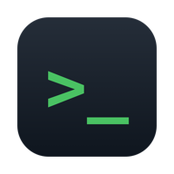
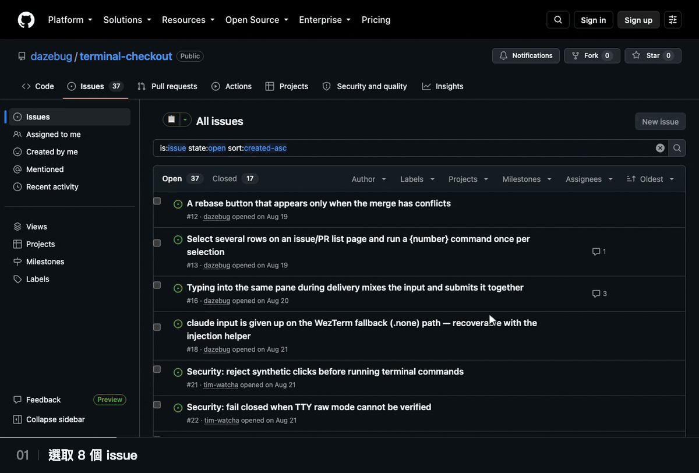
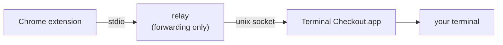

<!-- Translated from README.md at commit 59a640c. Keep this file line-for-line with README.md; see CONTRIBUTING.md. -->
<div align="center">
  <p><a href="README.ko.md">🇰🇷 한국어</a> · <b>🇹🇼 繁體中文</b> · <a href="README.md">🇺🇸 English</a> · <a href="README.ja.md">🇯🇵 日本語</a></p>
  
  <h1>Terminal Checkout</h1>
  <p><strong>從 GitHub 一鍵進入儲存庫、分支或工作樹。</strong></p>
  <p>啟動 Claude Code 並交給它 PR 或 issue 的脈絡，還能為這次執行附上一句話。</p>
  <p>由 Chrome 擴充功能與原生 macOS 應用程式組成。Claude Code 為選用。</p>
  <p>
    <a href="https://github.com/dazebug/terminal-checkout/actions/workflows/ci.yml"></a>
    <a href="#系統需求"></a>
    <a href="LICENSE"></a>
  </p>
  <p><a href="#安裝">安裝</a> · <a href="#使用方式">使用方式</a> · <a href="#支援的終端機">終端機</a> · <a href="#疑難排解">疑難排解</a> · <a href="CONTRIBUTING.md">貢獻指南</a></p>
</div>



## 功能

- **13 個預設，也能自訂指令**：選一個現成的工作流程，或自行定義。
- **每個 PR 各用一個工作樹**：選取的 PR 會分別在獨立的工作樹與終端機工作階段中開啟。
- **給 Claude Code 的脈絡**：`!gh …` 行在 claude 的 shell 模式中執行，之後再送出只屬於這次執行的 ▾ 一句話。
- **Chrome 不需要終端機控制權限**：權限是授予原生應用程式的。
- **按鈕與指令會同步**：透過 Chrome 同步在多台電腦間共用，並提供五種介面語言。

## 安裝

### 系統需求

- macOS 13 以上、Google Chrome，以及任一款[支援的終端機](#支援的終端機)
- 建置需要 Swift 工具鏈，安裝 Command Line Tools（`xcode-select --install`）就夠了
- 選用：[gh](https://cli.github.com)（會呼叫 gh 的預設需要它，複製本機還沒有的儲存庫時也會用到）、`claude`（用於 Claude Code），以及 [zoxide](https://github.com/ajeetdsouza/zoxide)（不論儲存庫放在哪裡都找得到，見[進入儲存庫](#進入儲存庫)）。登入 shell 缺少的工具若會影響工作流程，會顯示在共用問題區域。

### 支援的終端機

| 終端機 | 必要設定 | 鍵入 Claude 輸入的條件 |
|:---|:---|:---|
| iTerm2 | 自動化權限，只授予 Terminal Checkout | 除了這項權限，沒有其他條件 |
| WezTerm | 不需要 macOS 權限 | 必須已有開啟的 WezTerm 視窗 |
| Warp | 不需要自動化權限 | 需要輔助使用權限，且傳送輸入期間目標分頁必須保持可見 |
| cmux | 通訊端控制模式設為 `automation`（`password` 與 `allowAll` 也可以） | shell 整合必須提供該 surface 的 tty；分頁在背景時也能繼續傳送 |
| cmux NIGHTLY | 同 cmux；是獨立的選項，絕不會退回穩定版 | 同 cmux |

最後一欄只適用於鍵入的 claude 輸入。沒有 claude 輸入的按鈕，或唯一一則輸入隨開場訊息送出的按鈕，只需要完成必要設定，詳見 [claude 輸入](#claude-輸入)。

### <a name="2-build-and-install-the-app"></a>1. 建置並安裝應用程式

```bash
git clone https://github.com/dazebug/terminal-checkout.git
cd terminal-checkout
./install.sh
```

`install.sh` 會建置應用程式、安裝到 `~/Applications/Terminal Checkout.app`，然後啟動它。不需要 sudo、不需互動，而且是冪等的。

### <a name="3-finish-in-the-setup-window"></a>2. 在設定視窗中完成設定

設定視窗分為「一般」、「GitHub」與「Slack」三個工具列項目。共用的首次安裝指南會帶你完成 Native Host 註冊、在 Chrome 安裝擴充功能，以及從 GitHub 傳出第一個要求；之後可在「一般」重新開啟指南。

1. **首次安裝**：按下綠色的[在 Chrome 中安裝]。應用程式會複製擴充功能資料夾路徑、開啟 `chrome://extensions`，並展開指南中的四個步驟。請在 Chrome 開啟**開發人員模式**，點選**載入未封裝項目**，再依序按 **⇧⌘G → ⌘V → Enter → 選取**。請讓開發人員模式保持開啟 — 從 Chrome 133 起，關閉它會停用未封裝的擴充功能。
2. **一般**：從[支援的終端機](#支援的終端機)中選一個，再用[測試終端機]確認命令會在新分頁或 workspace 開啟。這項測試不會確認 Chrome 是否傳來要求，也不會確認 claude 輸入是否送達。
3. **執行後顯示**：選擇按下按鈕後切換到新終端機，或讓目前畫面保持在前景。Warp 一律切換到新分頁，並停用這項選擇。
4. **GitHub**：設定儲存庫基礎資料夾，讓命令在複製陌生儲存庫前先到該處尋找。只有設定無法使用時才會顯示提示。
5. **Slack**：設定工作資料夾與選用的 claude 指示；若要用鍵盤開啟 Slack 討論串，請錄製快速鍵。

<details>
<summary>設定視窗補充說明</summary>

- **首次安裝指南**：應用程式會在啟動時檢查並修復 Native Host 註冊。載入擴充功能後，請開啟 GitHub PR 頁面並按一次 Terminal Checkout 按鈕。記錄到要求只代表擴充功能的執行環境抵達應用程式，不代表命令已成功執行。
- 「一般」的**連線詳細資料**會顯示 Chrome 要求記錄、Native Host、應用程式通訊端、所選終端機，以及登入 shell 找到的工具。使用 cmux 時，可按[複製 cmux 設定並開啟檔案]或[再次檢查 cmux 狀態]。
- **權限與問題**：需要處理 iTerm2 自動化、cmux 通訊端存取或 Warp 輔助使用權限時，問題區會顯示問題區塊。cmux 存取遭拒不會被視為「未執行」。cmux 通訊端控制建議使用 automation 模式；password 與 allowAll 也可使用。
- **Warp claude 輸入**：只有需要鍵入 claude 輸入的按鈕才需要輔助使用權限。隨附且設定 claude 輸入的四個預設都走這條路徑。傳送期間必須讓 Warp 分頁保持在畫面上；沒有權限時，應用程式會在開啟分頁前拒絕該按鈕。
- **儲存庫基礎資料夾**：留白時命令會使用 zoxide。若 zoxide 找不到儲存庫，則改用已設定的基準資料夾；若儲存庫尚未存在，會在那裡使用 `gh` 複製。gh 必須先安裝並完成驗證。
- 「一般」中的[編輯 GitHub 按鈕…]會在應用程式收到擴充功能要求後開啟擴充功能選項頁。完成設定後，三個工具列項目仍可使用；首次安裝指南可從「一般」重新開啟。
- 平常使用時看不到應用程式：選單列沒有圖示，只有設定視窗開著時才會出現在 Dock。可從 Spotlight（⌘Space）或 Launchpad 重新開啟；應用程式未執行時，按下擴充功能按鈕會自動啟動它。
- 已經在另一台電腦上使用 Terminal Checkout？只要 Chrome 以同一個 Google 帳號同步，載入擴充功能後，按鈕與指令就會自動同步過來，不必重新設定。

</details>
### 3. 按下第一個按鈕

找一個符合下列條件的儲存庫：zoxide 已經以儲存庫名稱記錄了它的複本，或它位於 `<base>/<repo>`（或能用 `gh` 複製到那裡）。打開它的 GitHub 頁面，按下名稱旁的 **📂**，終端機就會在該儲存庫內開啟新分頁。接下來請看[使用方式](#使用方式)，了解每種頁面各提供什麼。

## 更新

```bash
git pull --ff-only
./install.sh
```

接著在 `chrome://extensions` 重新整理擴充功能（按 Terminal Checkout 卡片上的 ↻），並重新載入 GitHub 分頁。只要程式碼有變更，重新建置就會一併改變應用程式的 ad-hoc 簽署身分，所以 iTerm2 使用者需要在自動化權限提示中再次授權，在 Warp 上以鍵入方式傳送 claude 輸入的使用者則要重新授予輔助使用權限（[疑難排解](#疑難排解)）。

<details>
<summary>上次儲存後，預設又改進了？</summary>

已儲存的按鈕會原封不動地保留你原本的指令，不會在你不知情時被重寫。預設有新版本時，選項頁會顯示更新提示：以 `old → new` 列出每個受影響的按鈕，說明這項變更的作用，每一項都附有核取方塊。把隨附預設換成新指令的項目會預先勾選；你自訂過的指令則不預先勾選，並標示為行為變更，因為後續指令會改在新子句所進入的目錄中執行。套用只會填入表單，實際寫入仍和其他編輯一樣要按**儲存**；拒絕（「保留我的」）也會被記錄，所以提示不會再出現。如果這個頁面開著的時候，另一部裝置變更了你的設定，儲存會被拒絕，而不會覆寫那些變更；請重新載入查看，若有尚未儲存的編輯，請先匯出。自訂過的指令只有在第一個子句與舊版完全相同時才會被重寫，其他情況則會列出來，由你自行處理。schema 版本會隨 `storage.sync` 同步，所以只要決定一次，帳號下的每台電腦都會照這個決定處理。

</details>

## 使用方式

<a name="pr-pages"></a><a name="issue-pages"></a><a name="pr-and-issue-list-pages"></a><a name="repository-pages"></a>每一種 GitHub 頁面各有一組專屬按鈕，最多五個，按鈕上顯示表情符號或簡短文字。點選擴充功能圖示，會執行目前頁面的第一個按鈕。

| 頁面 | 按鈕位置 | 預設按鈕 |
|:---|:---|:---|
| PR | PR 標頭的分支名稱旁 | ⏏️ **簽出分支**：簽出 PR 分支；若失敗，就進入它的 `../{repo}-{branch_underbar}` 工作樹 |
| issue | Open/Closed 標章旁 | 📋 **閱讀 issue (claude)**：啟動 claude，並透過 shell 模式取得 issue、留言與交叉參照編號 |
| 儲存庫 | 儲存庫名稱旁 | 📂 **在終端機中開啟**：進入該儲存庫 |
| PR 清單 | 清單上方 | 🤖 **簽出 PR + Claude**：透過 `gh pr checkout`，為每個選取的 PR 各開一個 HEAD 處於分離狀態的工作樹（`../{repo}-pr-{number}`）與 claude 工作階段 |
| issue 清單 | 清單上方 | 📋 **分流 issue**：為每個選取的 issue 各開一個 claude 工作階段，並附上留言 |

- **清單頁面**：用 GitHub 的核取方塊選取列（GitHub 沒顯示核取方塊的地方，Terminal Checkout 會自行加上）；每個選取的列各開一個工作階段，每批最多 25 個。在清單頁面上，擴充功能圖示看不到你選了什麼，所以會執行第一個*儲存庫*按鈕。
- **預設的 PR 簽出**假設分支位於 `origin`，因此無法處理來自 fork 的 PR；PR 清單的預設使用 `gh pr checkout`，可以處理這種 PR。
- **呼叫 `gh` 的預設**（審查 PR (claude)、簽出 PR + Claude、閱讀 issue (claude)、開始處理 issue 與分流 issue）需要先安裝並登入 gh（`brew install gh`，接著 `gh auth login`）；缺少 gh 時會顯示在共用問題區域。

<details>
<summary>全部 13 個預設</summary>

可以在擴充功能選項頁中選擇預設，也可以用[變數](#變數)自己寫指令。

| 頁面 | 顯示 | 預設 | 執行的內容 |
|:---|:---:|:---|:---|
| PR | ⏏️ | 簽出分支 | `{cd} && git fetch origin && { git checkout {branch} \|\| cd ../{repo}-{branch_underbar}; }` |
| PR | 🤖 | 簽出 + Claude | 同上，接著執行 `claude` |
| PR | 🌳 | 工作樹 + Claude | fetch 後，建立或重複使用 `../{repo}-{branch_underbar}` 作為 `{branch}` 的工作樹並快轉，接著執行 `claude` |
| PR | 🪵 | 工作樹 | 同上，但不啟動 claude |
| PR | 🔍 | 審查 PR (claude) | `{cd} && claude`，接著在 claude 的 shell 模式中執行 `!gh pr view {number} --comments` 與 `!gh pr diff {number}` |
| PR 清單 | 🤖 | 簽出 PR + Claude | 對每個選取的 PR：建立 HEAD 處於分離狀態的工作樹 `../{repo}-pr-{number}`、執行 `gh pr checkout {number} --detach`，接著執行 `claude` |
| issue | 📋 | 閱讀 issue (claude) | `{cd} && claude`，接著透過 shell 模式取得 issue、留言，以及交叉參照它的 issue 與 PR 編號 |
| issue | 🌳 | 開始處理 issue | 建立或重複使用工作樹 `../{repo}-issue-{number}`（新建時會從 `origin/{main}` 開出新分支 `issue-{number}`），接著執行 `claude` 並附上 issue 的留言 |
| issue | 📂 | 開啟 issue | `{cd}` |
| issue 清單 | 📋 | 分流 issue | 對每個選取的 issue：`{cd} && claude`，接著附上 issue 的留言 |
| 儲存庫 | 📂 | 在終端機中開啟 | `{cd}` |
| 儲存庫 | 📂🤖 | 開啟 + Claude | `{cd} && claude` |
| 儲存庫 | ⤓ | 更新 main | `{cd} && git checkout {main} && git pull --ff-only` |

閱讀 issue (claude) 會安排傳送下列 shell 模式輸入；開始處理 issue 與分流 issue 只安排第二行：

```bash
!gh issue view {number}                       # body and metadata
!gh issue view {number} --comments            # comments
!gh api repos/{owner}/{repo}/issues/{number}/timeline \
  --jq '[.[]|select(.event=="cross-referenced")|.source.issue.number]'   # numbers of issues/PRs that cross-reference this one
```

</details>

## Claude Code

### claude 輸入

如果按鈕的指令會執行 `claude`，就可以在選項頁為它預先設定最多 10 則輸入，例如先 `!gh pr diff {number}`，再 `Summarize the risky parts`。應用程式會在啟動時附上符合條件的開場訊息，或把輸入鍵入正在執行的工作階段：

- **`!` 輸入會鍵入 claude 的 shell 模式**，因此會以真正的 shell 指令執行，輸出也會留在工作階段裡。連續的這類輸入只有在通過安全檢查、且合併後不超過 4 KiB 時，才會併成一行。
- **恰好只有一則純文字輸入時，它可以成為開場訊息**，前提是通過下方的指令、shell 與可執行檔檢查；否則會改用鍵入。
- 斜線指令、`#` 記憶行，以及其他輸入組合，都會以鍵入方式送出。

<details>
<summary>輸入的傳送方式</summary>

**`!` 輸入會以鍵入方式送出，連續的多則會合成一行鍵入**。只有 claude 自己的輸入框會把 `!` 行當成「在 shell 中執行這個」：若在啟動時以引數傳入，它只是一段普通文字，接著由 claude 決定用它的 Bash 工具執行；這可能會停在權限提示，還要多花一個回合（實測）。以鍵入方式送出時，它就會以指令執行，也會以指令的形式留在工作階段中。

- **連續的 `!` 輸入會用 `;` 串成一行**，每一則前面都加上橫幅，方便分辨各自的輸出。這樣三則輸入只需要一輪鍵入與送出，而不是三輪。之所以用 `;` 而不用 `&&`，是因為分開送出的 `!` 行本來就不會互相中斷，合併後也維持這一點：某個指令失敗，不會連帶吞掉後面的指令。
- **合併會改變實際執行的內容時，就不合併**。分開送出時，每一行 `!` 都在全新的 shell 中執行（`!export TOKEN=x` 不會延續到下一則輸入），合併後的一行卻共用同一個 shell。因此，一串輸入只要含有任何會改變 shell 狀態的內容（`cd`、`export`、`source`、`set`、`exit`、`VAR=…`），就會逐則鍵入；若某則輸入的語法可能影響後續輸入的解析，也會逐則鍵入。第二項檢查刻意做得很粗略：**任何沒有加引號的 `#` 或 `=`，不論出現在哪裡，都會讓合併停止**；heredoc、結尾的 `&`、未閉合的引號、複合指令關鍵字（`if`、`for`、`while`、`case`…），以及開頭或結尾是運算子的內容，也都一樣。`echo a#b` 雖然無害，還是會單獨鍵入：這項檢查不嘗試判斷哪個 `#` 是註解，因為過去曾兩次判斷錯誤。加上引號（`echo 'a#b'`），這串輸入就能再次合併。這會多花一輪，但 `["!cd sub", "!rm -rf build"]` 刪除的仍會是你原本要刪的目錄。
- **合併後超過 4 KiB 的一行，會改為逐則鍵入**。內容絕不會被截斷：之所以設這個上限，是因為 Warp 的注入協助程式在單一請求超過 8 KiB 時會拒絕；合併只是為了提高效率，因此會取消合併，改為逐則鍵入。
- 實際執行的就是你寫下的文字，經由 claude 的 shell 模式，在 claude 所在的目錄中執行；所以它會連同輸出，以指令的形式出現在工作階段中，就像你親手鍵入一樣。
- 純文字輸入、斜線指令與 `#` 記憶行都會各自單獨鍵入；連續的 `!` 輸入遇到第一則不屬於此類的輸入就結束。
- 含有 NUL 位元組的輸入會直接被拒絕，而不是修改後再傳送：tty 無法傳遞這種位元組。

**清單若恰好只含一則純文字輸入，就可以改作開場訊息**。純文字就只是一則訊息，所以可以當作 claude 的第一個引數附加在指令後面，工作階段一開始就已經帶著它：不需要鍵入、不需要讀取畫面，也不必等 claude 啟動完成。只有下列每一條規則都成立時才會附加，否則會改用鍵入：

- 文字會交給 **`command claude`**，而不是 `claude`。`command` 在 POSIX 中的意思是「略過函式與別名，執行可執行檔」，所以同名的 wrapper 收不到你的文字。但它**不會**略過 shell 內建指令，因此指令中若載入了內建指令（`zmodload`、`enable`），就不會附加開場訊息。
- 因此，**附加的前提是真的有 `claude` 可執行檔**。應用程式會在啟動時詢問登入 shell，而且是在子 shell 中詢問，以免你的函式或別名遮蔽實際的可執行檔；它也會檢查該檔案確實可以執行。如果 `claude` *只是*函式或別名，輸入就不會作為第一則訊息傳送，而會改以鍵入方式送出，共用問題區域也會說明這一點。Slack 連結只能作為第一則訊息傳遞，因此無法開啟。
- 只有當最終產生的指令是單純的串接（`&&`、`||`、`;`、`|`、群組、子 shell），而且**最後一個指令是單獨的 `claude`** 時，才會附加：不帶旗標、不在管線的接收端、沒有重新導向，後面也沒有任何東西。之所以排除旗標，是因為有些旗標（`--resume`）會把這個引數當成自己的值吞掉。
- 此外，**指令中的每個詞，即使當成指令名稱，也必須安全**：不能有任何可在該 shell 中重新繫結名稱的東西（`function`、`alias`、`eval`、`source`/`.`、`hash`、`trap`、`export`、像 `PATH=…` 這樣的指派、`if`/`for`/`while`/`case` 之類的複合關鍵字），也不能有任何加了引號或會被展開的內容，因為應用程式無法解讀這些內容。代價是判定偏嚴：`git add . && claude` 以及任何帶有加引號引數的指令都會改以鍵入方式傳送輸入，與先前的行為相同。
- 登入 shell 必須是 POSIX 系列（`sh`、`bash`、`zsh`、`dash`、`ksh`…），而且訊息只能有一行。在 csh/tcsh 中，文字裡任何位置的 `!` **即使在單引號內**也會被歷史展開，連帶讓整行指令一起失敗（實測：`echo START; /bin/echo -- 'do it!x'` 只會印出 `x: Event not found.`，`START` 根本沒有執行）；而換行在 iTerm2 和 WezTerm 中都會讓指令列提前結束。
- **不能混用**。清單裡只要同時有純文字*和*其他任何輸入，就會全部改用鍵入。在同一個工作階段中既送出開場訊息、又鍵入輸入，會和 claude 的啟動過程互相競爭：送出那則訊息會在啟動後 2∼3 秒清空輸入框，在那之前鍵入的內容都會被清掉（實測）。

**鍵入的代價，以及應用程式會告訴你、不會告訴你的事。**

- 應用程式最多等 **2 分鐘**，讓新分頁中的 claude 進入就緒狀態；超過就放棄，並在記錄中註明。它絕不會把文字鍵入 shell：會先等到 claude 成為前景處理程序、且 tty 進入 raw 模式。
- 每則輸入前，它會先鍵入一段簡短的隨機標記，確認標記出現後清空輸入框，再確認標記消失。藉此它才能知道：讀到的畫面就是這個窗格、出現的內容確實在輸入框裡，而且終端機的 Ctrl+U 確實起了作用。接著才把輸入鍵入一次並送出。
- claude 對首次開啟的資料夾顯示信任提示時，傳送會先暫停。約 **15 秒**內接受，傳送就會繼續；超過這個時間，就會從那一則輸入起放棄。
- 記錄中的 **sent** 只表示已送出，不代表已送達。claude 有沒有把送出的那一行變成訊息，TUI 以外的任何東西都無法確認，所以應用程式不會這樣宣稱。如果某次 Return 鍵始終沒有生效，那則輸入就會遺失，但記錄仍會把它算成已送出。
- **在 cmux 與 cmux NIGHTLY 上，傳送對象是所建立的 surface，分頁在背景時也會繼續傳送**；這兩個通道都不使用 Warp 那種依賴焦點的畫面驗證，也不需要輔助使用權限。

</details>

### 給 claude 的一句話

指令中含有 `claude` 這個詞的按鈕旁邊會出現 ▾ 箭頭，即使按鈕已儲存滿 10 則輸入也一樣，因為你的一句話會使用額外的一格；頁面標頭上的按鈕和清單的批次按鈕都適用。點開後是一個單行輸入框，上方列出這個按鈕原本就會送出的輸入。你的一句話會排在它們之後送出，所以 claude 讀到時，取得的脈絡都已經就緒。這句話只屬於那一次點擊，絕不會被儲存；在清單頁面上，批次中的每個工作階段都會收到它。

這句話是一行純文字，UTF-8 編碼最多 4096 位元組。它不能以 `!`、`/`、`#` 或其他種類的空白、不可見字元開頭，不能包含 `{…}` 片段，也不能含有換行、定位字元或其他控制字元。

按 Enter 或傳送按鈕即可送出；按鈕會先顯示 ⏳，再顯示 ✅ 或 ❌。✅ 代表應用程式已接受指令並開啟了終端機；傳送給 claude 的情況，則會在應用程式的記錄中回報。被拒絕的一句話會留在輸入框裡，下方顯示原因；出現 ❌ 後，輸入框會保持開啟，你的一句話也還在。

<details>
<summary>一句話的補充說明</summary>

- 輸入框上方的清單會依序列出已儲存的輸入，其中 `{number}` 與其他變數都還沒填入，送出時才會填入。沒有已儲存輸入的按鈕不會顯示這份清單。
- 檢查前會先去掉頭尾的一般空格。之所以限制開頭字元，是因為應用程式會把這些字元當成 shell 指令或輸入框指令；禁止 `{…}` 片段，則是因為應用程式會把它當成變數。換行、定位字元與其他控制字元會被拒絕，而不是被刪除；含有換行的文字在你貼上或拖放時就會被拒絕，不會被壓成一行。
- 如果頁面繪製按鈕之後，按鈕已儲存的輸入有了變動（你在選項頁中編輯了它，或另一部裝置同步了變更），送出會被拒絕，避免在清單已不符實際輸入的情況下傳送一句話。請重新載入頁面。
- 輸入法還在組字時的按鍵會交給輸入法處理。韓文輸入時，按一次 Enter 會確定最後一個音節，並把整句話送出一次；按 Esc 則會關閉輸入框，並保留這句話。日文輸入時，用來確定轉換的 Enter 只會確定轉換，再按一次 Enter 才會送出。
- 出現 ❌ 時，原因會顯示在主控台。如果你尚未送出就關閉輸入框，或送出失敗，下次在同一個頁面開啟該按鈕的輸入框時，原本的一句話仍會出現；頁面重新載入後就不會保留。
- 在清單頁面上，批次涵蓋的是你按下傳送當下所選取的列。
- 這句話要鍵入工作階段，還是作為開場訊息傳入，依照 [claude 輸入](#claude-輸入)的規則決定；應用程式會先依自身規則去除首尾空白字元，再決定傳送方式，因此這裡不保證會採用哪一種方式。在 Warp 上鍵入的一句話，和其他鍵入的輸入一樣需要輔助使用權限。
- 擴充功能圖示依然會執行第一個按鈕，但不帶一句話。

</details>

### 已知限制

- 輸入只能是單行。
- 應用程式會在每則輸入前清空輸入框，並在傳送結束時嘗試清理，因此可能會抹掉你在傳送期間輸入的草稿。清理也可能失敗，留下按 Enter 就會被送出的文字。
- 需要以鍵入方式傳送輸入的按鈕，只要應用程式能判斷自己無法傳送，就會**在開啟任何東西之前被拒絕**（顯示 ❌，不開分頁），也就是：Warp 上沒有輔助使用權限或缺少隨附的注入協助程式時，以及選用 WezTerm 且未開啟任何 WezTerm 視窗時。沒有 claude 輸入、或唯一一則輸入隨開場訊息送出的按鈕不受影響；若點擊時附上一句話，應用程式也會將它納入判斷。
- **在 Warp 上，只有分頁顯示在畫面上時，鍵入的輸入才會傳送**。切換到別處會暫停傳送，切回來就會繼續。
- ✅ 代表應用程式已接受指令並開啟了終端機。應用程式的記錄會回報已送出的輸入與傳送失敗，但無法確認 claude 收到了每一則輸入。

<details>
<summary>應用程式在 shell 中看不到的事</summary>

有兩件事取決於執行時期的 shell 與檔案系統，所以應用程式無法在附加開場訊息前檢查：一是**會把 `claude` 解析成其他程式的 `PATH`**，二是 **rc 檔中名為 `command` 的函式或別名**，它會攔截 `command claude` 這次呼叫。

</details>

### 在 claude 中開啟 Slack 討論串

1. 在 Terminal Checkout 的 Slack 項目設定工作資料夾與指示。
2. 按下**設定快速鍵**，再按下想用的按鍵組合（例如 ⌃⇧⌘C）。組合必須包含 ⌘、⌃ 或 ⌥。
3. 勾選**登入時開啟 Terminal Checkout**。快速鍵只在 App 執行時可用，勾選後登入時會開啟 App。
4. 在 Slack 中選擇訊息的**複製連結**，再按下該快速鍵。Terminal Checkout 會從剪貼簿讀取連結，在設定的資料夾啟動 claude，並傳入一個開場引數，先放連結，有設定指示時再接在後面。claude 必須能使用你的 Slack MCP 才能讀取討論串。

無論哪個 App 在前景（包括 Slack），快速鍵都能使用。剪貼簿只能選擇 claude 要讀取哪則 Slack 訊息。工作資料夾、指示和命令都由應用程式設定。

## 設定

應用程式設定分為「一般」、「GitHub」與「Slack」項目。按鈕、指令與 main 分支則在擴充功能選項頁設定；應用程式收到擴充功能要求後，可從「一般」選擇[編輯 GitHub 按鈕…]，或前往 `chrome://extensions` → Terminal Checkout → 擴充功能選項。

- 擴充功能的設定只有在按下**儲存**時才會寫入。
- 拖曳 `⠿` 控點可以重新排列按鈕卡片，也可以把焦點移到控點上再按 `↑` `↓`；[複製] 會在原卡片正後方建立一份副本。這裡的順序就是 GitHub 上的按鈕順序，擴充功能圖示執行的是第一個按鈕。
- 設定儲存在 Chrome 的 `storage.sync` 中，因此只要各個 Chrome 登入同一個 Google 帳號，並開啟「擴充功能」同步，就會共用這些設定。
- **backup** 區段的 [匯出 (JSON)] / [匯入…] 可用來在不透過帳號的情況下搬移設定，也適用於重新安裝。匯入只會填入表單，請確認後按**儲存**套用。

<details>
<summary>同步與備份的補充說明</summary>

之所以能跨電腦同步，是因為擴充功能 ID 由 manifest 的 `key` 固定下來，在每台電腦上都相同。複製出來的卡片，工具提示會加上 `(1)` 這類後綴。

備份檔會記錄它是依據哪一代預設寫出的：匯入較舊的備份時，會出現和已儲存按鈕相同的更新提示，而且提示會涵蓋匯入後的整個表單，而不只是檔案裡帶有的那些鍵；較新版擴充功能產生的備份則會被拒絕，不會只讀進一半。

</details>

### <a name="1-decide-how-commands-find-your-repositories"></a>進入儲存庫

每個預設都以 `{cd}` 開頭，也就是負責進入儲存庫的子句。應用程式會依據 GitHub 項目中的**儲存庫基礎資料夾**產生它：

| 基準資料夾 | `{cd}` 的內容 |
|:---|:---|
| 未設定 | zoxide 跳轉：進入 zoxide 記錄中名稱恰好為 `{repo}` 的資料夾，不分大小寫 |
| `<base>` | 先嘗試 zoxide 跳轉；若未成功，再嘗試進入 `<base>/{repo}`（**前提是它是 git 儲存庫**）；仍未成功時，才執行 `gh repo clone {owner}/{repo} <base>/{repo}` |

跳轉會最先嘗試，所以它找到的資料夾絕不會被取代。有設定基準資料夾時，兩種方式都找不到的儲存庫會用 `gh repo clone` 複製，並沿用你在 `gh` 中的協定與驗證設定。基準資料夾只儲存在這台 Mac 上，絕不會寫進同步的擴充功能設定。

<details>
<summary>使用 zoxide</summary>

[zoxide](https://github.com/ajeetdsouza/zoxide) 不論儲存庫放在哪裡都能跳過去。安裝後，把它的初始化指令加到 shell 設定：

```bash
brew install zoxide
echo 'eval "$(zoxide init zsh)"' >> ~/.zshrc && source ~/.zshrc
```

這些指令執行的是 `zoxide` 可執行檔，所以 z.sh 及其移植版都不算數。zoxide 會記住你造訪過的目錄，因此從沒 `cd` 進去過的儲存庫還不在它的資料庫裡；在那之前跳轉都會失敗，而這正是基準資料夾要涵蓋的情況。設定了基準資料夾後，GitHub 項目會說明缺少 `zoxide` 時仍有替代路徑。

跳轉會用 `zoxide query --list` 查出 zoxide 以該儲存庫名稱記錄的資料夾，並進入其中名稱恰好為 `{repo}`（不分大小寫）、排名最高的那一個。這裡刻意不用 `z {repo}`：zoxide 會在資料夾名稱的任何位置比對 `{repo}`，並偏好最近用過的相符結果，所以 `z` 可能跳進由預設建立在本機儲存庫旁的 `{repo}-<branch>` 工作樹；而在本機儲存庫目錄內執行時，由於 `z` 會略過目前的目錄，一定會跳到別的地方。以不同資料夾名稱存放的複本，跳轉也找不到。

剛安裝的 zoxide 資料庫是空的，所以跳轉會印出 `zoxide has not recorded a directory named {repo}` 並以非零狀態結束，第一個 `&&` 之後的內容都不會執行。指令*確實*已送達，失敗發生在你的 shell 裡，所以按鈕仍會回報成功，終端機裡的那則訊息是唯一的線索。缺少 zoxide（`command not found`）也會以同樣的方式失敗，而基準資料夾兩種情況都能涵蓋。

中間那一步會先確認 `<base>/{repo}` 真的是 git 儲存庫，而不是直接進入。否則，存在但不是 git 儲存庫的目錄（例如中斷的複製留下的空資料夾，或臨時用的目錄）也會被當成「找到了」，指令的其餘部分（`git fetch`、`git checkout`）就會在那裡執行。檢查失敗時，git 會在畫面上說明（`fatal: not a git repository`），接著由複製步驟接手；如果那個資料夾不是空的，複製會以 `destination path ... already exists and is not an empty directory` 停止，不會動到裡面的內容。

</details>

### 變數

| 變數 | 值 | PR | PR 清單 | issue | issue 清單 | 儲存庫 |
|:---|:---|:---:|:---:|:---:|:---:|:---:|
| `{cd}` | 進入儲存庫；由應用程式填入，而非頁面（見[上文](#進入儲存庫)） | ✓ | ✓ | ✓ | ✓ | ✓ |
| `{repo}` | 儲存庫名稱 | ✓ | ✓ | ✓ | ✓ | ✓ |
| `{owner}` | 儲存庫擁有者（用於 `gh api repos/{owner}/{repo}/…`） | ✓ | ✓ | ✓ | ✓ | ✓ |
| `{main}` | main 分支（見下文） | ✓ | — | ✓ | — | ✓ |
| `{number}` | PR/issue 編號（僅限數字；在清單頁面上取自選取的列） | ✓ | ✓ | ✓ | ✓ | — |
| `{branch}` | PR 的 head 分支（要被合併的一方） | ✓ | — | — | — | — |
| `{base}` | PR 的 base 分支（合併的目標分支） | ✓ | — | — | — | — |
| `{branch_underbar}` | 把 `{branch}` 中的 `/` 換成 `_`（用於工作樹目錄名稱等） | ✓ | — | — | — | — |

變數在指令與 claude 輸入中的行為完全相同。頁面提供的值只能包含 ASCII 字母、數字與 `-_./`。`{cd}` 是應用程式用通過驗證的片段組出的 shell 語法，而且需要 `{repo}`。詳情頁的範本只有在它用到的每個變數在清單頁面上都能取得時，才能用在清單上；缺少任何變數，這次執行就會被拒絕。

**`{main}`** 的解析順序是：各儲存庫的覆寫項 → 頁面偵測 → 全域預設值。PR 頁面偵測的是 base 分支；儲存庫與 issue 頁面偵測的是儲存庫的預設分支，所以預設分支是 `master` 的儲存庫也不需要覆寫。

**`{base}`** 會原樣從 PR 頁面讀取，沒有覆寫項也沒有後備值；需要以實際合併目標為準時請用它（`git rebase origin/{base}`）。讀不到時，這次執行會被拒絕，而不會用其他值代替。

### 語言

Terminal Checkout 提供**英文、韓文、日文、簡體中文與繁體中文**。應用程式依「一般」中的**語言**列決定語言，預設跟隨 macOS 的語言；擴充功能則依 **Chrome 的**顯示語言，因此兩者可能不同。

> **翻譯說明**：應用程式與擴充功能的英文、韓文介面文字由人工撰寫。**兩者的日文、簡體中文與繁體中文介面文字則是機器翻譯的初版，尚未經過這些語言的使用者審閱**。歡迎透過 issue 或 PR 提供修正。我們翻譯的任何內容都不會傳到 shell。

<details>
<summary>兩邊如何決定各自的語言</summary>

- **會傳到 shell 的內容一律不翻譯**：測試指令，以及應用程式為進入儲存庫而組出的子句，在設計上就固定是英文；你自己的指令範本則絕不會被更動。
- **[跟隨系統語言]** 是預設值。它會依照 macOS 的語言順序，選出五種語言中第一個能對應的；五種都不涵蓋的語言會退回**英文**。明確選擇某個語言時，就會照你的選擇顯示，絕不會跳到你沒選的第三種語言。清單中的每個語言都以該語言本身的文字寫成，所以就算切換到看不懂的語言，也找得到路換回來。
- **應用程式本身的文字會立即改變**。選擇 [跟隨系統語言] 時，依據的是系統設定的語言順序，而不是本應用程式先前寫入的 `AppleLanguages` 值。由 macOS 繪製的系統對話方塊（檔案選擇器、警告、選單列的標準項目）要等**下次啟動**才會跟著改變，因此變更應用程式語言後可從「一般」重新啟動。如果在 claude 輸入還在傳送時按下重新啟動，應用程式只會告訴你這件事，不會做其他動作：重新啟動會中斷傳送，所以這個要求會被拒絕，而不是排進佇列；請等傳送完成後再按一次。
- **擴充功能不會向應用程式詢問任何事**。擴充功能繪製畫面時，會依訊息 ID 從對應 Chrome 顯示語言的訊息資源中取得文字，所以只要變更這個語言（在 `chrome://settings/languages`）並重新載入頁面即可；Chrome 沒有個別擴充功能的語言設定。已儲存的按鈕標籤是儲存當下的文字快照，所以變更 Chrome 的語言不會改寫這些標籤；想換上新文字，請重新建立或編輯按鈕。Chrome 設定的語言若不在我們提供的範圍內，會退回**英文**，頁面也會在自己的 `lang` 屬性中標明。
- `zh-Hant` 也涵蓋香港與澳門，這和 macOS 本身對這些地區的處理方式一致。
- **[跟隨系統語言] 只會清除本應用程式記錄過、且值仍然相同的覆寫**。在系統設定中為個別應用程式所做的選擇、`-AppleLanguages` 引數，或其他優先權更高的設定，仍然具有決定權；應用程式不會刪除無法證明是自己寫入的值。macOS 的權限提示又是另一回事：它由 macOS 自己繪製，是否會跟隨你在這裡的選擇，並不清楚。

</details>

## 運作方式



macOS 會把自動化權限歸屬於*負責的處理程序*，因此如果由 Chrome 啟動的 native host 自己操控終端機，這項權限就會落在 Chrome 身上。這裡的做法是：Chrome 啟動的 relay 只負責把位元組轉送到應用程式的 unix 通訊端，應用程式沒在執行時，就在背景啟動它。應用程式透過 LaunchServices 啟動，因此負責處理程序就是應用程式本身。它會驗證請求、產生指令、決定 claude 輸入的傳送方式並操控終端機，所以權限歸屬於 Terminal Checkout，絕不會落在瀏覽器身上。各部分為什麼這樣設計，都記錄在 [`docs/context/`](docs/context/index.md)。

## 安全性

- 指令範本是你自己寫的、受信任的設定；從 GitHub 頁面讀到的值都要通過[變數](#變數)的字元白名單，藉此防止指令注入。
- 應用程式通訊端、cmux 的 automation 模式與 Warp 注入協助程式，都會信任同一個 macOS 使用者的所有處理程序。
- 擴充功能只在 `https://github.com` 上執行。
- 在 GitHub 頁面上執行的指令碼（無論是 XSS，還是能存取該網站的其他擴充功能）可以在你按下傳送前更改一句話的內容，而 claude 會把它當成你寫的。但它無法自行送出一句話：偽造的點擊與按鍵都會被忽略。

<details>
<summary>機制</summary>

- Chrome 只會為白名單中的擴充功能 ID（`allowed_origins`）啟動 Native Host relay；這是由 Chrome 強制執行，而不是 relay 本身。
- 應用程式通訊端的模式為 0600，並會驗證對端；傳送一結束，Warp 注入協助程式就會立即被終止。

</details>

完整的信任模型與漏洞回報方式，請參閱 [SECURITY.md](SECURITY.md)。

## 疑難排解

<details>
<summary><b>出現「Native host has exited」，或擴充功能沒有反應</b></summary>

打開設定視窗（從 Spotlight 啟動 Terminal Checkout），問題會顯示在共用問題區域。Native Host 註冊需要處理時，請按[註冊或更新 Native Host]。如果你搬移過儲存庫或重新安裝過應用程式，請再執行一次 `./install.sh`。

</details>

<details>
<summary><b>你拒絕了權限</b></summary>

使用對應問題區塊中的按鈕開啟自動化或輔助使用設定。iTerm2 請在**隱私權與安全性 → 自動化**允許 Terminal Checkout；Warp 畫面讀取需要**輔助使用**權限。

</details>

<details>
<summary><b>cmux 或 cmux NIGHTLY 的通訊端存取遭拒</b></summary>

在「一般」的連線詳細資料中選擇[複製 cmux 設定並開啟檔案]，複製 JSON 片段並開啟 `~/.config/cmux/cmux.json`。應用程式建議使用 `automation` 模式；`password` 與 `allowAll` 也允許通訊端控制。兩個通道共用此檔案，應用程式不會寫入。

</details>

<details>
<summary><b>cmux 或 cmux NIGHTLY 沒有在執行</b></summary>

「一般」的[測試終端機]會以不帶參數的方式啟動所選通道。通訊端出現後，在連線詳細資料中選擇[再次檢查 cmux 狀態]。NIGHTLY 是獨立套件，不會悄悄換成穩定版。[複製 cmux 設定並開啟檔案]只會複製 JSON 片段並開啟現有檔案或資料夾，不會啟動 cmux 或寫入檔案。

</details>

<details>
<summary><b>cmux 或 cmux NIGHTLY 的指令有執行，但 claude 輸入沒有出現</b></summary>

可能是該窗格的 shell 整合沒有開啟，所以 `debug.terminals` 裡沒有這個 surface 的 tty；指令會保留，但 claude 輸入會被放棄。請用 `log show --predicate 'subsystem == "com.dazebug.terminal-checkout"' --last 15m --info` 查看應用程式的記錄。

</details>

<details>
<summary><b>Warp 上的 claude 輸入沒有送達</b></summary>

鍵入的輸入（所有 `!` 輸入，因此也包括隨附預設中設定了 claude 輸入的全部四個）需要輔助使用權限；隨開場訊息送出的輸入則不需要。▾ 箭頭的一句話也算一則輸入：加在已設定一則輸入的按鈕上，就變成兩則輸入的清單，所以會以鍵入方式送出。應用程式會先依自身規則去除首尾空白字元，再計算輸入則數；因此，已儲存的輸入若只含會被去除的字元，就不計入。如果按鈕顯示 ❌ 而且沒有開啟分頁，代表應用程式事先就知道無法傳送：請依照共用問題區域中的 Warp 輔助使用問題說明操作，或重新安裝以恢復隨附的協助程式。如果分頁有開啟，只是少了輸入：傳送完成前，你是否一直停留在那個分頁？切換到別處會讓應用程式等待（切回來就會繼續）。其他情況可用 `log show --predicate 'subsystem == "com.dazebug.terminal-checkout"' --last 15m --info` 查看原因。

</details>

<details>
<summary><b>claude 輸入以鍵入方式送出，而不是隨開場訊息送出</b></summary>

清單中只要有 `!`、斜線指令或 `#` 行，這就是正常的路徑：只有恰好含有一則純文字輸入的清單，才會附加到指令後面（兩行純文字之間需要換行，所以會以鍵入方式送出）。▾ 箭頭的一句話也算是其中一則輸入。如果單獨一則純文字輸入仍以鍵入方式送出，要附加就必須同時符合以下條件：指令以單獨的 `claude` 結尾（後面沒有旗標、重新導向、管線或註解）；你寫的每個詞都能被解讀，而且當作指令名稱也安全（`git add .`、`-m 'msg'`、`export …` 和 `PATH=…` 都會阻止附加，應用程式自己的 `{cd}` 子句則算作一個普通的詞）；訊息只有一行；登入 shell 是 POSIX 系列；`claude` 是真正的可執行檔，而不是函式或別名。

</details>

<details>
<summary><b>重新建置後又跳出權限提示</b></summary>

由於採用 ad-hoc 簽署，只要程式碼有變更，建置出來的簽署身分也會改變；請在自動化權限提示中再次授權。輔助使用權限失效時更難處理：舊的項目會留在系統設定裡，開關也還開著，但已經不再生效，而且切換開關也無法讓它恢復。`./install.sh` 會比較已安裝版本與新建置版本的程式碼雜湊值，只有兩者不同時才會重設該項目，讓你可以重新授權；這只有在你使用 Warp 的 claude 輸入時才有影響。如果無法執行重設，指令碼會印出那一條需要你自己執行的指令，而不會進行任何互動式操作。

</details>

<details>
<summary><b><code>zoxide has not recorded a directory named …</code>，之後的內容都沒有執行</b></summary>

zoxide 沒有名稱完全相同的資料夾：你在安裝 zoxide 之後還沒有 `cd` 進過這個儲存庫，或者本機複本的資料夾名稱與儲存庫不同。指令的第一個子句失敗後，`&&` 串接就停在那裡。應用程式看不到這個狀況：指令已經送達，是在你的 shell 裡失敗的，所以按鈕仍會回報成功。在 GitHub 項目中設定**儲存庫基礎資料夾**後，指令就會改為嘗試進入 `<base>/<repo>`，儲存庫不存在時再複製下來；或者親手 `cd` 進入該儲存庫一次，zoxide 就是這樣學會的。詳見[進入儲存庫](#進入儲存庫)。

</details>

<details>
<summary><b><code>command not found: zoxide</code></b></summary>

請確認 zoxide 已安裝、終端機使用的登入 shell 的 `PATH` 中有它，而且 shell 設定中有 `eval "$(zoxide init zsh)"`（或你所用 shell 的對應寫法）。少了這行初始化，zoxide 永遠學不到新的資料夾。基準資料夾同樣能涵蓋這種情況，因為缺少 zoxide 時的失敗方式與資料庫為空時相同。

</details>

<details>
<summary><b>按鈕沒有出現</b></summary>

GitHub 的介面更新可能會移動按鈕的錨點。點選擴充功能圖示是另一條不依賴這些錨點的路徑，但它讀取的是相同的頁面資料，所以也可能失敗；失敗會記錄在 service worker 的主控台中。

</details>

## 開發

```bash
swift test --package-path app   # Core unit tests
node --test                     # extension (JS) unit tests — no dependencies
app/build.sh                    # build the app bundle (app/build/Terminal Checkout.app)
app/e2e.sh                      # relay ↔ socket ↔ server round-trip regression test (after building)
node tools/check-locales.js     # _locales structure: name parity and argument bindings against en
```

請先閱讀 [CONTRIBUTING.md](CONTRIBUTING.md)。架構限制與實測過的陷阱記錄在 [`CLAUDE.md`](CLAUDE.md)，支援新終端機時要修改的地方列在 [`docs/new-terminal-checklist.md`](docs/new-terminal-checklist.md)，設計背後的理由則在 [`docs/context/`](docs/context/index.md)。

## 解除安裝

```bash
./uninstall.sh
```

Chrome 擴充功能請自行到 `chrome://extensions` 移除。

## 授權

[MIT](LICENSE)
